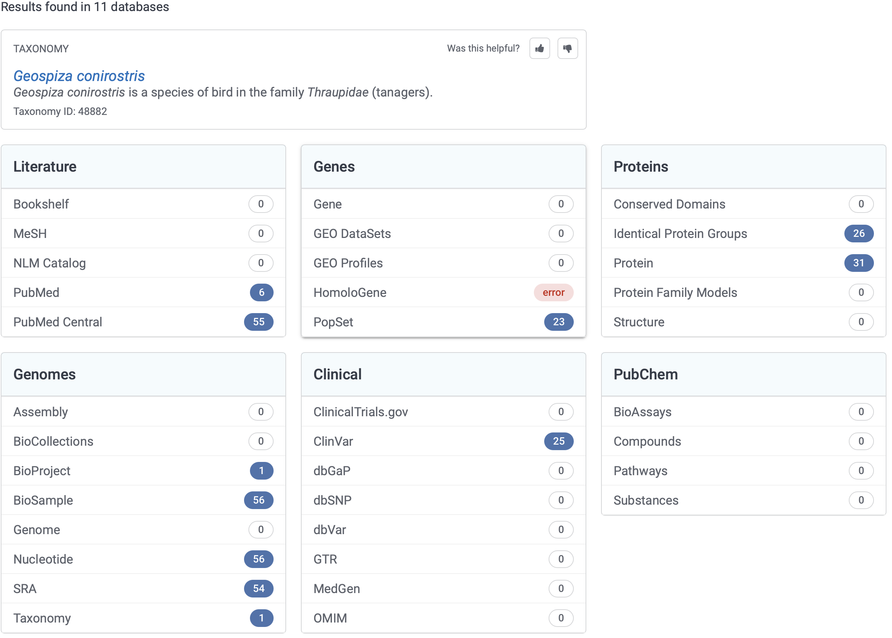
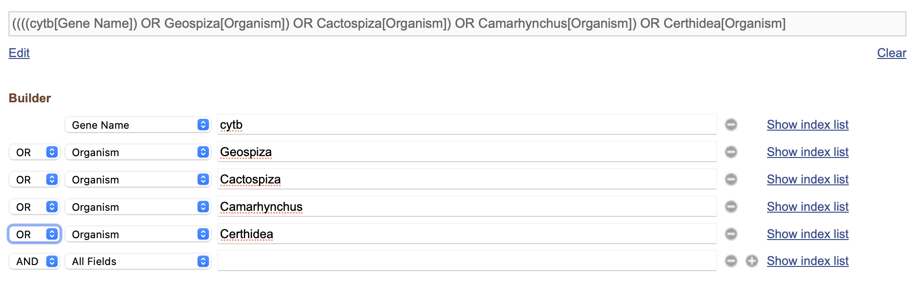
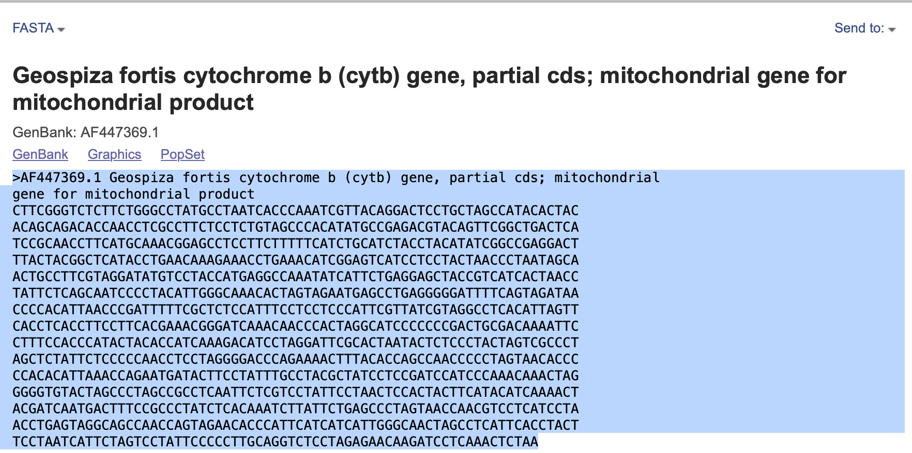
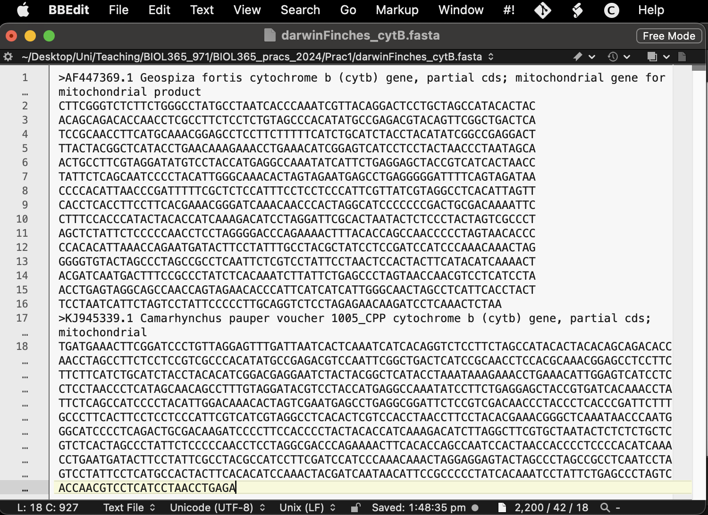

---
title: "BIOL365 Evolutionary Prac 2 — Access genetic data from GenBank"
author: Dr James B Dorey and Dr Damien Esquerré, University of Wollongong
date: "Version `r format(Sys.time(), '%Y-%m-%d')`; practical 2024-08-02"
output: 
  pdf_document:
    toc: true
    toc_depth: 2
    number_sections: true
    fig_caption: true
    latex_engine: pdflatex
    extra_dependencies: ["flafter"]
urlcolor: blue
abstract: "R is a very useful programming language that's open access and widely used in science. We don't expect you to become a master by the end of this topic or to understand everything that you're doing right now. But, by helping you get started and giving you robust example code we hope to enable you to succeed using R in the future, should you chose to pick it up more consistently. Here, we will use it as an *example* of how you can run genetic/phylogenetic analyses on a single platform. But note, others do exist. 

\n
**Be certain to save your R script from this week to help you next week!**"
--- 
  
```{r libraryChunk, load-packages, include=FALSE}
# Markdown written by James B Dorey; contact jdorey@uow.edu.au (jbdorey@me.com) if help is needed.
# markdown packages
library(rmarkdown)
library(formatR)
library(styler)

# Load core packages
library(dplyr)

options(width = 60)
matrix(runif(100), ncol = 20)
demonstratorVersion = FALSE

```


`r if(demonstratorVersion == TRUE){"\\\n\n**THIS IS A DEMONSTRATOR ONLY VERSION**\\\n"}`


```{r secretRootPath, include=FALSE}
# Set the RootPath to EPrac1 folder
RootPath <- "/Users/jamesdorey/Desktop/Uni/Teaching/BIOL365_971/BIOL365_pracs_2024/EPrac2"
setwd(RootPath)
```


# Script preparation 
## Working directory 
To start with, let's set up a working directory in a place that makes sense. We will use this working directory to, preferably, keep ALL of the data and scripts associated with this project. This is because, if we were to start putting files and scripts all over the computer, we increase the chances of losing them as we change file names and paths and, if we want to share the whole project, we can share everything by compressing and sharing one folder. **Save this folder for next week!**

```{r setRootPath, include=TRUE,  eval=FALSE}
  # Set the RootPath to EPrac2 folder
RootPath <- "YourFolderPathHere"
  # You can then set this as the project's working directory. 
  # This is where R will first look to find 
  # or save data as a default
setwd(RootPath)
```


## Install packages
R is a programming language which has a [*base*](https://stat.ethz.ch/R-manual/R-devel/library/base/html/00Index.html) and several default packages. But, because R is an open-source programming language, it currently has *20,853* packages available on ["CRAN"](https://cran.r-project.org/web/packages/); the official R package repository. Additional reliable R packages can be sourced from [bioconductor](https://www.bioconductor.org/packages/release/BiocViews.html#___Software) (*2,300* packages for working with biological data) and countless others on GitHub. 

This is all to say that the possibilities of analyses in R are nearly endless, free, open source, and widely used. This makes R an incredibly powerful language to learn for your education, research, and future career. 


To start out, we will need to install some basic packages. In particular, we will install packages in the *tidyverse* which have benefits over R's *base* packages in that they tend to be quicker and, more importantly, much easier to code with and understand. 

You'll notice that we are actually defining an R object as a simple character vector called "packageList" and then feeding it into the *base* R `install.packages()` function.
```{r installPackages, message=FALSE, warning=FALSE, results=FALSE, collapse = TRUE, eval = demonstratorVersion}
packageList <- c(
    # Tidyverse packages:
  "dplyr",            #  For data management and table manipulation
  "magrittr"          #  to use tidy pipes; %>%
)

# List the new (not installed) packages and then if there are any, install them.
install.packages(pkgs = c(packageList), 
              rebuild = FALSE,
              repos = "http://cran.us.r-project.org")
```

{width="100px"}
{width="100px"}

\
\


While you're here, why don't you run just the below word in your console and see what comes up. You can then also run that same object in the *base* R `class()` function to see what type it is.
```{r checkOut_packageList, include=TRUE,  eval=demonstratorVersion}
packageList
class(packageList)
```

>**Q1:** How does your input for "packageList" vary from what comes out when you run it in the R console?

`r if(demonstratorVersion == TRUE){"**The input uses the 'combine' function, 'c' and commas between. The output is simply the text returned as a list.**"}`

>**Q2:** What is the class of "packageList"?

`r if(demonstratorVersion == TRUE){"**The class is 'character'.**"}`

## Load packages
Even though we have installed the packages, we actually need to explicitly call each package using the `library()` function. This tells R which packages it should use and can solve issues of one function being called by multiple packages.

So, let's go ahead and load in the packages that we just installed. 

```{r loadPackages, include=TRUE,  eval= demonstratorVersion}

# Load all packages from the list specified above
lapply(c(packageList), 
       library, character.only = TRUE)
```

I prefer to go one step further, which removes the issue almost entirely, and is useful when going over your scripts and making it easy to find errors and understand what's happening. You can, at each function, explicitly call the package. For example:

```{r loadPackages_explicit, include=TRUE,  eval = demonstratorVersion}
  # We can explicitly call the base package's "library" function.
  # However, I tend to not do this with the base and default packages.
base::library(dplyr)
```

Now, that's probably enough of an introduction to R. We can work through more of that at a later time and in the course of this topic. Now, let's get onto the subject at hand... Harvesting genetic data.


# Accessing GenBank over a browser
There are several places online to download published genetic data, but for life sciences, [GenBank](https://www.ncbi.nlm.nih.gov/genbank/) is probably the major host. But, it is not the sole repository. Especially for the increasing amounts of next generation sequencing datasets, authors are hosting data on generalist repositories like [FigShare](https://figshare.com).

We are *also* going to access genetic data from GenBank using R. However, I think its still very much worthwhile taking an initial look on the website itself and this is how I would personally access these data in the first instance. Navigate to the [GenBank](https://www.ncbi.nlm.nih.gov) homepage now. At the top of the page, there is a search bar, there search "**All Databases**" for one of Darwin's finches, "*Geospiza conirostris*" (**Fig. 1**). 


This search should return something like the below (**Fig. 2**). Now, there's quite a lot to see there and GenBank has broken it down into the literature sources and citations (which is very helpful!). It also provides data in the form of genomes from various sources, genes, genetic data associated with health issues ("*Clinical*"), and proteins. Basically, GenBank is seeking to be able to host and share a whole bunch of molecular data with anyone who wants to use it. Great open science! **Just remember, when you use these data you must cite the original source!** Good thing that GenBank gives the citation to you.

## Searching a taxon
Under **Genes**, let's click on **PopSet**. Here you will see a whole bunch of single gene region extracts from finches of this species, information about the gene that has been sequenced (e.g., MHC class IIB antigen pseudogene, cytochrome b, ornithine decarboxylase, and other stupid gene names...), and information about those extracts. Underneath there is more information to help you decide what you might like to look at, such as the number of sequences provided and the type of study. 




Let us click on "Passeriformes MHC class IIB antigen pseudogene, partial sequence." and look a little closer.

>**Q3:** How many sequences are in this alignment?

`r if(demonstratorVersion == TRUE){"**There are 17 sequences, at the time of me writing this**"}`

>**Q4:** What is the *title* and *journal* of the study that produced these genes and shared them on GenBank?

`r if(demonstratorVersion == TRUE){"**The title is 'Evolution of Mhc class II B genes in Darwin's finches and their closest relatives: birth of a new gene.' AND the journal 'Immunogenetics'**"}`

>**Q5:** For the gene with the accession number "*AY064447.1*", click on that number and tell us, what are the first 10 basepairs for the sequence? *HINT: have a look down the bottom of the page.*

`r if(demonstratorVersion == TRUE){"**The first ten basepairs are 'acggagaagg'**"}`

>**Q6:** On the alignment page, can you find and download the entire alignment with all sequnces in a **FASTA** format? *HINT: search the page for "FASTA" and click on that link; on that page at the top right use the "Send to:" drop down to select "File" and then click "Create File".*

>**Q7:** What does the fasta file look like and what information does it contain?

`r if(demonstratorVersion == TRUE){"**The file, called 'sequence.fasta' contains the individuals' name and potentially other information after a greater than symbol, '>'. '>AY064447.1 Loxigilla noctis isolate LonoC62i3 MHC class IIB antigen gene, exon 2 and partial cds'. And then the sequence itself starting on a new line 'ACGGAGAAGGTGAGGCTCGTGGAGAGGTACATCTACAACCGGCAGCAGTACGTGATGTTCGACAGCGACGTGGGGCACTACGTGGGATTCACCCCCTTTGGAGAGAAACAGGCCCGGCACTGGAACAGCAGCCCGGCCAGACTGAAGTACATGCGGGCTGCGGTGGACACGCTCTGCCGGTACAACTACGAGGTGTTCCGCCCGTTCACCGTGGAGCGCCGAGGTGAGCGCGGGGCAGAGCGTGTCCCCTCGGGCCCTGCCCTGCCAGTGACCATCCCAGTCAATCCCAGTCCCTACCAG'**"}`

Fasta files are one of the most commonly used formats for genetic data. They are nice and simple files that are essentially just plain text that store two data types (**Q7**). Their simplicity makes them powerful and easy to understand.

## Searching a group
Now, let's make a more useful search. Let us try and find the data that's available for all of Darwin's finches in the genera *Geospiza*, *Cactospiza*, *Camarhynchus*, and *Certhidea*.

Go back to the [GenbBank](https://www.ncbi.nlm.nih.gov) homepage and instead of searching "**All Databases**", search "**Nucleotide**" and click "**Search**" with the text bar empty and, on the following page, click "**Advanced**". Here, we can start to build an advanced query. 
  > 1. In the first field, enter "cytb" which is the mitochondrial gene "*cytochrome b*"; a very commonly used gene for shallow (~recent divergences) inter-species phylogenetic analyses. Choose the drop-down as "**Gene Name**" and not "**All Fields**".
  
  > 2. In the next four fields put the four bird genera names and choose the drop-down as "**Organism**"
  
  > 3. In the "**AND**" drop-downs, choose "**OR**" and click "**Search**" (**Fig. 3**)



  > 4. Because we have chosen all "**OR**"s, we actually have cytB genes for any species at all! Oops! However, we can fix this and make a much better search with this In the search bar at the top, you can see that our search has been turned into a text query! 
  
  "*((((cytb[Gene Name]) OR Geospiza[Organism]) OR Cactospiza[Organism]) OR Camarhynchus[Organism]) OR Certhidea[Organism]*"
  
  Here you can see that our query is bounded by a bunch of confusing brackets. They are specifying the relationships between each query, but what we want is to find all cytB genes for any (**OR**) of the four genera, so we can enclose the gene name and then all of the genera, separated by an "**AND**" to specify this. Go ahead and make this change or paste the below query into the search bar.
  
  "*(cytb[Gene Name]) AND ("Geospiza"[Organism]) OR "Camarhynchus"[Organism] OR "Certhidea"[Organism])*"
  
  Now, you'll see that there are some crazy genetic materials in there including genomic data (genes from in the cell nucleus). On the left-hand side there's a filter that you can choose called "**Mitochondrion**" (search for it on the page if you need). Click on that and you'll see that what's mostly left are a bunch of 800 to 1,120 basepair sequences. But, there are also some much long full mitogenomes (>16,000 bp) and sequences of different lengths (probably differing due to the sequencing and filtering methods used in their production). You may also note that "*AND mitochondrion[filter]*" was also added to the search query.
  
## Download sequence data from the browser
  
  From this point, you might go through these sequences and try to find one for each species you want to include, or a subset of those species. You might sort these sequences by length (**Fig. 4**) and then look for the longest sequence of each species as you scroll down the page.


Why don't you take a few moments to try and find the longest sequences for all of the species that have cytB data on GenBank? **Hint**: there are 14 species that I can see cytB for: *Geospiza magnirostris*, *Geospiza fortis*, *Camarhynchus heliobates*, *Geospiza difficilis*, *Geospiza conirostris*, *Certhidea fusca*, *Certhidea olivacea*, *Camarhynchus psittacula*, *Camarhynchus parvulus*, *Camarhynchus pauper*, *Geospiza fuliginosa*, *Geospiza scandens*, *Geospiza septentrionalis*, and *Camarhynchus pallidus*.

You could download each as a fasta file and then copy them together in a text editor, or just click on "FASTA" for each sequence and copy the fasta text into a text file (**Fig. 5**). **Note**: for mac users BBEdit is a fantastic and free text editor (**Fig. 6**).





Save this file with an informative name in your R working directory and with the file suffix ".fasta". Maybe something like *darwinFinches_cytB.fasta* — we will skip this part right now in favour of showing you, very quickly, how to accomplish this in R. However, reading the fasta into R is really simple using the **ape** package (see the example line of code below and the next section).

    DarwinFinches_cytB <- ape::read.FASTA("darwinFinches_cytB.fasta")


# Accessing GenBank in R
## Examining GenBank databases

Now, that we've had an explore of GenBank on a nice browser, we can have a look at accessing it right here in R. *Gasp!* For that, we're going to want some extra packages because the creator of R — being as short-sighted as they are — did not consider us phylogeneticists when making their programming language ... >:(

```{r install_and_load_GeneticsPackages, include=TRUE,  eval = demonstratorVersion}
  # Let's install some packages the old-fashioned way just to show you how
# Accesses GenBank's "Entrez Utilities" API through R (i.e., it searches GenBank)
install.packages("rentrez",
              repos = "http://cran.us.r-project.org")
# A central R phylogenetics package that stands for "Analysis of Phylogenetics and Evolution"
install.packages("ape",
              repos = "http://cran.us.r-project.org") 

  # Let's do the same by loading them in
library(rentrez)
library(ape)
```

{width="100px"}
{width="100px"}

\


## Run a GenBank query
Let us dive right into querying GenBank in R. First, lets use `entrez_search()` on the "nucleotide" database using our previous search term. **Note:** that we have to remove the internal quotes in the search "**term**". Use the following term: *"(cytb[Gene Name]) AND (Geospiza[Organism]) OR Camarhynchus[Organism] OR Certhidea[Organism]) AND (mitochondrion[filter])"*

```{r myFirstSearch,  eval = demonstratorVersion}
myFirstSearch <- rentrez::entrez_search(db = "nucleotide",
              term = "(cytb[Gene Name]) AND (Geospiza[Organism]) OR Camarhynchus[Organism] 
              OR Certhidea[Organism]) AND (mitochondrion[filter])",
                # With this new search term, I can see 171 sequences, which is enough for me to
                # download, I think! So, I'll set this in retmax
              retmax = 200)

# Inspect the object and answer the question below
myFirstSearch

```

> **Q8:** How many search results were found and does that number seem familiar?

### OPTIONAL: Accessing R help files
Let's take a quick interlude, if you have a moment.

Let us say that we are novices and we don't know what a function can or should do? Well, R is here to help and this is a tip that you will be using for years to come. If you want to quickly bring up the function's help file simply run "?*function*". In this case, let's have a closer look at `entrez_search()` by typing "?*entrez_search*" into the R console.

```{r EntrexSearch1, include = TRUE,  eval = demonstratorVersion}
# Access the help file for the function entrez_search
?entrez_search
```

Here you will see with a bunch of information to hopefully help you understand and use the function! 

> **Q9:** What does the help file say under the "**Description**"? 

## Download genetic data

We can then use the *ape* package and these accession numbers to download the fasta data right onto our computers. We will use the `read.GenBank()` function from *ape*, so why don't you first run "?*read.GenBank*" to have a look at the help file, especially focus on the **Description**, **Arguments**, and **Value**.

**Note:** Most R objects are some kind of "list" and you can access elements of that list by R operator “\$”. For example, if you type in “myFirstSearch\$” in the console and wait a moment, it will come up with a dropdown list of the objects inside that object! This is really important, because to now download the genetic data, we need the GenBank accession numbers which are stored in the “$ids” slot of our object.

```{r accessFasta,  eval = demonstratorVersion}
# Download the data from GenBank using the ids that you got from rentrez
DarwinFinches_cytB <- ape::read.GenBank(access.nb = myFirstSearch$ids)

# What type of file is this? 
class(DarwinFinches_cytB)

# What does it look like?
DarwinFinches_cytB

# Have a look at one sequence with the accession number "56682244"
DarwinFinches_cytB$`56682244`
  # Wow, those data are stored really strangely! I agree. DNAbin objects store genetics data
  # in non-user-friendly ways. Many genetics programs do, in fact. I bet that you miss that
  # simple fasta now 
# However, this format also allows extra attributes to be saved! So, let's save this as an R
  # object for next week
base::saveRDS(DarwinFinches_cytB, 
        file = "DarwinFinches_cytB.rds")

# Let's save this fasta file
ape::write.FASTA(DarwinFinches_cytB,
                 file = "DarwinFinches_cytB.fasta")
```

# Start thinking about your project

## Think about a taxon that's interesting to you

Now then, it's time for you to choose a taxon that you might be interested in looking at! You might already have a good idea about a taxon that you're interested in! Maybe you're into frogs, lizards, birds, wasps, bees, whatever! Maybe you have no idea! Regardless, I'd suggest choosing a group that is reasonable to deal with and not overwhelming. Maybe somewhere between 7 and 30 species? You can always choose a bigger group as well and then take a step backwards in regards to how many species you include from that group (you don't need to do them all).

But, how on earth will you know this? Well, I can provide a little guidance here and a quick way for you to start querying taxa and their size. **Keep in mind** that even if a group has 10 species, you may not be able to get genetic data for all of those 10 species — and, you need genetic data that aligns (i.e., is from the same gene and the same part of that gene). So, maybe shoot for a few more species and then search for what's available.

The below function, `taxadbToBeeBDC()` from the **BeeBDC** package will get taxon names from [GBIF](https://www.gbif.org), the Global Biodiversity Information Facility, and return a table with the valid and old names for each species. We will then use the **dplyr** package to filter to only "**accepted**" names, group by "**genus**" and then return a table with the count of valid species in each genus. Please, feel free to play around at this point! 

**Note:** You may get an error in the below code. Please do *read the error*, then *think about it*, and then see if you can solve it! A big part of programming is being able to read and solve errors. You can also totally google it or ask ChatGPT! If these fail, ask your demonstrator.

```{r TestTaxaQuery, eval = demonstratorVersion}
# A useful package for taxonomic and occurrence data
install.packages("BeeBDC",
              repos = "http://cran.us.r-project.org")
library(BeeBDC)

  # Run the BeeBDC query
speciesCountTable <- BeeBDC::taxadbToBeeBDC(name = "Apidae",
                               rank = "Family",
                               provider = "gbif") %>%
  dplyr::filter(taxonomic_status == "accepted") %>%
  dplyr::group_by(genus) %>%
  dplyr::count()

#As usual, what class is returned?
class(speciesCountTable)

# What did we make?
speciesCountTable

# Did you know that you could sort the table? You could either look at the function:
?dplyr::arrange
  # or run:
#View(speciesCountTable) # REMEMBER: R is case-sensitive!
  # and sort by the "n" column

```

{width="100px"}

\

> **Q10:** Which bee genus in the Apidae family has the most species in it, according to GBIF?

`r if(demonstratorVersion == TRUE){"**The gneus 'Nomada' with 793 species**"}`

> **Q11:** What is a taxon that's interesting to you and that might have an appropriate number of species with genetic sequences?

**Note:** But hey, what a minute, James, what the shit is this "%>%" crap? Well, I'm glad that you *[were forced]* to ask! It's called a pipe and it's from the *magrittr* package. It essentially passes the output of the first function forwards (**%>%**) into the next function. It is equivalent to running the below, but it's much quicker and neater. 

      BeeBDC_query <- BeeBDC::taxadbToBeeBDC(name = "Apidae",
                               rank = "Family",
                               provider = "gbif") 
      BeeBDC_query <- dplyr::filter(BeeBDC_query, taxonomic_status == "accepted")
      BeeBDC_query <- dplyr::group_by(BeeBDC_query, genus)
      speciesCountTable <- dplyr::count(BeeBDC_query)

## What genetic markers are out there?

Okay, I've given you the tools that you'll need to choose a taxonomic group and to query GenBank to get your data. The rest is up to you. If you still have time in this prac, please start playing around with all of this and searching for a group that might interest you. Additionally, there are more genes to choose from! We used **cytB** here, but there are loads of other very commonly used genes. Some examples include: 

  1. **COI** — Cytochrome c oxidase subunit I (mitochondrial)
  2. **EEF1A1** — eukaryotic translation elongation factor 1 alpha 1 (nuclear)
  3. **16S** rRNA (ribosomal RNA)
  4. **28S** rRNA (ribosomal RNA)
  5. **ITS** rRNA — Internal transcribed spacer (ribosomal RNA)
  
There are plenty more. So, choose your taxon and have a look at what's available! Especially this initial search might be better done using the online version of GenBank


# What's coming next week?

Next week, we will be putting the genetic data that we gather this week together! We will begin with aligning the sequences together and then we will begin phylogenetic inference (making phylogenetic trees). So, do try and make sure you've got something for next week. Even if it's for just Darwin's finches.

**Be certain to save your R script from this week to help you next week!** If you don't, well... sounds like you've got some catching up to do.


 \
 \
 \
 \
   
# Packages used today
{width="200px"}
{width="200px"}
{width="200px"}
{width="200px"}
{width="200px"}


