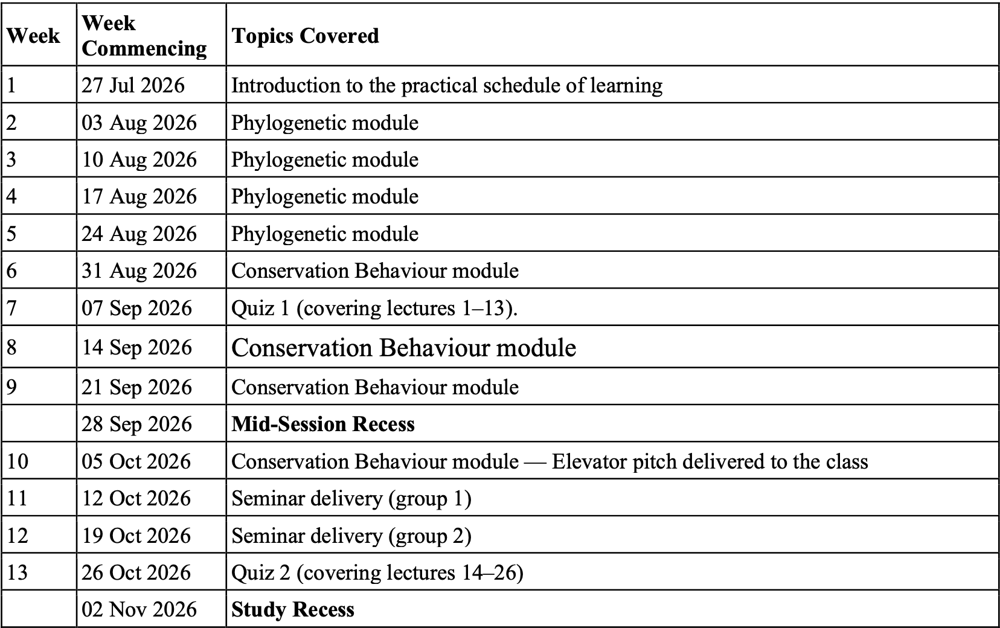
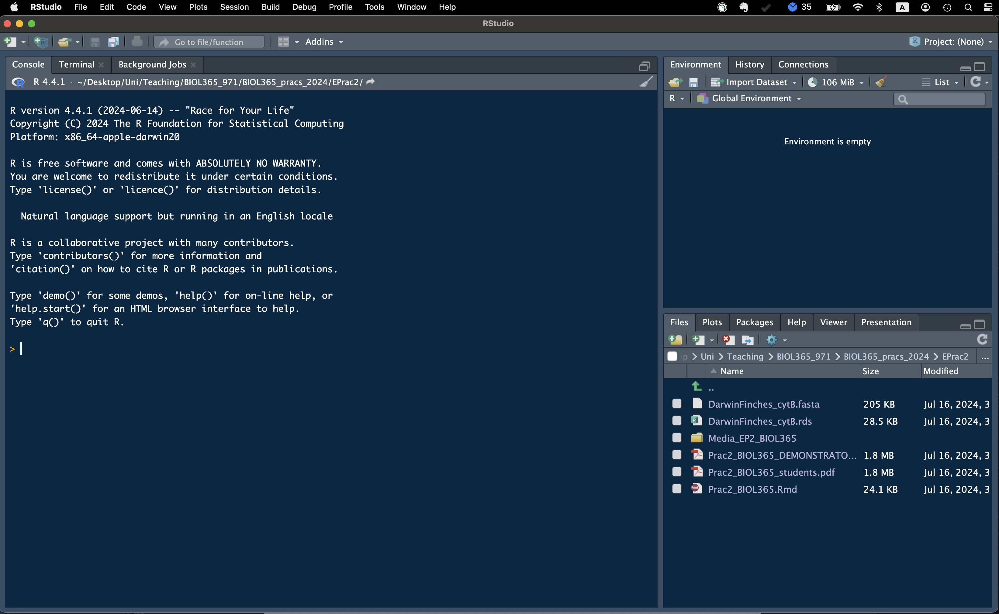
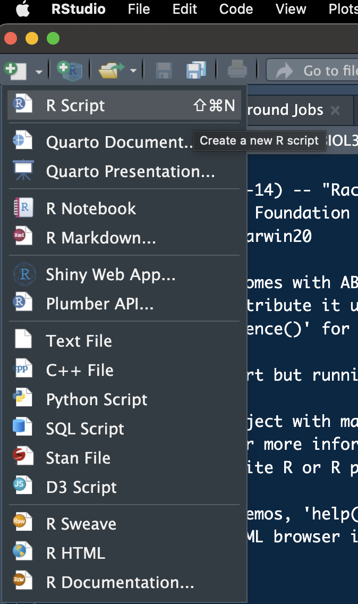
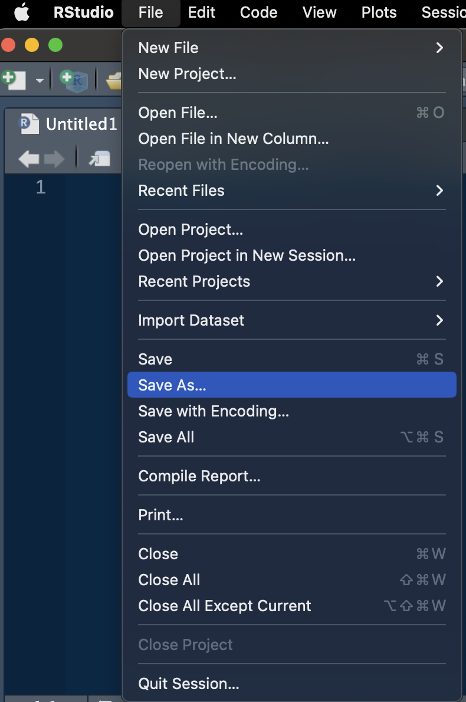

# Evolution Prac 1 — Getting ready!

Abstract

This practical class should not be particularly onerous. Today is mostly
focussed on giving you a very brief overview of what is to come in this
practical series and to get you thinking about what you might like to do
for your Grant Proposal assignment.  
R is a very useful programming language that’s open access and widely
used in science. We don’t expect you to become a master by the end of
this topic or to understand everything that you’re doing right now. But,
by helping you get started and giving you robust example code we hope to
enable you to succeed using R in the future, should you chose to pick it
up more consistently.

## 1 Introduction to the practical schedule

Practicals will be run as the below practical schedule from the course
handbook. Following this practical, we will have:

1.  Four weeks of the *Phylogenetics Module*. The first three weeks will
    be focused on teaching you phylogenetics in the *R* programming
    language and the fourth will be aimed at providing support for your
    **Grant Proposal** assignment.
2.  We will have four weeks of the *Conservation Behaviour Module*. This
    module will focus on teaching you about human-wildlife conflicts and
    supporting you in your **Elevator Pitch** assignment.
3.  In weeks **7** and **13**, instead of a prac, we will have in-class
    quizzes, each worth 20% of your final grade and base on the lectures
    delivered previously.
4.  In weeks **11** and **12**, you will deliver your seminars to the
    class, instead of undertaking a standard practical.



**Attention:**  
**Once you have completed all of the questions** and **shown your
demonstrator or Lecturer** the answers and the outputs, you may leave.
Or, feel free to hang around, play, or help your classmates.

## 2 Working together

You won’t be forming groups *per se*, but it is possible to work
together on benches to provide your neighbours help with code and the
like. I do encourage this as your neighbour may have already overcome
errors that you have come across and both the student helping and the
one receiving help should benefit! Of course, we will be here to help
you as well; your demonstrators should have the answers and, if not,
your lecturers will.

## 3 Start thinking about a macroevolutionary question

“Macroevolutionary questions” may sound like an arcane concept. However,
they are really just questions that we ask with the goal of uncovering
broad scale (almost always across multiple species) evolutionary
patterns. Maybe that doesn’t help… But, a simple question like “*I
wonder how many bird species have purple feathers*” could easily be
addressed as a macroevolutionary question! But, that might be too broad
of a question…

Because I work on bees, I might have a question about a particular bee
subgenus. Say the halictid (from the family Halictidae) bee subgenus
*Lasioglossum (Homalictus)*. I might come up with a hypothesis such as
“*More bees in the subgenus* Homalictus *are metalic in colouration than
non-metalic*”. That’s a simple enough question and I suspect that it’s
true… but these bees are found all over the place (Australia to Southern
China and India)! Maybe I could narrow it down to a place where there
are fewer species and lots of genetic data available. I happen to work
on the Fijian *Homalictus*, so I could hypothesise that “*More FIJIAN
bees in the subgenus* Homalictus *have metallic abdomens than
non-metallic abdomens*” — a question about the prevalence of a state.
The data to answer this question could be derived from
[here](https://uowmailedu-my.sharepoint.com/:b:/g/personal/jdorey_uow_edu_au/EY-bgdariG1BmtpnuPjMHagBMtcrx9BQaxgHqgpl2bo5Aw?e=BFcQVj).
You could also hypothesise that “*Homalictus* bees are more likely to
move from having metallic abdomens to non-metallic abdomens than the
other way around” — a question about how frequently states evolve and
their direction.


Photos of various Fijian *Lasioglossum (Homalictus)* (Hymenoptera:
Halictidae) bees by James Dorey

You get the idea. Now we are talking in terms of macroevolution.

You might have a question that you want to answer, or you might have a
group that you are interested in. But, you need to choose a taxon that
is big enough (say \>7 species) and limit yourself to a subset of those
species (\<30) for which both genetic data and trait data either exist
or can easily be harvested. You could start by searching in **Google
Scholar**, or **Scopus**, for something like “*macroevolution bears*”.
Then you can see what genetic data are available and what morphological
data are available. While you can use those same data for your
assignment, you **must ask a novel question using those data or a subset
of those data**.

Talk among your table or with your desk mate and with your
demonstrators. You don’t need to have a project set in stone by any
means, but it’s good to get started on thinking about this and what you
might be able to do!

## 4 Getting ready with *R* and *RStudio*

Your computers should already have *R* and *RStudio* installed. If they
do not, or you are using a personal computer, feel free to follow the
steps below to prepare yourself for the week 2 practicals, where we will
dive in pretty quickly.

If you have a moment of spare time you may consider skimming the below
text, especially the “Script preparation” and “What’s coming next week”
sections.

### 4.1 Install *R*

If *R* is NOT installed on your computer already, we will go ahead and
do that now. Please visit the [**CSIRO mirror for
CRAN**](https://cran.csiro.au) and download the relevant version of *R*
for your operating system. Then, follow the instructions to install it
on your computer.

### 4.2 Install *RStudio*

*R* is a command-land programming language and *R*, by itself is
horribly ugly and I don’t like the idea of working in it directly. For
this reason, most users will use R within a much nicer interface
program, called *RStudio*. Download the free version of
[RSTudio](https://posit.co/download/rstudio-desktop/). Now, when both
programs are installed, you can simply open up RStudio and get coding!

We are not going to do much with *R* today, don’t worry, but I’d like to
get you a little acquainted and at least start installing some packages
in *R* so that we are ready for the following weeks.

### 4.3 Running *R* in *RStudio*

Before we get into working in *RStudio*, let’s make a folder where we
will save all of our practical outputs and related files. Mine is called
“*BIOL365_pracs_2025*”. Notice how I have used underscores instead of
spaces? This is very good practice to not have ANY spaces in your folder
paths where you want to do coding stuff. Most of the time it’s fine…
but, **pro tip**, sometimes, it will cause problems that might be hard
to track down!

When you open up *RStudio* for the first time, it will look a little
something like the below (Fig. 2). But, without the funky colour scheme.



An empty *RStudio* page

In the top left-hand side drop down, there is a white page with a green
plus sign on it. Click on that and you can then select to add a new “R
Script” (Fig. 3). We can then go ahead and save this blank script in a
folder for these pracs (Fig. 4). I have called this script
“*MyFirstRScript.R*”.



How to add a new *R* Script



How to save your new *R* Script

It’s also VERY good practice to leave some info about who made this
script, why, and how they can get in touch with you! Go ahead and copy
the below into your script and then personalise it with your details!

``` r

# BIOL365 at the University of Wollongong, very basic R stuff
# Getting ready to do stuff with R
# Written by FirstName LastName YEAR-MONTH-DAY University of Wollongong; your@email.here
```

Did you notice all of the hashtags? These are comments and *R* will
ignore them (Fig. 5)!


My colour scheme shows hashtags in blue, and actual code in white. Very
handy.

### 4.4 Script preparation

#### 4.4.1 Working directory primer

I know that many of you struggle with the concept of **working
directories** and I think that they are important enough, as some of you
have pointed out — thank you :), to describe in some detail. Just like
some of the content that we cover in Conservation Biology (e.g., think
about macroecology), the name sounds much scarier than the reality and
accepting that will hopefully help you master these concepts. *(Upon
reflection, this may be a poor example for many.)* Similarly **working
directories** are actually quite simple! One way to look at a working
directory is to think of them as a breadcrumb trail from the **root
directory** where all of your computer’s files are stored directly to
your working file (**working directory**) that contains your **R**
project, code, files, etc.

You could imagine that your **root directory** is your closet (e.g., `/`
on Mac/Linux and `C:\` on Windows). Within your closet you may have
shelves, hangers, shoe racks, *no, don’t look at the skeletons*, a
laundry basket, etc. These are all things that you might use to keep
your closet nice, tidy, and organised — **these are your folders**.
Within your drawers you may also have further compartments which you
could also consider **folders** and, in this way, you closet is a
hierarchical system containing smaller and smaller storage units
(**folders**). Each of these units may contain further units
(**folders**), and each of these may also contain items like shirts,
jewelry, shoes… To take our figure example below the item “Shirt” is
clothing; this tells us about the use of the item. In the same way, file
extensions (e.g., `file.extension`) tells the computer what a file is
and how to open it! You are likely very used to these things like images
(`.jpg`, `.tiff`, `.png`), text files (`.docx`, `.txt`, `.r`), or data
files (`.csv`, `.xlsx`, `.rda`). Hence, we might say `Shirt.cloth`!

These items are the **files**, just like your `.r` file that holds the
text of your code!


**If we imagine that the closet is our computer and each box is a file,
to find the file path from the bag (orange) to the computer, we would
write our breadcrumb as `/Closet/Box2/Shirt.cloth`.**

This is essentially what your computer looks like!

> What about cloud storage like *OneDrive* or *GoogleDrive*? Well,
> imagine that you keep all of your stuff in Elon Musk’s closet and say
> “Let me keep all of my stuff in your closet and use it whenever I
> want, because my closet is just a matchbox”. And then you trust all of
> your stuff to Elon and hope that he doesn’t cut it, lose it, or sell
> it to someone else. This is probably fine, but you often rely on
> internet access to be able to use stuff in your closet.

Each time that you start an **R** project, you make a decision about
where to store this in your closet. Maybe you store it somewhere very
hidden, or maybe it’s the first thing there when you open the door (near
the **root directory**). Every time that you want to access that
project, and the associated items (**files**), you might decide that you
need to search the closet to find everything (*and trust me, finding
that anything in your closet that you used two years ago is not
easy!!*). This is what you do when you choose your directory from the
**Files** tab in RStudio. It’s a headache.

Alternatively, imagine that when you next wanted to find everything
associated with your project you just had to find the .r code file and
at the very top there was a magical string attached to you **working
directory** and every item that you needed needed for your project. This
is what we are doing below.

**Attention:**  
Windows gives file paths in a different way than everyone else. :(

**Windows:**  
On **Windows**, to find your file paths, right click on a file or folder
and select “Properties”. Then, you can copy the file “Location”. But,
you will need to change all of the backslashes (`\`) into forward
slashes (`/`). For example:

      "D:\Users\jamesdorey\..." 

Becomes…

      "D:/Users/jamesdorey/..."

**MacOS:**  
On Mac or Linux, this is much easier. Using a Mac, you can right-click
on a file and hold the “option” key to `Copy "file/folder" as Pathname`.
Simply paste this into R and you will get something like the below
automatically:

    '/Users/jamesdorey/...'

#### 4.4.2 Setting the working directory

Let us begin by telling *R* where our working directory (the folder that
you made above) actually is. My “*BIOL365_pracs_2025*” folder is found
at the end of the path:

“*/Users/jamesdorey/Desktop/Uni/Teaching/BIOL365_971/BIOL365_pracs_2025/Prac1/*”
(see again, no spaces!). So, I can run the below:

``` r

  # Set the RootPath to your folder
RootPath <- "/Users/jamesdorey/Desktop/Uni/Teaching/BIOL365_971/BIOL365_pracs_2025/Prac1/BIOL365_pracs_2025"
  # You can then set this as the project's working directory. 
  # This is where R will first look to find 
  # or save data as a default
setwd(RootPath)
```

Congratulations, you have set your working directory! *R* can still
access files outside of this folder, but it will look there by default
after you set it (this must be set each time you open *R*).

**A quick pro-tip:** You can run code, once it’s entered into your
script by having your mouse click on, or above, the line that you want
to run and then pressing the “**Run**” button on the top right hand side
of the script window. That’s a right pain. On mac you can simply use
“**command+enter**” and on PC you can use “**control+enter**” to run
your code. It’ll make you life easier and quicker.

> **Q1:** What is your working directory? Are you running Windows or Mac
> and did you need to change the path to make this work?

#### 4.4.3 Install packages

Let us also quickly install a few packages that we’ll need to start with
next week (you mostly only need to do this once per package and per
version of *R*).

``` r

#  This package is for data management and table manipulation
install.packages("dplyr")
# This package lets us use tidy pipes; %>%
install.packages("magrittr")
```

You may have seen that more than one package was installed when you ran
the above code. That’s normal, many packages depend on other packages to
work.

#### 4.4.4 Load packages

The last *R* thing that I will get you to do today is to load the
packages into *R* (this also should be done every time you open *R*, for
the relevant packages). You need to do this because you may not always
want EVERY package that you have ever downloaded to be accessible from
in *R*… it can cause issues. In this way, you can be more selective
about which ones are active.

``` r

library(dplyr)
library(magrittr)
```

## 5 Read in data

I’m going to borrow this part from another course that I teach into,
BIOL361 and so this might be familiar to some of you. But, getting you a
little familiar with data in R this week when the mental load is a
little lower should help!

Let’s go ahead and download a dataset from [this
publication](https://doi.org/10.3389/fevo.2024.1339446) to play with. We
can start by simply downloading it using the below code (or you could
copy the url to the website and download it via your browser, but why
not do it all in R?).

``` r

utils::download.file(url = "https://raw.githubusercontent.com/jbdorey/BIOL361_25/main/DoreyPrac1/SuppCollectionInfo_7Aug2023.csv",
                     destfile = "SuppCollectionInfo_7Aug2023.csv",
                     method="curl")
```

Okay, we have downloaded these data and you can go ahead and look in
your working directory (*if you’re not sure type “getwd()” into R to see
where this is*). Let’s go ahead and read it into R and we can also look
at it once it’s read in. To do this, we will use the **tidyverse**
package, **readr**.

``` r

  # read in the data using readr
HylaeusData <- readr::read_csv("SuppCollectionInfo_7Aug2023.csv")
#> New names:
#> Rows: 84 Columns: 42
#> ── Column specification
#> ──────────────────────────────────── Delimiter: "," chr
#> (31): recordNumber, otherCatalogNumbers, catalogNum... dbl
#> (7): year, month, day, individualCount, coordinate... lgl
#> (2): ...27, ...42 date (1): eventDate time (1): eventTime
#> ℹ Use `spec()` to retrieve the full column specification
#> for this data. ℹ Specify the column types or set
#> `show_col_types = FALSE` to quiet this message.
#> • `` -> `...27`
#> • `` -> `...42`
```

Now that we have read it in, you can view the data either by simply
running “`HylaeusData`” or “`View(HylaeusData)`”. You can also have a
scroll below of the dataset.

> **Q2:** After *View()*ing the data, tell us, what is in the third
> column 5th row?

| recordNumber | otherCatalogNumbers | catalogNumber | associatedSequences | scientificName | identifiedBy | sex | typeStatus | Scribe | eventDate | year | month | day | verbatimEventDate | eventTime | individualCount | order | family | genus | subgenus | specificEpithet | cladeDesignation | GPS# | verbatimElevation | coordinateUncertaintyInMeters | Google Earth Elevation | …27 | decimalLatitude | decimalLongitude | georeferencedBy | recordedBy | basisOfRecord | samplingProtocol | associatedTaxa | locality | island | country | fieldNotes | institutionCode | identificationReferences | samplingEffort | …42 |
|:---|:---|:---|:---|:---|:---|:---|:---|:---|:---|---:|---:|---:|:---|:---|---:|:---|:---|:---|:---|:---|:---|:---|:---|---:|:---|:---|---:|---:|:---|:---|:---|:---|:---|:---|:---|:---|:---|:---|:---|:---|:---|
| FJVL6b_N02_16 | NA | FBA 063182 | NA | Hylaeus albaeus | Karl Magnacca | female | NA | NA | 2003-12-15 | 2003 | 12 | 15 | 24.XI-15.XII.\[20\]03 | NA | 1 | Hymenoptera | Colletidae | Hylaeus | Prosopisteron | albaeus | CladeB | NA | 55 m | NA | NA | NA | -18.16940 | 177.4847 | NA | E Schlinger, M Tokotaʻa | PreservedSpecimen | Malaise | NA | Sigatoka Sand Dunes N.P.; 1.1 km SSW of Volivoli Vlg. | Viti Levu | Fiji | NA | BPBM | NA | 21 days | NA |
| FJVL6b_M02_16 | NA | FBA 063181 | NA | Hylaeus albaeus | Karl Magnacca | female | NA | NA | 2003-12-15 | 2003 | 12 | 15 | 24.XI-15.XII.\[20\]03 | NA | 1 | Hymenoptera | Colletidae | Hylaeus | Prosopisteron | albaeus | CladeB | NA | 55 m | NA | NA | NA | -18.16940 | 177.4847 | NA | E Schlinger, M Tokotaʻa | PreservedSpecimen | Malaise | NA | Sigatoka Sand Dunes N.P., malaise 1.1 km SSW of Volivoli Vlg. | Viti Levu | Fiji | NA | BPBM | NA | 21 days | NA |
| FJVL6b_M02_16 | NA | FBA 063184 | NA | Hylaeus albaeus | Karl Magnacca | female | NA | NA | 2003-12-15 | 2003 | 12 | 15 | 24.XI-15.XII.\[20\]03 | NA | 1 | Hymenoptera | Colletidae | Hylaeus | Prosopisteron | albaeus | CladeB | NA | 55 m | NA | NA | NA | -18.16940 | 177.4847 | NA | E Schlinger, M Tokotaʻa | PreservedSpecimen | Malaise | NA | Sigatoka Sand Dunes N.P., malaise 1.1 km SSW of Volivoli Vlg. | Viti Levu | Fiji | NA | BPBM | NA | 21 days | NA |
| FJVL6b_M02_16 | NA | FBA 063195 | NA | Hylaeus albaeus | Karl Magnacca | female | NA | NA | 2003-12-15 | 2003 | 12 | 15 | 24.XI-15.XII.\[20\]03 | NA | 1 | Hymenoptera | Colletidae | Hylaeus | Prosopisteron | albaeus | CladeB | NA | 55 m | NA | NA | NA | -18.16940 | 177.4847 | NA | E Schlinger, M Tokotaʻa | PreservedSpecimen | Malaise | NA | Sigatoka Sand Dunes N.P., malaise 1.1 km SSW of Volivoli Vlg. | Viti Levu | Fiji | NA | BPBM | NA | 21 days | NA |
| FJVL6b_M02_19 | NA | FBA 064760 | NA | Hylaeus albaeus | Karl Magnacca | female | NA | NA | 2004-05-17 | 2004 | 5 | 17 | 5.IV-17.V.\[20\]04 | NA | 1 | Hymenoptera | Colletidae | Hylaeus | Prosopisteron | albaeus | CladeB | NA | 55 m | NA | NA | NA | -18.16940 | 177.4847 | NA | E Schlinger, M Tokotaʻa | PreservedSpecimen | Malaise | NA | Sigatoka Sand Dunes N.P., malaise 1.1 km SSW of Volivoli Vlg. | Viti Levu | Fiji | NA | BPBM | NA | 42 days | NA |
| CFJRR_NH9 | CFJRR_NH9 | NA | NH9 | Hylaeus albaeus | James B Dorey | male | Holotype | NA | 2016-04-01 | 2016 | 4 | NA | NA | NA | 1 | Hymenoptera | Colletidae | Hylaeus | Prosopisteron | albaeus | CladeB | NA | 3 m | 20 | NA | NA | -17.36030 | 178.1537 | NA | MP Schwarz | PreservedSpecimen | Sweep net | Metrosideros collina var. collina | Rakiraki hotel | Viti Levu | Fiji | NA | SAMA | Michener, CD. (2007). The Bees of the World; Houston, TF. (1981). A Revision of the Australian Hylaeine Bees (Hymenoptera : Colletidae) | NA | NA |
| NA | NA | NA | NA | Hylaeus albaeus | Karl Magnacca | female | NA | NA | 1970-10-01 | 1970 | 10 | 1 | 1.X.\[19\]70 | NA | 1 | Hymenoptera | Colletidae | Hylaeus | Prosopisteron | albaeus | CladeB | NA | 500–600 m | 20000 | NA | NA | -17.80000 | 177.7000 | JB Dorey | NLH Krauss | PreservedSpecimen | NA | NA | Nausori Highlands | Viti Levu | Fiji | NA | BPBM | NA | NA | NA |
| NA | NA | NA | NA | Hylaeus albaeus | Karl Magnacca | female | NA | NA | 1970-10-01 | 1970 | 10 | 1 | 1.X.\[19\]71; \[possibly year wrong? printed label corrected by hand on the other specimens, not on this one\] | NA | 1 | Hymenoptera | Colletidae | Hylaeus | Prosopisteron | albaeus | CladeB | NA | 500–600 m | 20000 | NA | NA | -17.80000 | 177.7000 | JB Dorey | NLH Krauss | PreservedSpecimen | NA | NA | Nausori Highlands | Viti Levu | Fiji | NA | BPBM | NA | NA | NA |
| FJ-6B Malaise | NA | FBA 026755 | NA | Hylaeus albaeus | Karl Magnacca | female | NA | NA | 2002-12-13 | 2002 | 12 | 13 | 1.XII–13.XII.\[20\]02 | NA | 1 | Hymenoptera | Colletidae | Hylaeus | Prosopisteron | albaeus | CladeB | NA | 100 m | NA | NA | NA | -18.16000 | 177.5000 | NA | M Irwin, E Schlinger, M Tokotaʻa | PreservedSpecimen | Malaise | NA | Sigatoka Prov., Sigatoka Sand Dunes N.P. | Viti Levu | Fiji | NA | BPBM | NA | 12 days | NA |
| FJ-6B Malaise | NA | FBA 026760 | NA | Hylaeus albaeus | Karl Magnacca | male | NA | NA | 2002-12-13 | 2002 | 12 | 13 | 1.XII–13.XII.\[20\]02 | NA | 1 | Hymenoptera | Colletidae | Hylaeus | Prosopisteron | albaeus | CladeB | NA | 100 m | NA | NA | NA | -18.16000 | 177.5000 | NA | M Irwin, E Schlinger, M Tokotaʻa | PreservedSpecimen | Malaise | NA | Sigatoka Prov., Sigatoka Sand Dunes N.P. | Viti Levu | Fiji | NA | BPBM | NA | 12 days | NA |
| FJ-6C Malaise | NA | FBA 035880 | NA | Hylaeus albaeus | Karl Magnacca | female | NA | NA | 2003-12-13 | 2003 | 12 | 13 | 1.XII–13.XII.\[20\]03 | NA | 1 | Hymenoptera | Colletidae | Hylaeus | Prosopisteron | albaeus | CladeB | NA | 100 m | NA | NA | NA | -18.16000 | 177.5000 | NA | M Irwin, E Schlinger, M Tokotaʻa | PreservedSpecimen | Malaise | NA | Sigatoka Sand Dunes N.P. | Viti Levu | Fiji | NA | BPBM | NA | 12 days | NA |
| FJ-6C Malaise | NA | FBA 035899 | NA | Hylaeus albaeus | Karl Magnacca | male | NA | NA | 2003-12-13 | 2003 | 12 | 13 | 1.XII–13.XII.\[20\]03 | NA | 1 | Hymenoptera | Colletidae | Hylaeus | Prosopisteron | albaeus | CladeB | NA | 100 m | NA | NA | NA | -18.16000 | 177.5000 | NA | M Irwin, E Schlinger, M Tokotaʻa | PreservedSpecimen | Malaise | NA | Sigatoka Sand Dunes N.P. | Viti Levu | Fiji | NA | BPBM | NA | 12 days | NA |
| GA19MCE76 | 19FJ51 | SAMA | MSAPB4748_19 | Hylaeus apertus | James B Dorey | female | NA | MCElmer | 2019-04-29 | 2019 | 4 | 29 | NA | 13:12:00 | 1 | Hymenoptera | Colletidae | Hylaeus | Prosopisteron | apertus | CladeE | Avenza, android (MCE’s phone) | 875 m | 10 | 872 | NA | -16.83622 | -179.9730 | NA | JBDorey | PreservedSpecimen | General sweep | Metrosideros collina var. collina | Taveuni - Des Voeux track | Taveuni | Fiji | JBDorey noticed little red flowers at the top of a high tree and began sweeping with the long net. Tree was about 10-15 m tall and likely a Myrtaceae. After first sweep noticed some colletids, likely Hylaeus sp. And we continued sweeping for a while catching colletids and Homalictus. There were many plants near this tree that we did not find bees on, including Stachytarpheta urticifolia, Polygala paniculata and touchy feely plant. A small sample of the tree was taken, with some photos, which were later identified by Marika Tuiwawa as Metrosideros collina var. collina. Sunny and warm. | SAMA | Michener, CD. (2007). The Bees of the World; Houston, TF. (1981). A Revision of the Australian Hylaeine Bees (Hymenoptera : Colletidae) | NA | NA |
| GA19MCE77 | 19FJ59 | SAMA | NA | Hylaeus apertus | James B Dorey | female | NA | MCElmer | 2019-04-29 | 2019 | 4 | 29 | NA | 13:20:00 | 1 | Hymenoptera | Colletidae | Hylaeus | Prosopisteron | apertus | CladeE | Avenza, android (MCE’s phone) | 875 m | 10 | 872 | NA | -16.83622 | -179.9730 | NA | JBDorey | PreservedSpecimen | General sweep | Metrosideros collina var. collina | Taveuni - Des Voeux track | Taveuni | Fiji | JBDorey noticed little red flowers at the top of a high tree and began sweeping with the long net. Tree was about 10-15 m tall and likely a Myrtaceae. After first sweep noticed some colletids, likely Hylaeus sp. And we continued sweeping for a while catching colletids and Homalictus. There were many plants near this tree that we did not find bees on, including Stachytarpheta urticifolia, Polygala paniculata and touchy feely plant. A small sample of the tree was taken, with some photos, which were later identified by Marika Tuiwawa as Metrosideros collina var. collina. Sunny and warm. | SAMA | Michener, CD. (2007). The Bees of the World; Houston, TF. (1981). A Revision of the Australian Hylaeine Bees (Hymenoptera : Colletidae) | NA | NA |
| GA19MCE77 | 19FJ61 | SAMA | NA | Hylaeus apertus | James B Dorey | female | NA | MCElmer | 2019-04-29 | 2019 | 4 | 29 | NA | 13:20:00 | 1 | Hymenoptera | Colletidae | Hylaeus | Prosopisteron | apertus | CladeE | Avenza, android (MCE’s phone) | 875 m | 10 | 872 | NA | -16.83622 | -179.9730 | NA | JBDorey | PreservedSpecimen | General sweep | Metrosideros collina var. collina | Taveuni - Des Voeux track | Taveuni | Fiji | JBDorey noticed little red flowers at the top of a high tree and began sweeping with the long net. Tree was about 10-15 m tall and likely a Myrtaceae. After first sweep noticed some colletids, likely Hylaeus sp. And we continued sweeping for a while catching colletids and Homalictus. There were many plants near this tree that we did not find bees on, including Stachytarpheta urticifolia, Polygala paniculata and touchy feely plant. A small sample of the tree was taken, with some photos, which were later identified by Marika Tuiwawa as Metrosideros collina var. collina. Sunny and warm. | SAMA | Michener, CD. (2007). The Bees of the World; Houston, TF. (1981). A Revision of the Australian Hylaeine Bees (Hymenoptera : Colletidae) | NA | NA |
| GA19MCE78 | 19FJ63 | SAMA | NA | Hylaeus apertus | James B Dorey | female | NA | MCElmer | 2019-04-29 | 2019 | 4 | 29 | NA | 13:30:00 | 1 | Hymenoptera | Colletidae | Hylaeus | Prosopisteron | apertus | CladeE | Avenza, android (MCE’s phone) | 875 m | 10 | 872 | NA | -16.83622 | -179.9730 | NA | JBDorey | PreservedSpecimen | General sweep | Metrosideros collina var. collina | Taveuni - Des Voeux track | Taveuni | Fiji | JBDorey noticed little red flowers at the top of a high tree and began sweeping with the long net. Tree was about 10-15 m tall and likely a Myrtaceae. After first sweep noticed some colletids, likely Hylaeus sp. And we continued sweeping for a while catching colletids and Homalictus. There were many plants near this tree that we did not find bees on, including Stachytarpheta urticifolia, Polygala paniculata and touchy feely plant. A small sample of the tree was taken, with some photos, which were later identified by Marika Tuiwawa as Metrosideros collina var. collina. Sunny and warm. | SAMA | Michener, CD. (2007). The Bees of the World; Houston, TF. (1981). A Revision of the Australian Hylaeine Bees (Hymenoptera : Colletidae) | NA | NA |
| GA19MCE81 | 19FJ74 | SAMA | NA | Hylaeus apertus | James B Dorey | female | NA | MCElmer | 2019-04-29 | 2019 | 4 | 29 | NA | 13:42:00 | 1 | Hymenoptera | Colletidae | Hylaeus | Prosopisteron | apertus | CladeE | Avenza, android (MCE’s phone) | 875 m | 10 | 872 | NA | -16.83622 | -179.9730 | NA | JBDorey | PreservedSpecimen | General sweep | Metrosideros collina var. collina | Taveuni - Des Voeux track | Taveuni | Fiji | JBDorey noticed little red flowers at the top of a high tree and began sweeping with the long net. Tree was about 10-15 m tall and likely a Myrtaceae. After first sweep noticed some colletids, likely Hylaeus sp. And we continued sweeping for a while catching colletids and Homalictus. There were many plants near this tree that we did not find bees on, including Stachytarpheta urticifolia, Polygala paniculata and touchy feely plant. A small sample of the tree was taken, with some photos, which were later identified by Marika Tuiwawa as Metrosideros collina var. collina. Sunny and warm. | SAMA | Michener, CD. (2007). The Bees of the World; Houston, TF. (1981). A Revision of the Australian Hylaeine Bees (Hymenoptera : Colletidae) | NA | NA |
| GA19MCE76 | 19FJ53 | SAMA | NA | Hylaeus apertus | James B Dorey | female | NA | MCElmer | 2019-04-29 | 2019 | 4 | 29 | NA | 13:12:00 | 1 | Hymenoptera | Colletidae | Hylaeus | Prosopisteron | apertus | CladeE | Avenza, android (MCE’s phone) | 875 m | 10 | 872 | NA | -16.83622 | -179.9730 | NA | JBDorey | PreservedSpecimen | General sweep | Metrosideros collina var. collina | Taveuni - Des Veoux track | Taveuni | Fiji | JBDorey noticed little red flowers at the top of a high tree and began sweeping with the long net. Tree was about 10-15 m tall and likely a Myrtaceae. After first sweep noticed some colletids, likely Hylaeus sp. And we continued sweeping for a while catching colletids and Homalictus. There were many plants near this tree that we did not find bees on, including Stachytarpheta urticifolia, Polygala paniculata and touchy feely plant. A small sample of the tree was taken, with some photos, which were later identified by Marika Tuiwawa as Metrosideros collina var. collina. Sunny and warm. | SAMA | Michener, CD. (2007). The Bees of the World; Houston, TF. (1981). A Revision of the Australian Hylaeine Bees (Hymenoptera : Colletidae) | NA | NA |
| GA19MCE77 | 19FJ55 | NA | NA | Hylaeus apertus | James B Dorey | female | NA | MCElmer | 2019-04-29 | 2019 | 4 | 29 | NA | 13:20:00 | 1 | Hymenoptera | Colletidae | Hylaeus | Prosopisteron | apertus | CladeE | Avenza, android (MCE’s phone) | 875 m | 10 | 872 | NA | -16.83622 | -179.9730 | NA | JBDorey | PreservedSpecimen | General sweep | Metrosideros collina var. collina | Taveuni - Des Veoux track | Taveuni | Fiji | JBDorey noticed little red flowers at the top of a high tree and began sweeping with the long net. Tree was about 10-15 m tall and likely a Myrtaceae. After first sweep noticed some colletids, likely Hylaeus sp. And we continued sweeping for a while catching colletids and Homalictus. There were many plants near this tree that we did not find bees on, including Stachytarpheta urticifolia, Polygala paniculata and touchy feely plant. A small sample of the tree was taken, with some photos, which were later identified by Marika Tuiwawa as Metrosideros collina var. collina. Sunny and warm. | SAMA | Michener, CD. (2007). The Bees of the World; Houston, TF. (1981). A Revision of the Australian Hylaeine Bees (Hymenoptera : Colletidae) | NA | NA |
| GA19MCE77 | 19FJ57 | NA | NA | Hylaeus apertus | James B Dorey | female | NA | MCElmer | 2019-04-29 | 2019 | 4 | 29 | NA | 13:20:00 | 1 | Hymenoptera | Colletidae | Hylaeus | Prosopisteron | apertus | CladeE | Avenza, android (MCE’s phone) | 875 m | 10 | 872 | NA | -16.83622 | -179.9730 | NA | JBDorey | PreservedSpecimen | General sweep | Metrosideros collina var. collina | Taveuni - Des Veoux track | Taveuni | Fiji | JBDorey noticed little red flowers at the top of a high tree and began sweeping with the long net. Tree was about 10-15 m tall and likely a Myrtaceae. After first sweep noticed some colletids, likely Hylaeus sp. And we continued sweeping for a while catching colletids and Homalictus. There were many plants near this tree that we did not find bees on, including Stachytarpheta urticifolia, Polygala paniculata and touchy feely plant. A small sample of the tree was taken, with some photos, which were later identified by Marika Tuiwawa as Metrosideros collina var. collina. Sunny and warm. | SAMA | Michener, CD. (2007). The Bees of the World; Houston, TF. (1981). A Revision of the Australian Hylaeine Bees (Hymenoptera : Colletidae) | NA | NA |
| GA19MCE78 | 19FJ64 | NA | NA | Hylaeus apertus | James B Dorey | female | NA | MCElmer | 2019-04-29 | 2019 | 4 | 29 | NA | 13:30:00 | 1 | Hymenoptera | Colletidae | Hylaeus | Prosopisteron | apertus | CladeE | Avenza, android (MCE’s phone) | 875 m | 10 | 872 | NA | -16.83622 | -179.9730 | NA | JBDorey | PreservedSpecimen | General sweep | Metrosideros collina var. collina | Taveuni - Des Veoux track | Taveuni | Fiji | JBDorey noticed little red flowers at the top of a high tree and began sweeping with the long net. Tree was about 10-15 m tall and likely a Myrtaceae. After first sweep noticed some colletids, likely Hylaeus sp. And we continued sweeping for a while catching colletids and Homalictus. There were many plants near this tree that we did not find bees on, including Stachytarpheta urticifolia, Polygala paniculata and touchy feely plant. A small sample of the tree was taken, with some photos, which were later identified by Marika Tuiwawa as Metrosideros collina var. collina. Sunny and warm. | SAMA | Michener, CD. (2007). The Bees of the World; Houston, TF. (1981). A Revision of the Australian Hylaeine Bees (Hymenoptera : Colletidae) | NA | NA |
| GA19MCE79 | 19FJ66 | NA | NA | Hylaeus apertus | James B Dorey | female | NA | MCElmer | 2019-04-29 | 2019 | 4 | 29 | NA | 13:37:00 | 1 | Hymenoptera | Colletidae | Hylaeus | Prosopisteron | apertus | CladeE | Avenza, android (MCE’s phone) | 875 m | 10 | 872 | NA | -16.83622 | -179.9730 | NA | MIStevens, MCElmer | PreservedSpecimen | General sweep | Metrosideros collina var. collina | Taveuni - Des Veoux track | Taveuni | Fiji | JBDorey noticed little red flowers at the top of a high tree and began sweeping with the long net. Tree was about 10-15 m tall and likely a Myrtaceae. After first sweep noticed some colletids, likely Hylaeus sp. And we continued sweeping for a while catching colletids and Homalictus. There were many plants near this tree that we did not find bees on, including Stachytarpheta urticifolia, Polygala paniculata and touchy feely plant. A small sample of the tree was taken, with some photos, which were later identified by Marika Tuiwawa as Metrosideros collina var. collina. Sunny and warm. | SAMA | Michener, CD. (2007). The Bees of the World; Houston, TF. (1981). A Revision of the Australian Hylaeine Bees (Hymenoptera : Colletidae) | NA | NA |
| GA19MCE80 | 19FJ69 | NA | NA | Hylaeus apertus | James B Dorey | female | NA | MCElmer | 2019-04-29 | 2019 | 4 | 29 | NA | 13:42:00 | 1 | Hymenoptera | Colletidae | Hylaeus | Prosopisteron | apertus | CladeE | Avenza, android (MCE’s phone) | 875 m | 10 | 872 | NA | -16.83622 | -179.9730 | NA | JBDorey | PreservedSpecimen | General sweep | Metrosideros collina var. collina | Taveuni - Des Veoux track | Taveuni | Fiji | JBDorey noticed little red flowers at the top of a high tree and began sweeping with the long net. Tree was about 10-15 m tall and likely a Myrtaceae. After first sweep noticed some colletids, likely Hylaeus sp. And we continued sweeping for a while catching colletids and Homalictus. There were many plants near this tree that we did not find bees on, including Stachytarpheta urticifolia, Polygala paniculata and touchy feely plant. A small sample of the tree was taken, with some photos, which were later identified by Marika Tuiwawa as Metrosideros collina var. collina. Sunny and warm. | SAMA | Michener, CD. (2007). The Bees of the World; Houston, TF. (1981). A Revision of the Australian Hylaeine Bees (Hymenoptera : Colletidae) | NA | NA |
| GA19MCE81 | 19FJ73 | NA | NA | Hylaeus apertus | James B Dorey | female | NA | MCElmer | 2019-04-29 | 2019 | 4 | 29 | NA | 13:42:00 | 1 | Hymenoptera | Colletidae | Hylaeus | Prosopisteron | apertus | CladeE | Avenza, android (MCE’s phone) | 875 m | 10 | 872 | NA | -16.83622 | -179.9730 | NA | JBDorey | PreservedSpecimen | General sweep | Metrosideros collina var. collina | Taveuni - Des Veoux track | Taveuni | Fiji | JBDorey noticed little red flowers at the top of a high tree and began sweeping with the long net. Tree was about 10-15 m tall and likely a Myrtaceae. After first sweep noticed some colletids, likely Hylaeus sp. And we continued sweeping for a while catching colletids and Homalictus. There were many plants near this tree that we did not find bees on, including Stachytarpheta urticifolia, Polygala paniculata and touchy feely plant. A small sample of the tree was taken, with some photos, which were later identified by Marika Tuiwawa as Metrosideros collina var. collina. Sunny and warm. | SAMA | Michener, CD. (2007). The Bees of the World; Houston, TF. (1981). A Revision of the Australian Hylaeine Bees (Hymenoptera : Colletidae) | NA | NA |
| GA19MCE81 | 19FJ75 | NA | NA | Hylaeus apertus | James B Dorey | female | NA | MCElmer | 2019-04-29 | 2019 | 4 | 29 | NA | 13:42:00 | 1 | Hymenoptera | Colletidae | Hylaeus | Prosopisteron | apertus | CladeE | Avenza, android (MCE’s phone) | 875 m | 10 | 872 | NA | -16.83622 | -179.9730 | NA | JBDorey | PreservedSpecimen | General sweep | Metrosideros collina var. collina | Taveuni - Des Veoux track | Taveuni | Fiji | JBDorey noticed little red flowers at the top of a high tree and began sweeping with the long net. Tree was about 10-15 m tall and likely a Myrtaceae. After first sweep noticed some colletids, likely Hylaeus sp. And we continued sweeping for a while catching colletids and Homalictus. There were many plants near this tree that we did not find bees on, including Stachytarpheta urticifolia, Polygala paniculata and touchy feely plant. A small sample of the tree was taken, with some photos, which were later identified by Marika Tuiwawa as Metrosideros collina var. collina. Sunny and warm. | SAMA | Michener, CD. (2007). The Bees of the World; Houston, TF. (1981). A Revision of the Australian Hylaeine Bees (Hymenoptera : Colletidae) | NA | NA |
| GA19MCE76 | 19FJ52 | SAMA | NA | Hylaeus apertus | James B Dorey | male | Holotype | MCElmer | 2019-04-29 | 2019 | 4 | 29 | NA | 13:12:00 | 1 | Hymenoptera | Colletidae | Hylaeus | Prosopisteron | apertus | CladeE | Avenza, android (MCE’s phone) | 875 m | 10 | 872 | NA | -16.83622 | -179.9730 | NA | JBDorey | PreservedSpecimen | General sweep | Metrosideros collina var. collina | Taveuni - Des Voeux track | Taveuni | Fiji | JBDorey noticed little red flowers at the top of a high tree and began sweeping with the long net. Tree was about 10-15 m tall and likely a Myrtaceae. After first sweep noticed some colletids, likely Hylaeus sp. And we continued sweeping for a while catching colletids and Homalictus. There were many plants near this tree that we did not find bees on, including Stachytarpheta urticifolia, Polygala paniculata and touchy feely plant. A small sample of the tree was taken, with some photos, which were later identified by Marika Tuiwawa as Metrosideros collina var. collina. Sunny and warm. | SAMA | Michener, CD. (2007). The Bees of the World; Houston, TF. (1981). A Revision of the Australian Hylaeine Bees (Hymenoptera : Colletidae) | NA | NA |
| GA19MCE77 | 19FJ56 | SAMA | NA | Hylaeus apertus | James B Dorey | male | NA | MCElmer | 2019-04-29 | 2019 | 4 | 29 | NA | 13:20:00 | 1 | Hymenoptera | Colletidae | Hylaeus | Prosopisteron | apertus | CladeE | Avenza, android (MCE’s phone) | 875 m | 10 | 872 | NA | -16.83622 | -179.9730 | NA | JBDorey | PreservedSpecimen | General sweep | Metrosideros collina var. collina | Taveuni - Des Voeux track | Taveuni | Fiji | JBDorey noticed little red flowers at the top of a high tree and began sweeping with the long net. Tree was about 10-15 m tall and likely a Myrtaceae. After first sweep noticed some colletids, likely Hylaeus sp. And we continued sweeping for a while catching colletids and Homalictus. There were many plants near this tree that we did not find bees on, including Stachytarpheta urticifolia, Polygala paniculata and touchy feely plant. A small sample of the tree was taken, with some photos, which were later identified by Marika Tuiwawa as Metrosideros collina var. collina. Sunny and warm. | SAMA | Michener, CD. (2007). The Bees of the World; Houston, TF. (1981). A Revision of the Australian Hylaeine Bees (Hymenoptera : Colletidae) | NA | NA |
| GA19MCE77 | 19FJ58 | SAMA | MSAPB4749_19 | Hylaeus apertus | James B Dorey | male | NA | MCElmer | 2019-04-29 | 2019 | 4 | 29 | NA | 13:20:00 | 1 | Hymenoptera | Colletidae | Hylaeus | Prosopisteron | apertus | CladeE | Avenza, android (MCE’s phone) | 875 m | 10 | 872 | NA | -16.83622 | -179.9730 | NA | JBDorey | PreservedSpecimen | General sweep | Metrosideros collina var. collina | Taveuni - Des Voeux track | Taveuni | Fiji | JBDorey noticed little red flowers at the top of a high tree and began sweeping with the long net. Tree was about 10-15 m tall and likely a Myrtaceae. After first sweep noticed some colletids, likely Hylaeus sp. And we continued sweeping for a while catching colletids and Homalictus. There were many plants near this tree that we did not find bees on, including Stachytarpheta urticifolia, Polygala paniculata and touchy feely plant. A small sample of the tree was taken, with some photos, which were later identified by Marika Tuiwawa as Metrosideros collina var. collina. Sunny and warm. | SAMA | Michener, CD. (2007). The Bees of the World; Houston, TF. (1981). A Revision of the Australian Hylaeine Bees (Hymenoptera : Colletidae) | NA | NA |
| GA19MCE78 | 19FJ62 | SAMA | NA | Hylaeus apertus | James B Dorey | male | NA | MCElmer | 2019-04-29 | 2019 | 4 | 29 | NA | 13:30:00 | 1 | Hymenoptera | Colletidae | Hylaeus | Prosopisteron | apertus | CladeE | Avenza, android (MCE’s phone) | 875 m | 10 | 872 | NA | -16.83622 | -179.9730 | NA | JBDorey | PreservedSpecimen | General sweep | Metrosideros collina var. collina | Taveuni - Des Voeux track | Taveuni | Fiji | JBDorey noticed little red flowers at the top of a high tree and began sweeping with the long net. Tree was about 10-15 m tall and likely a Myrtaceae. After first sweep noticed some colletids, likely Hylaeus sp. And we continued sweeping for a while catching colletids and Homalictus. There were many plants near this tree that we did not find bees on, including Stachytarpheta urticifolia, Polygala paniculata and touchy feely plant. A small sample of the tree was taken, with some photos, which were later identified by Marika Tuiwawa as Metrosideros collina var. collina. Sunny and warm. | SAMA | Michener, CD. (2007). The Bees of the World; Houston, TF. (1981). A Revision of the Australian Hylaeine Bees (Hymenoptera : Colletidae) | NA | NA |
| GA19MCE79 | 19FJ67 | NA | NA | Hylaeus apertus | James B Dorey | male | NA | MCElmer | 2019-04-29 | 2019 | 4 | 29 | NA | 13:37:00 | 1 | Hymenoptera | Colletidae | Hylaeus | Prosopisteron | apertus | CladeE | Avenza, android (MCE’s phone) | 875 m | 10 | 872 | NA | -16.83622 | -179.9730 | NA | MIStevens, MCElmer | PreservedSpecimen | General sweep | Metrosideros collina var. collina | Taveuni - Des Voeux track | Taveuni | Fiji | JBDorey noticed little red flowers at the top of a high tree and began sweeping with the long net. Tree was about 10-15 m tall and likely a Myrtaceae. After first sweep noticed some colletids, likely Hylaeus sp. And we continued sweeping for a while catching colletids and Homalictus. There were many plants near this tree that we did not find bees on, including Stachytarpheta urticifolia, Polygala paniculata and touchy feely plant. A small sample of the tree was taken, with some photos, which were later identified by Marika Tuiwawa as Metrosideros collina var. collina. Sunny and warm. | SAMA | Michener, CD. (2007). The Bees of the World; Houston, TF. (1981). A Revision of the Australian Hylaeine Bees (Hymenoptera : Colletidae) | NA | NA |
| GA19MCE77 | 19FJ54 | NA | NA | Hylaeus apertus | James B Dorey | male | NA | MCElmer | 2019-04-29 | 2019 | 4 | 29 | NA | 13:20:00 | 1 | Hymenoptera | Colletidae | Hylaeus | Prosopisteron | apertus | CladeE | Avenza, android (MCE’s phone) | 875 m | 10 | 872 | NA | -16.83622 | -179.9730 | NA | JBDorey | PreservedSpecimen | General sweep | Metrosideros collina var. collina | Taveuni - Des Veoux track | Taveuni | Fiji | JBDorey noticed little red flowers at the top of a high tree and began sweeping with the long net. Tree was about 10-15 m tall and likely a Myrtaceae. After first sweep noticed some colletids, likely Hylaeus sp. And we continued sweeping for a while catching colletids and Homalictus. There were many plants near this tree that we did not find bees on, including Stachytarpheta urticifolia, Polygala paniculata and touchy feely plant. A small sample of the tree was taken, with some photos, which were later identified by Marika Tuiwawa as Metrosideros collina var. collina. Sunny and warm. | SAMA | Michener, CD. (2007). The Bees of the World; Houston, TF. (1981). A Revision of the Australian Hylaeine Bees (Hymenoptera : Colletidae) | NA | NA |
| GA19MCE77 | 19FJ60 | NA | NA | Hylaeus apertus | James B Dorey | male | NA | MCElmer | 2019-04-29 | 2019 | 4 | 29 | NA | 13:20:00 | 1 | Hymenoptera | Colletidae | Hylaeus | Prosopisteron | apertus | CladeE | Avenza, android (MCE’s phone) | 875 m | 10 | 872 | NA | -16.83622 | -179.9730 | NA | JBDorey | PreservedSpecimen | General sweep | Metrosideros collina var. collina | Taveuni - Des Veoux track | Taveuni | Fiji | JBDorey noticed little red flowers at the top of a high tree and began sweeping with the long net. Tree was about 10-15 m tall and likely a Myrtaceae. After first sweep noticed some colletids, likely Hylaeus sp. And we continued sweeping for a while catching colletids and Homalictus. There were many plants near this tree that we did not find bees on, including Stachytarpheta urticifolia, Polygala paniculata and touchy feely plant. A small sample of the tree was taken, with some photos, which were later identified by Marika Tuiwawa as Metrosideros collina var. collina. Sunny and warm. | SAMA | Michener, CD. (2007). The Bees of the World; Houston, TF. (1981). A Revision of the Australian Hylaeine Bees (Hymenoptera : Colletidae) | NA | NA |
| GA19MCE79 | 19FJ65 | NA | NA | Hylaeus apertus | James B Dorey | male | NA | MCElmer | 2019-04-29 | 2019 | 4 | 29 | NA | 13:37:00 | 1 | Hymenoptera | Colletidae | Hylaeus | Prosopisteron | apertus | CladeE | Avenza, android (MCE’s phone) | 875 m | 10 | 872 | NA | -16.83622 | -179.9730 | NA | MIStevens, MCElmer | PreservedSpecimen | General sweep | Metrosideros collina var. collina | Taveuni - Des Veoux track | Taveuni | Fiji | JBDorey noticed little red flowers at the top of a high tree and began sweeping with the long net. Tree was about 10-15 m tall and likely a Myrtaceae. After first sweep noticed some colletids, likely Hylaeus sp. And we continued sweeping for a while catching colletids and Homalictus. There were many plants near this tree that we did not find bees on, including Stachytarpheta urticifolia, Polygala paniculata and touchy feely plant. A small sample of the tree was taken, with some photos, which were later identified by Marika Tuiwawa as Metrosideros collina var. collina. Sunny and warm. | SAMA | Michener, CD. (2007). The Bees of the World; Houston, TF. (1981). A Revision of the Australian Hylaeine Bees (Hymenoptera : Colletidae) | NA | NA |
| GA19MCE80 | 19FJ71 | NA | NA | Hylaeus apertus | James B Dorey | male | NA | MCElmer | 2019-04-29 | 2019 | 4 | 29 | NA | 13:42:00 | 1 | Hymenoptera | Colletidae | Hylaeus | Prosopisteron | apertus | CladeE | Avenza, android (MCE’s phone) | 875 m | 10 | 872 | NA | -16.83622 | -179.9730 | NA | JBDorey | PreservedSpecimen | General sweep | Metrosideros collina var. collina | Taveuni - Des Veoux track | Taveuni | Fiji | JBDorey noticed little red flowers at the top of a high tree and began sweeping with the long net. Tree was about 10-15 m tall and likely a Myrtaceae. After first sweep noticed some colletids, likely Hylaeus sp. And we continued sweeping for a while catching colletids and Homalictus. There were many plants near this tree that we did not find bees on, including Stachytarpheta urticifolia, Polygala paniculata and touchy feely plant. A small sample of the tree was taken, with some photos, which were later identified by Marika Tuiwawa as Metrosideros collina var. collina. Sunny and warm. | SAMA | Michener, CD. (2007). The Bees of the World; Houston, TF. (1981). A Revision of the Australian Hylaeine Bees (Hymenoptera : Colletidae) | NA | NA |
| NA | NA | 1983.25 | NA | Hylaeus aureaviridis | Karl Magnacca | female | NA | NA | 1977-03-09 | 1977 | 3 | 9 | 9.III.1977 | NA | 1 | Hymenoptera | Colletidae | Hylaeus | Prosopisteron | aureaviridis | CladeC | NA | 1800 m | 2000 | NA | NA | -17.60000 | -149.5000 | JB Dorey | WC Gagne | PreservedSpecimen | NA | NA | Fare Ata, Aorai Trail | Tahiti | French Polynesia | NA | BPBM | NA | NA | NA |
| NA | NA | 1983.25 | NA | Hylaeus aureaviridis | Karl Magnacca | male | NA | NA | 1977-03-09 | 1977 | 3 | 9 | 9.III.1977 | NA | 1 | Hymenoptera | Colletidae | Hylaeus | Prosopisteron | aureaviridis | CladeC | NA | 1800 m | 2000 | NA | NA | -17.60000 | -149.5000 | JB Dorey | WC Gagne | PreservedSpecimen | NA | NA | Fare Ata, Aorai Trail | Tahiti | French Polynesia | NA | BPBM | NA | NA | NA |
| NA | NA | 1983.25 | NA | Hylaeus aureaviridis | Karl Magnacca | female | NA | NA | 1977-06-29 | 1977 | 6 | 29 | 29-30.VI.1977 | NA | 1 | Hymenoptera | Colletidae | Hylaeus | Prosopisteron | aureaviridis | CladeC | NA | 1490 m | NA | NA | NA | -17.60000 | -149.5000 | NA | PD Ashlock | PreservedSpecimen | NA | Weinmannia | Mt. Marau | Tahiti | French Polynesia | NA | BPBM | NA | NA | NA |
| NA | NA | 1985.69 | NA | Hylaeus aureaviridis | Karl Magnacca | female | NA | NA | 1984-08-28 | 1984 | 8 | 28 | 28.VIII.1984 | NA | 1 | Hymenoptera | Colletidae | Hylaeus | Prosopisteron | aureaviridis | CladeC | NA | 1300–1400 m | NA | NA | NA | -17.60000 | -149.5000 | NA | G Paulay | PreservedSpecimen | NA | NA | Mt. Marau | Tahiti | French Polynesia | NA | BPBM | NA | NA | NA |
| PFnG9Gf | PFnG9Gf | NA | MSAPB4747_19 | Hylaeus aureaviridis | James B Dorey | female | NA | T Ramage | 2017-08-27 | 2017 | 8 | 27 | NA | NA | 1 | Hymenoptera | Colletidae | Hylaeus | Prosopisteron | aureaviridis | CladeC | NA | 1409 m | 10 | 1409 m | NA | -17.60904 | -149.5332 | NA | T Ramage | PreservedSpecimen | Sweep net | Solanum nigrum | Tahiti, Near the summit of the Mt Marau | Tahiti | French Polynesia | Visiting the flowers of an introduced Solanum (Solanum nigrum or close species), and one specimen in a yellow pan trap I set for the few hours I spent there this day, very close to the Solanum specimens. | SAMA | Michener, CD. (2007). The Bees of the World; Houston, TF. (1981). A Revision of the Australian Hylaeine Bees (Hymenoptera : Colletidae) | NA | NA |
| PFnG9Gm | PFnG9Gm | NA | MSAPB4746_19 | Hylaeus aureaviridis | James B Dorey | male | Holotype | T Ramage | 2017-08-27 | 2017 | 8 | 27 | NA | NA | 1 | Hymenoptera | Colletidae | Hylaeus | Prosopisteron | aureaviridis | CladeC | NA | 1409 m | 10 | 1409 m | NA | -17.60904 | -149.5332 | NA | T Ramage | PreservedSpecimen | Sweep net | Solanum nigrum | Tahiti, Near the summit of the Mt Marau | Tahiti | French Polynesia | Visiting the flowers of an introduced Solanum (Solanum nigrum or close species), and one specimen in a yellow pan trap I set for the few hours I spent there this day, very close to the Solanum specimens. | SAMA | Michener, CD. (2007). The Bees of the World; Houston, TF. (1981). A Revision of the Australian Hylaeine Bees (Hymenoptera : Colletidae) | NA | NA |
| NA | NA | NA | NA | Hylaeus breviflavus | Karl Magnacca | male | NA | NA | 1970-10-01 | 1970 | 10 | 1 | 1.X.\[19\]70 | NA | 1 | Hymenoptera | Colletidae | Hylaeus | Prosopisteron | breviflavus | Hylaeus nausori | NA | 500–600 m | 20000 | NA | NA | -17.80000 | 177.7000 | JB Dorey | NLH Krauss | PreservedSpecimen | NA | NA | Nausori Highlands | Viti Levu | Fiji | NA | BPBM | NA | NA | NA |
| FSM_AI006 | FSM_AI006 | SAMA 32-38373 | MSAPB5223-19 | Hylaeus chuukensis | Olivia K. Davies and James B Dorey | female | NA | NA | 2014-04-14 | 2014 | 4 | 14 | NA | NA | 1 | Hymenoptera | Colletidae | Hylaeus | Euprosopoides | chuukensis | CladeA | NA | 0 m | 20 | NA | NA | 7.36200 | 151.9230 | NA | SVC Groom | PreservedSpecimen | Sweep net | NA | Chuuk, Fono Mu Islet | Fono Mu | Micronesia | NA | SAMA | Keys: Michener 2010; Michener, CD. (2007). The Bees of the World; Houston, TF. (1981). A Revision of the Australian Hylaeine Bees (Hymenoptera : Colletidae) | NA | NA |
| FSM_AI003 | FSM_AI003 | SAMA 32-38375 | MSAPB5225-19 | Hylaeus chuukensis | Olivia K. Davies and James B Dorey | male | Holotype | NA | 2014-04-14 | 2014 | 4 | 14 | NA | NA | 1 | Hymenoptera | Colletidae | Hylaeus | Euprosopoides | chuukensis | CladeA | NA | 39 m | 20 | NA | NA | 7.44700 | 151.8870 | NA | SVC Groom | PreservedSpecimen | Sweep net | NA | Chuuk, Weno, Xavier College Campus | Weno | Micronesia | NA | SAMA | Keys: Michener 2010; Michener, CD. (2007). The Bees of the World; Houston, TF. (1981). A Revision of the Australian Hylaeine Bees (Hymenoptera : Colletidae) | NA | NA |
| FSM_AI008 | FSM_AI008 | SAMA 32-38374 | MSAPB5224-19 | Hylaeus chuukensis | Olivia K. Davies and James B Dorey | male | NA | NA | 2014-04-14 | 2014 | 4 | 14 | NA | NA | 1 | Hymenoptera | Colletidae | Hylaeus | Euprosopoides | chuukensis | CladeA | NA | 0 m | 20 | NA | NA | 7.36200 | 151.9230 | NA | SVC Groom | PreservedSpecimen | Sweep net | NA | Chuuk, Fono Mu Islet | Fono Mu | Micronesia | NA | SAMA | Keys: Michener 2010; Michener, CD. (2007). The Bees of the World; Houston, TF. (1981). A Revision of the Australian Hylaeine Bees (Hymenoptera : Colletidae) | NA | NA |
| 19JDFJ1 | 19JDFJ1a | SAMA | MSAPB6349_20 | Hylaeus derectus | James B Dorey | female | NA | JB Dorey | 2019-10-14 | 2019 | 10 | 14 | NA | 14:28:00 | 1 | Hymenoptera | Colletidae | Hylaeus | Prosopisteron | derectus | CladeG | James Avensa | 898 m | 10 | NA | NA | -17.56820 | 177.9527 | NA | JB Dorey | PreservedSpecimen | Sweep net | Mistletoe sp. - Decaisnina forsteriana? | Near Nadarivatu | Viti Levu | Fiji | Swept off mistletoe sp. - severl other of these in broad area, but not terribly common or large plants. Ones side of road is forest while tho ther is cleared pasture land. Sunny/overcast and warm | SAMA | Michener, CD. (2007). The Bees of the World; Houston, TF. (1981). A Revision of the Australian Hylaeine Bees (Hymenoptera : Colletidae) | 10 minutes | NA |
| 19JDFJ1 | 19JDFJ1b | SAMA | MSAPB6348_20 | Hylaeus derectus | James B Dorey | female | NA | JB Dorey | 2019-10-14 | 2019 | 10 | 14 | NA | 14:28:00 | 1 | Hymenoptera | Colletidae | Hylaeus | Prosopisteron | derectus | CladeG | James Avensa | 898 m | 10 | NA | NA | -17.56820 | 177.9527 | NA | JB Dorey | PreservedSpecimen | Sweep net | Mistletoe sp. - Decaisnina forsteriana? | Near Nadarivatu | Viti Levu | Fiji | Swept off mistletoe sp. - severl other of these in broad area, but not terribly common or large plants. Ones side of road is forest while tho ther is cleared pasture land. Sunny/overcast and warm | SAMA | Michener, CD. (2007). The Bees of the World; Houston, TF. (1981). A Revision of the Australian Hylaeine Bees (Hymenoptera : Colletidae) | 10 minutes | NA |
| 19JDFJ1 | 19JDFJ1d | SAMA | MSAPB6350_20 | Hylaeus derectus | James B Dorey | male | NA | JB Dorey | 2019-10-14 | 2019 | 10 | 14 | NA | 14:28:00 | 1 | Hymenoptera | Colletidae | Hylaeus | Prosopisteron | derectus | CladeG | James Avensa | 898 m | 10 | NA | NA | -17.56820 | 177.9527 | NA | JB Dorey | PreservedSpecimen | Sweep net | Mistletoe sp. - Decaisnina forsteriana? | Near Nadarivatu | Viti Levu | Fiji | Swept off mistletoe sp. - severl other of these in broad area, but not terribly common or large plants. Ones side of road is forest while tho ther is cleared pasture land. Sunny/overcast and warm | SAMA | Michener, CD. (2007). The Bees of the World; Houston, TF. (1981). A Revision of the Australian Hylaeine Bees (Hymenoptera : Colletidae) | 10 minutes | NA |
| 19JDFJ5 | 19JDFJ5a | NA | MSAPB6343_20 | Hylaeus derectus | James B Dorey | female | NA | JB Dorey | 2019-10-18 | 2019 | 10 | 18 | NA | 14:45:00 | 1 | Hymenoptera | Colletidae | Hylaeus | Prosopisteron | derectus | CladeG | James Avensa | 898 m | 10 | NA | NA | -17.56820 | 177.9527 | NA | JB Dorey | PreservedSpecimen | Sweep net | Mistletoe sp. - Decaisnina forsteriana? | Near Nadarivatu | Viti Levu | Fiji | Swept off mistletoe sp. - several other of these in broad area, but not terribly common or large plants. Ones side of road is forest while tho ther is cleared pasture land. Mostly overcast, became active with small bit of sunlight, +2ii | SAMA | Michener, CD. (2007). The Bees of the World; Houston, TF. (1981). A Revision of the Australian Hylaeine Bees (Hymenoptera : Colletidae) | 15 minutes | NA |
| 19JDFJ5 | 19JDFJ5b | NA | MSAPB6339_20 | Hylaeus derectus | James B Dorey | female | NA | JB Dorey | 2019-10-18 | 2019 | 10 | 18 | NA | 14:45:00 | 1 | Hymenoptera | Colletidae | Hylaeus | Prosopisteron | derectus | CladeG | James Avensa | 898 m | 10 | NA | NA | -17.56820 | 177.9527 | NA | JB Dorey | PreservedSpecimen | Sweep net | Mistletoe sp. - Decaisnina forsteriana? | Near Nadarivatu | Viti Levu | Fiji | Swept off mistletoe sp. - several other of these in broad area, but not terribly common or large plants. Ones side of road is forest while tho ther is cleared pasture land. Mostly overcast, became active with small bit of sunlight, +2ii | SAMA | Michener, CD. (2007). The Bees of the World; Houston, TF. (1981). A Revision of the Australian Hylaeine Bees (Hymenoptera : Colletidae) | 15 minutes | NA |
| 19JDFJ5 | 19JDFJ5i | NA | MSAPB6340_20 | Hylaeus derectus | James B Dorey | female | NA | JB Dorey | 2019-10-18 | 2019 | 10 | 18 | NA | 14:45:00 | 1 | Hymenoptera | Colletidae | Hylaeus | Prosopisteron | derectus | CladeG | James Avensa | 898 m | 10 | NA | NA | -17.56820 | 177.9527 | NA | JB Dorey | PreservedSpecimen | Sweep net | Mistletoe sp. - Decaisnina forsteriana? | Near Nadarivatu | Viti Levu | Fiji | Swept off mistletoe sp. - several other of these in broad area, but not terribly common or large plants. Ones side of road is forest while tho ther is cleared pasture land. Mostly overcast, became active with small bit of sunlight, +2ii | SAMA | Michener, CD. (2007). The Bees of the World; Houston, TF. (1981). A Revision of the Australian Hylaeine Bees (Hymenoptera : Colletidae) | 15 minutes | NA |
| 19JDFJ4 | 19JDFJ4ii | NA | MSAPB6345_20 | Hylaeus derectus | James B Dorey | male | NA | JB Dorey | 2019-10-18 | 2019 | 10 | 18 | NA | 14:45:00 | 1 | Hymenoptera | Colletidae | Hylaeus | Prosopisteron | derectus | CladeG | James Avensa | 898 m | 10 | NA | NA | -17.56820 | 177.9527 | NA | JB Dorey | PreservedSpecimen | Sweep net | Mistletoe sp. - Decaisnina forsteriana? | Near Nadarivatu | Viti Levu | Fiji | Swept off mistletoe sp. - several other of these in broad area, but not terribly common or large plants. Ones side of road is forest while tho ther is cleared pasture land. Mostly overcast, became active with small bit of sunlight, +2ii | SAMA | Michener, CD. (2007). The Bees of the World; Houston, TF. (1981). A Revision of the Australian Hylaeine Bees (Hymenoptera : Colletidae) | 15 minutes | NA |
| DE18 | DE18 | NA | M.0S3APB6341_20 | Hylaeus derectus | James B Dorey | male | Holotype | C DaSilva | 2019-10-19 | 2019 | 10 | 19 | NA | NA | 1 | Hymenoptera | Colletidae | Hylaeus | Prosopisteron | derectus | CladeG | James Avensa | 904 m | 10 | NA | NA | -17.56800 | 177.9530 | NA | JB Dorey | PreservedSpecimen | Sweep net | NA | Near Nadarivatu | Viti Levu | Fiji | NA | SAMA | Michener, CD. (2007). The Bees of the World; Houston, TF. (1981). A Revision of the Australian Hylaeine Bees (Hymenoptera : Colletidae) | NA | NA |
| Malaise 3 | NA | FBA 134592 | NA | Hylaeus navai | Karl Magnacca | female | NA | NA | 2002-11-17 | 2002 | 11 | 17 | 10-17.XI.2002 | NA | 1 | Hymenoptera | Colletidae | Hylaeus | Prosopisteron | navai | CladeF | NA | 1064 m | NA | NA | NA | -16.84100 | -179.9680 | NA | Schlinger, M Tokotaʻa | PreservedSpecimen | Malaise | NA | Cakaudrove Prov., 5.3 km SE Tavuki Vlg. Mt. Devo | Taveuni | Fiji | NA | BPBM | NA | 7 days | NA |
| Malaise 1 | NA | FBA 099896 | NA | Hylaeus navai | Karl Magnacca | female | NA | NA | 2002-11-21 | 2002 | 11 | 21 | 14-21.XI.2002 | NA | 1 | Hymenoptera | Colletidae | Hylaeus | Prosopisteron | navai | CladeF | NA | 140 m | NA | NA | NA | -16.83300 | -180.0000 | NA | EI Schlinger | PreservedSpecimen | Malaise | NA | Cakaudrove Prov., Soqulu House in Soqulu Estate | Taveuni | Fiji | NA | BPBM | NA | 7 days | NA |
| FJ-11A Malaise | NA | FBA 029757 | NA | Hylaeus navai | Karl Magnacca | female | NA | NA | 2003-07-15 | 2003 | 7 | 15 | 6.VI-15.VII.\[20\]03 | NA | 1 | Hymenoptera | Colletidae | Hylaeus | Prosopisteron | navai | CladeF | NA | 700 m | NA | NA | NA | -17.61600 | 177.9830 | NA | M Irwin, E Schlinger, M Tokotaʻa | PreservedSpecimen | Malaise | NA | Naitasiri Prov., Navai Village | Viti Levu | Fiji | NA | BPBM | NA | 39 days | NA |
| 19JDFJ7i | 19JDFJ7i | NA | MSAPB6342_20 | Hylaeus navai | James B Dorey | female | Holotype | JB Dorey | 2019-10-18 | 2019 | 10 | 18 | NA | 15:35:00 | 1 | Hymenoptera | Colletidae | Hylaeus | Prosopisteron | navai | CladeF | James Avensa | 898 m | 10 | NA | NA | -17.56820 | 177.9527 | NA | JB Dorey | PreservedSpecimen | Sweep net | Mistletoe sp. - Decaisnina forsteriana? | Near Nadarivatu | Viti Levu | Fiji | Swept off mistletoe sp. - severl other of these in broad area, but not terribly common or large plants. Ones side of road is forest while tho ther is cleared pasture land. | SAMA | Michener, CD. (2007). The Bees of the World; Houston, TF. (1981). A Revision of the Australian Hylaeine Bees (Hymenoptera : Colletidae) | NA | NA |
| DE146 | DE146 | NA | MSAPB6344_20 | Hylaeus navai | James B Dorey | female | NA | C DaSilva | 2019-10-19 | 2019 | 10 | 19 | NA | NA | 1 | Hymenoptera | Colletidae | Hylaeus | Prosopisteron | navai | CladeF | James Avensa | 1072 m | 10 | NA | NA | -17.57600 | 177.9350 | NA | JB Dorey | PreservedSpecimen | NA | NA | Nadarivatu tel towers | Viti Levu | Fiji | Notes from memory (Dec. 2021). Sight-swept from the mistletoe, Decaisnina forsteriana, on top of the mountiain. The plant was on the edge of the cleared area and the forest at the top. It was partly sunny and cloudy, and also breezy. There were not many bees present. However, the area had a reasonable amount of flowering plants active, and two Malaise traps that did not collect any Hylaeus | SAMA | Michener, CD. (2007). The Bees of the World; Houston, TF. (1981). A Revision of the Australian Hylaeine Bees (Hymenoptera : Colletidae) | NA | NA |
| DE149 | DE149 | SAMA | NA | Hylaeus navai | James B Dorey | female | NA | C DaSilva | 2019-10-19 | 2019 | 10 | 19 | NA | NA | 1 | Hymenoptera | Colletidae | Hylaeus | Prosopisteron | navai | CladeF | James Avensa | 1072 m | 10 | NA | NA | -17.57625 | 177.9354 | NA | JB Dorey | PreservedSpecimen | Sweep net | NA | Nadarivatu tel towers | Viti Levu | Fiji | Notes from memory (Dec. 2021). Sight-swept from the mistletoe, Decaisnina forsteriana, on top of the mountiain. The plant was on the edge of the cleared area and the forest at the top. It was partly sunny and cloudy, and also breezy. There were not many bees present. However, the area had a reasonable amount of flowering plants active, and two Malaise traps that did not collect any Hylaeus | SAMA | Michener, CD. (2007). The Bees of the World; Houston, TF. (1981). A Revision of the Australian Hylaeine Bees (Hymenoptera : Colletidae) | NA | NA |
| NA | NA | NA | NA | Hylaeus tuamotuensis | NA | NA | Holotype | NA | 1934-05-13 | 1934 | 5 | 13 | NA | NA | 1 | Hymenoptera | Colletidae | Hylaeus | Prosopisteron | tuamotuensis | tuamotuensis | NA | NA | 10000 | NA | NA | -17.30000 | -145.5000 | JBDorey | EC Zimmerman | PreservedSpecimen | NA | NA | Tukuhora | Anaa | French Polynesia | NA | BPBM | NA | NA | NA |
| NA | NA | NA | NA | Hylaeus tuamotuensis | NA | female | NA | NA | 1934-05-19 | 1934 | 6 | 19 | NA | NA | 1 | Hymenoptera | Colletidae | Hylaeus | Prosopisteron | tuamotuensis | tuamotuensis | NA | NA | 10000 | NA | NA | -18.10000 | -140.9000 | JBDorey | EC Zimmerman | NA | NA | NA | Boring Bay | Hao Island | French Polynesia | NA | BPBM | NA | NA | NA |
| NA | NA | NA | NA | Hylaeus tuamotuensis | R.R. Snelling 1997 | male | NA | NA | 1984-06-29 | 1983 | 6 | 29 | 29.VI.1984 | NA | 1 | Hymenoptera | Colletidae | Hylaeus | Prosopisteron | tuamotuensis | tuamotuensis | NA | 0–2 m asl | 5000 | NA | NA | -14.47000 | -145.0400 | JBDorey | G.A. Samuelson | NA | NA | mostly on Euphorbia atoto | Teavaroa to Opakari | Takaroa Atoll | French Polynesia | NA | BPBM | NA | NA | NA |
| NA | NA | NA | NA | Hylaeus tuamotuensis | R.R. Snelling 1997 | male | NA | NA | 1984-06-29 | 1983 | 6 | 29 | 29.VI.1984 | NA | 1 | Hymenoptera | Colletidae | Hylaeus | Prosopisteron | tuamotuensis | tuamotuensis | NA | 0–2 m asl | 5000 | NA | NA | -14.47000 | -145.0400 | JBDorey | G.A. Samuelson | NA | NA | mostly on Euphorbia atoto | Teavaroa to Opakari | Takaroa Atoll | French Polynesia | NA | BPBM | NA | NA | NA |
| NA | NA | NA | NA | Hylaeus tuamotuensis | R.R. Snelling 1997 | male | NA | NA | 1984-06-29 | 1983 | 6 | 29 | 29.VI.1984 | NA | 1 | Hymenoptera | Colletidae | Hylaeus | Prosopisteron | tuamotuensis | tuamotuensis | NA | 0–2 m asl | 5000 | NA | NA | -14.47000 | -145.0400 | JBDorey | G.A. Samuelson | NA | NA | mostly on Euphorbia atoto | Teavaroa to Opakari | Takaroa Atoll | French Polynesia | NA | BPBM | NA | NA | NA |
| NA | NA | NA | NA | Hylaeus tuamotuensis | R.R. Snelling 1997 | male | NA | NA | 1984-06-29 | 1983 | 6 | 29 | 29.VI.1984 | NA | 1 | Hymenoptera | Colletidae | Hylaeus | Prosopisteron | tuamotuensis | tuamotuensis | NA | 0–2 m asl | 5000 | NA | NA | -14.47000 | -145.0400 | JBDorey | G.A. Samuelson | NA | NA | mostly on Euphorbia atoto | Teavaroa to Opakari | Takaroa Atoll | French Polynesia | NA | BPBM | NA | NA | NA |
| NA | NA | NA | NA | Hylaeus tuamotuensis | R.R. Snelling 1997 | male | NA | NA | 1984-06-29 | 1983 | 6 | 29 | 29.VI.1984 | NA | 1 | Hymenoptera | Colletidae | Hylaeus | Prosopisteron | tuamotuensis | tuamotuensis | NA | 0–2 m asl | 5000 | NA | NA | -14.47000 | -145.0400 | JBDorey | G.A. Samuelson | NA | NA | mostly on Euphorbia atoto | Teavaroa to Opakari | Takaroa Atoll | French Polynesia | NA | BPBM | NA | NA | NA |
| NA | NA | NA | NA | Hylaeus tuamotuensis | R.R. Snelling 1997 | male | NA | NA | 1984-06-29 | 1983 | 6 | 29 | 29.VI.1984 | NA | 1 | Hymenoptera | Colletidae | Hylaeus | Prosopisteron | tuamotuensis | tuamotuensis | NA | 0–2 m asl | 5000 | NA | NA | -14.47000 | -145.0400 | JBDorey | G.A. Samuelson | NA | NA | mostly on Euphorbia atoto | Teavaroa to Opakari | Takaroa Atoll | French Polynesia | NA | BPBM | NA | NA | NA |
| NA | NA | NA | NA | Hylaeus tuamotuensis | R.R. Snelling 1997 | male | NA | NA | 1984-06-29 | 1983 | 6 | 29 | 29.VI.1984 | NA | 1 | Hymenoptera | Colletidae | Hylaeus | Prosopisteron | tuamotuensis | tuamotuensis | NA | 0–2 m asl | 5000 | NA | NA | -14.47000 | -145.0400 | JBDorey | G.A. Samuelson | NA | NA | mostly on Euphorbia atoto | Teavaroa to Opakari | Takaroa Atoll | French Polynesia | NA | BPBM | NA | NA | NA |
| NA | NA | NA | NA | Hylaeus tuamotuensis | R.R. Snelling 1997 | male | NA | NA | 1984-06-29 | 1983 | 6 | 29 | 29.VI.1984 | NA | 1 | Hymenoptera | Colletidae | Hylaeus | Prosopisteron | tuamotuensis | tuamotuensis | NA | 0–2 m asl | 5000 | NA | NA | -14.47000 | -145.0400 | JBDorey | G.A. Samuelson | NA | NA | mostly on Euphorbia atoto | Teavaroa to Opakari | Takaroa Atoll | French Polynesia | NA | BPBM | NA | NA | NA |
| NA | NA | NA | NA | Hylaeus tuamotuensis | R.R. Snelling 1997 | male | NA | NA | 1984-06-29 | 1983 | 6 | 29 | 29.VI.1984 | NA | 1 | Hymenoptera | Colletidae | Hylaeus | Prosopisteron | tuamotuensis | tuamotuensis | NA | 0–2 m asl | 5000 | NA | NA | -14.47000 | -145.0400 | JBDorey | G.A. Samuelson | NA | NA | mostly on Euphorbia atoto | Teavaroa to Opakari | Takaroa Atoll | French Polynesia | NA | BPBM | NA | NA | NA |
| NA | NA | NA | NA | Hylaeus tuamotuensis | R.R. Snelling 1997 | male | NA | NA | 1984-06-29 | 1983 | 6 | 29 | 29.VI.1984 | NA | 1 | Hymenoptera | Colletidae | Hylaeus | Prosopisteron | tuamotuensis | tuamotuensis | NA | 0–2 m asl | 5000 | NA | NA | -14.47000 | -145.0400 | JBDorey | G.A. Samuelson | NA | NA | mostly on Euphorbia atoto | Teavaroa to Opakari | Takaroa Atoll | French Polynesia | NA | BPBM | NA | NA | NA |
| NA | NA | NA | NA | Hylaeus tuamotuensis | R.R. Snelling 1997 | female | NA | NA | 1984-06-29 | 1983 | 6 | 29 | 29.VI.1984 | NA | 1 | Hymenoptera | Colletidae | Hylaeus | Prosopisteron | tuamotuensis | tuamotuensis | NA | 0–2 m asl | 5000 | NA | NA | -14.47000 | -145.0400 | JBDorey | G.A. Samuelson | NA | NA | mostly on Euphorbia atoto | Teavaroa to Opakari | Takaroa Atoll | French Polynesia | NA | BPBM | NA | NA | NA |
| GA19MCE79 | 19FJ68 | NA | MSAPB4750_19 | Hylaeus veli | James B Dorey | male | Holotype | MCElmer | 2019-04-29 | 2019 | 4 | 29 | NA | 13:37:00 | 1 | Hymenoptera | Colletidae | Hylaeus | Prosopisteron | veli | CladeD | Avenza, android (MCE’s phone) | 875 m | 10 | 872 | NA | -16.83622 | -179.9730 | NA | MIStevens, MCElmer | PreservedSpecimen | General sweep | Metrosideros collina var. collina | Taveuni - Des Veoux track | Taveuni | Fiji | JBDorey noticed little red flowers at the top of a high tree and began sweeping with the long net. Tree was about 10-15 m tall and likely a Myrtaceae. After first sweep noticed some colletids, likely Hylaeus sp. And we continued sweeping for a while catching colletids and Homalictus. There were many plants near this tree that we did not find bees on, including Stachytarpheta urticifolia, Polygala paniculata and touchy feely plant. A small sample of the tree was taken, with some photos, which were later identified by Marika Tuiwawa as Metrosideros collina var. collina. Sunny and warm. | SAMA | Michener, CD. (2007). The Bees of the World; Houston, TF. (1981). A Revision of the Australian Hylaeine Bees (Hymenoptera : Colletidae) | NA | NA |
| GA19MCE80 | 19FJ70 | SAMA | NA | Hylaeus veli | James B Dorey | male | NA | MCElmer | 2019-04-29 | 2019 | 4 | 29 | NA | 13:42:00 | 1 | Hymenoptera | Colletidae | Hylaeus | Prosopisteron | veli | CladeD | Avenza, android (MCE’s phone) | 875 m | 10 | 872 | NA | -16.83622 | -179.9730 | NA | JBDorey | PreservedSpecimen | General sweep | Metrosideros collina var. collina | Taveuni - Des Veoux track | Taveuni | Fiji | JBDorey noticed little red flowers at the top of a high tree and began sweeping with the long net. Tree was about 10-15 m tall and likely a Myrtaceae. After first sweep noticed some colletids, likely Hylaeus sp. And we continued sweeping for a while catching colletids and Homalictus. There were many plants near this tree that we did not find bees on, including Stachytarpheta urticifolia, Polygala paniculata and touchy feely plant. A small sample of the tree was taken, with some photos, which were later identified by Marika Tuiwawa as Metrosideros collina var. collina. Sunny and warm. | SAMA | Michener, CD. (2007). The Bees of the World; Houston, TF. (1981). A Revision of the Australian Hylaeine Bees (Hymenoptera : Colletidae) | NA | NA |
| GA19MCE80 | 19FJ72 | NA | NA | Hylaeus veli | James B Dorey | male | NA | MCElmer | 2019-04-29 | 2019 | 4 | 29 | NA | 13:42:00 | 1 | Hymenoptera | Colletidae | Hylaeus | Prosopisteron | veli | CladeD | Avenza, android (MCE’s phone) | 875 m | 10 | 872 | NA | -16.83622 | -179.9730 | NA | JBDorey | PreservedSpecimen | General sweep | Metrosideros collina var. collina | Taveuni - Des Veoux track | Taveuni | Fiji | JBDorey noticed little red flowers at the top of a high tree and began sweeping with the long net. Tree was about 10-15 m tall and likely a Myrtaceae. After first sweep noticed some colletids, likely Hylaeus sp. And we continued sweeping for a while catching colletids and Homalictus. There were many plants near this tree that we did not find bees on, including Stachytarpheta urticifolia, Polygala paniculata and touchy feely plant. A small sample of the tree was taken, with some photos, which were later identified by Marika Tuiwawa as Metrosideros collina var. collina. Sunny and warm. | SAMA | Michener, CD. (2007). The Bees of the World; Houston, TF. (1981). A Revision of the Australian Hylaeine Bees (Hymenoptera : Colletidae) | NA | NA |
| NA | NA | NA | NA | NA | NA | NA | NA | NA | NA | NA | NA | NA | NA | NA | NA | NA | NA | NA | NA | NA | NA | NA | NA | NA | NA | NA | NA | NA | NA | NA | NA | NA | NA | NA | NA | NA | NA | NA | NA | NA | NA |
| NA | NA | NA | NA | NA | NA | NA | NA | NA | NA | NA | NA | NA | NA | NA | NA | NA | NA | NA | NA | NA | NA | NA | NA | NA | NA | NA | NA | NA | NA | NA | NA | NA | NA | NA | NA | NA | NA | NA | NA | NA | NA |
| NA | NA | NA | NA | NA | NA | NA | NA | NA | NA | NA | NA | NA | NA | NA | NA | NA | NA | NA | NA | NA | NA | NA | NA | NA | NA | NA | NA | NA | NA | NA | NA | NA | NA | NA | NA | NA | NA | NA | NA | NA | NA |
| NA | NA | NA | NA | NA | NA | NA | NA | NA | NA | NA | NA | NA | NA | NA | NA | NA | NA | NA | NA | NA | NA | NA | NA | NA | NA | NA | NA | NA | NA | NA | NA | NA | NA | NA | NA | NA | NA | NA | NA | NA | NA |
| NA | NA | NA | NA | NA | NA | NA | NA | NA | NA | NA | NA | NA | NA | NA | NA | NA | NA | NA | NA | NA | NA | NA | NA | NA | NA | NA | NA | NA | NA | NA | NA | NA | NA | NA | NA | NA | NA | NA | NA | NA | NA |
| NA | NA | NA | NA | NA | NA | NA | NA | NA | NA | NA | NA | NA | NA | NA | NA | NA | NA | NA | NA | NA | NA | NA | NA | NA | NA | NA | NA | NA | NA | NA | NA | NA | NA | NA | NA | NA | NA | NA | NA | NA | NA |
| NA | NA | NA | NA | NA | NA | NA | NA | NA | NA | NA | NA | NA | NA | NA | NA | NA | NA | NA | NA | NA | NA | NA | NA | NA | NA | NA | NA | NA | NA | NA | NA | NA | NA | NA | NA | NA | NA | NA | NA | NA | NA |
| NA | NA | NA | NA | NA | NA | NA | NA | NA | NA | NA | NA | NA | NA | NA | NA | NA | NA | NA | NA | NA | NA | NA | NA | NA | NA | NA | NA | NA | NA | NA | NA | NA | NA | NA | NA | NA | NA | NA | NA | NA | NA |
| NA | NA | NA | NA | NA | NA | NA | NA | NA | NA | NA | NA | NA | NA | NA | NA | NA | NA | NA | NA | NA | NA | NA | NA | NA | NA | NA | NA | NA | NA | NA | NA | NA | NA | NA | NA | NA | NA | NA | NA | NA | NA |
| NA | NA | NA | NA | NA | NA | NA | NA | NA | NA | NA | NA | NA | NA | NA | NA | NA | NA | NA | NA | NA | NA | NA | NA | NA | NA | NA | NA | NA | NA | NA | NA | NA | NA | NA | NA | NA | NA | NA | NA | NA | NA |

You can find more info about getting started with *R* and *RStudio*,
along with other tutorials at [**Our Coding
Club**](https://ourcodingclub.github.io/tutorials/intro-to-r/#download).

## 6 Got a problem with R? **CHECK HERE!**

I made the first iteration of these pracs in 2024. That means that there
is one year of students (~71 people) who have already been through these
practicals. They came up with some common issues and so I decided to
help them by collating a list of these issues and potential fixes (or
suggestions). These can be found under the [Week 5 prac
article](https://jbdorey.github.io/EvolutionPracs/articles/PhyloPrac5.html)!
You know what that means? **If you have a problem, go and check there
first :)**

I also will update these practicals to improve the learning and so new
errors may occur. Do be patient with me as these pracs are tested over
and over and are also run on an agnostic machine (GitHub) to make sure
that they can work on a computer that is NOT mine. But, now we’re
running it on up to 100 new computers and with up to 100 new hands
typing out possible error ;)

## 7 What’s coming next week?

Next week, we will be downloading data from GenBank using a web browser
and then using *R*. Once we have those data and have played around with
them a little bit, it’ll be time for you to explore and maybe start
thinking about the data that you want to use for your **Grant Proposal**
assignment!

## 8 Packages used today


