---
title: "Evolution Prac MEGA supplement — Using MEGA to align sequences and build trees"
author: Dr James B Dorey and Dr Damien Esquerré, University of Wollongong
date: "Version `r format(Sys.time(), '%Y-%m-%d')`; practical NA"
output: 
  rmarkdown::html_document:
  toc: true
toc_depth: 3
toc_float: true
number_sections: true
theme: cerulean
highlight: pygments
fig_caption: true
latex_engine: xelatex
pkgdown:
  as_is: true
vignette: >
  %\VignetteIndexEntry{MEGAsupp}
  %\VignetteEngine{knitr::rmarkdown}
  %\VignetteEncoding{UTF-8}
always_allow_html: true
urlcolor: blue
abstract: "This is a supplementary practical to show you how to align sequences in MEGA and also make trees! Wow!

\n
**Be certain to save your data and take good notes on what you've done!**"
--- 
  
```{r libraryChunk, load-packages, include=FALSE}
# Markdown written by James B Dorey; contact jdorey@uow.edu.au (jbdorey@me.com) if help is needed.
# markdown packages
library(rmarkdown)
library(formatR)
library(styler)
library(kableExtra)

# Load core packages
library(dplyr)

options(width = 60)
matrix(runif(100), ncol = 20)
demonstratorVersion = FALSE
if(demonstratorVersion == FALSE){
  demoHide = 'hide'
}else{
  demoHide = 'markup'
}
#| include: FALSE
knitr::opts_chunk$set(collapse = TRUE, comment = "#>")

```


`r if(demonstratorVersion == TRUE){"\\\n\n**THIS IS A DEMONSTRATOR ONLY VERSION**\\\n"}`


```{r secretRootPath, include=FALSE}
# Set the RootPath to your folder
RootPath <- tempdir()
# You can then set this as the project's working directory. 
# This is where R will first look to find 
# or save data as a default
setwd(RootPath)

packageList <- c(
  # Tidyverse packages:
  "tibble",            #  A lovely table format package
  "tidyr",             # Another data maniupulation package from the tidyverse
  "stringr"           #  to manipulate text strings
)
lapply(c(packageList, "dplyr", "magrittr", "ape", "rentrez"), 
       library, character.only = TRUE)
```

<div class="alert alert-danger" role="alert">
**Science tip:** Using GUI (or Graphical User Interface) programs is quite normal in scientific research. Many researchers even prefer them! For myself, I have a long history of making phylogenies using a program called **BEAST2**, which is a GUI program. Thankfully, many of these programs create files that run code in the background that can be read by parts of that program or by the user to *remember what the heck they did!* 

That might seem silly, but often we are quickly running analyses and doing things and then some months — or years — down the track we need to write EXACTLY what we did in the methods sections of our scientific manuscripts! With **R** coding and some other packages, so long as you save your data and know the version that you used, all of this is quite clear and can be referred back to easily enough. With GUI programs that may not always be the case. 

My advice then? Take excellent notes of what you did when using a GUI. Even when I use some other coding languages (especially **bash** in Mac's **Terminal**) I will take notes of exactly what I did so that when I come back to it later, I have a chance of explaining myself or finding errors! 

That's a long-winded way of saying and justifying that you need to take good notes. Please. For all of our sake's.

</div>


# Intro to **MEGA**

Did you know that I've never actually used MEGA before? Ha! So, welcome to my tutorial where I teach you as I learn! *I sure know how ot inspire confidence.* But, I have used a similar, but paid program called **Geneious** quite extensively. MEGA, [downloadable here](https://www.megasoftware.net), is a powerful free software that can really do a variety of things. It has been around for a long time and is still being maintained and updated, which is amazing! 

## Downloading **MEGA**

From the [MEGA home page](https://www.megasoftware.net) you can download the program. Note, that it has drop-downs to help you choose the operating system, version (GUI or command-line [code]), and version that you want. But, this should automatically populate correctly for you. Go ahead and click the green "**DOWNLOAD**" button.

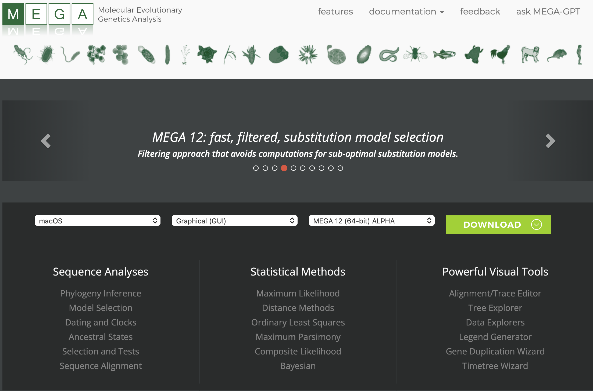

You will then need to scroll down and "**Accept**" the user agreement. 

Then, you will need to fill out a short survey about who you are (similar to below). **Note:** that **MEGA** is free for *research* and *education*. So, make sure that you tick at least one of those :) Then, you will be able to use the download client to install it on your computer.

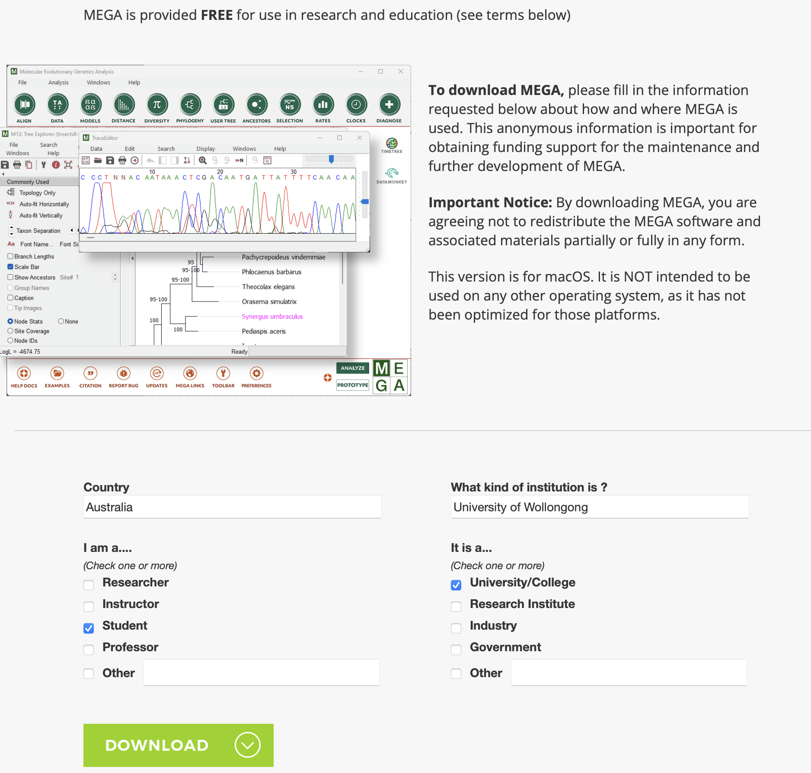

## Running **MEGA**

When you first open **MEGA**, you will likely get asked some questions about yourself... Feel free to answer, or not. That's up to you, but generally speaking, when someone makes resources freely available, I'm quite inclined to help out and answer! 

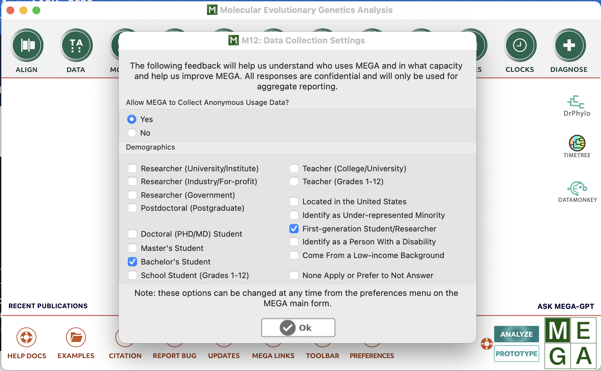

Take a moment to look at **MEGA** and some of the options it provides. It also provides help for first-time users and tutorials (as below) that you might find useful! 

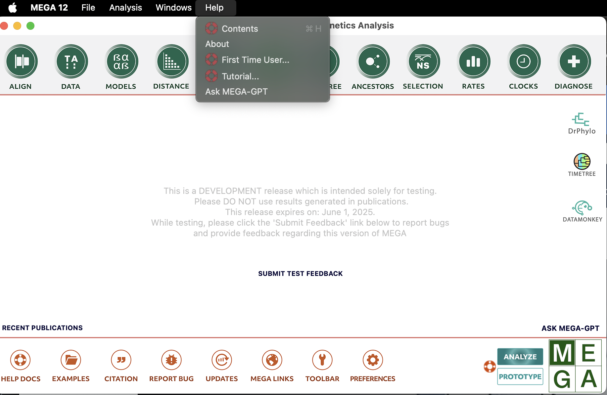

This includes tutorials on aligning sequences and whatever else you could want — hey, this is a pretty cool program! 

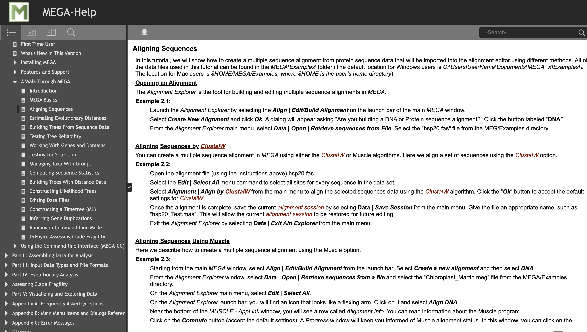

## Open your data
First thing's first, let's open our alignment in **MEGA**. You can click on the "**DATA**" and then navigate to the alignment you want to use. I will use our *equalisedFasta.fasta* file, which you can download using the below code in **R** (or by pasting that link into your browser and copying the text).

```{r downloadFasta, eval = FALSE}
utils::download.file(url = "https://raw.githubusercontent.com/jbdorey/EvolutionPracs/main/vignettes/equalisedFasta.fasta",
                     destfile = "equalisedFasta.fasta",
                     method="curl")
```

You will then be asked if you'd like to *Align* or *Analyze* your data import. Choose **Align**.

  1. 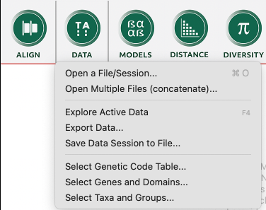
  2. 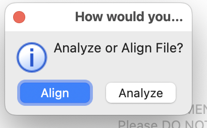
  3. 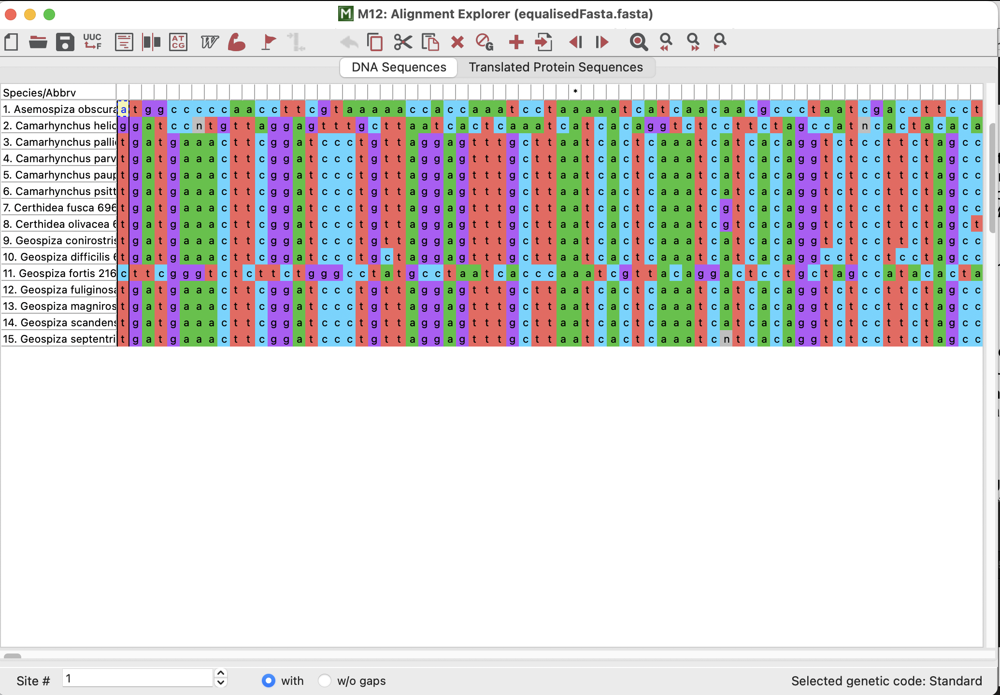
  
The alignment that opens up should look pretty similar to the one that I helped you to make in practical 3! We can see the species/sequence names in a column down the left-hand side and we can see the sequence base pairs themselves coloured on the right-hand side. 

<div class="alert alert-info">
**Side note:**

We could also "Translate" our sequence into amino acids (proteins) if we click on the "Translated Protein Sequence" button. This will prompt us if the genetic code is "Standard" (i.e., if it is for nuclear data). *It is not*, and so we would click "Cancel" and select "Vertebrate Mitochondrial" because this gene is found in the mitochondria of vertebrates! 

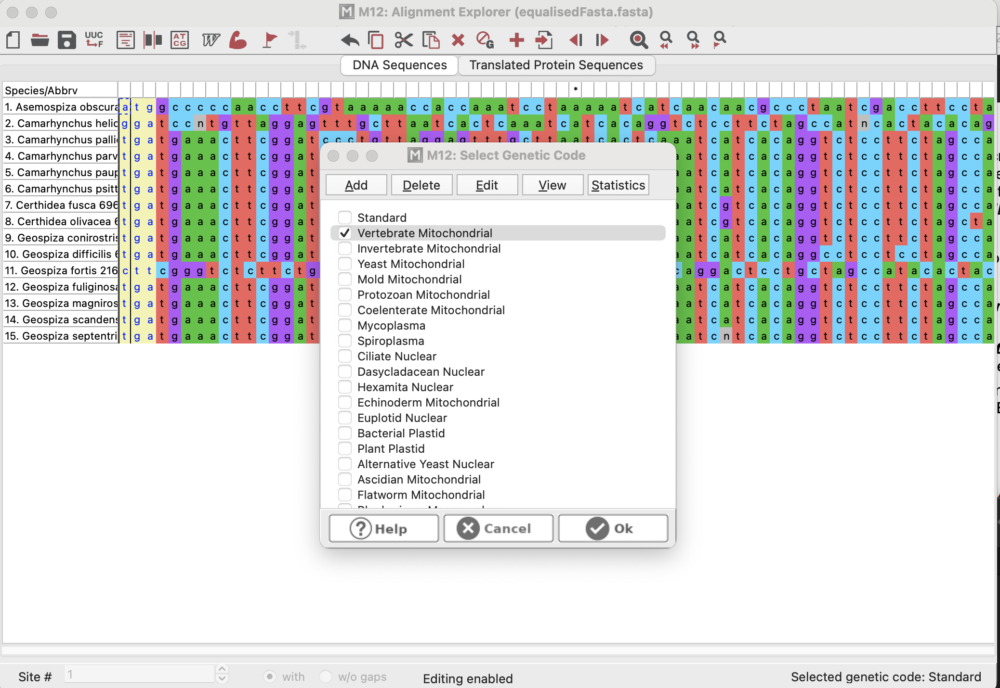

</div>


## Align your data

Okay, now that we have our sequences in, let's align them. **MEGA** offers two common alignment protocols, *ClustalW* and *MUSCLE*. We don't need to go into the details of either (and frankly I don't know which is better, I tend to play around with both and then manually align as needed). So, let's just use ClustalW.

Up on the top bar, select Alignment > ClustalW. This will open a dialog to help you chose alignment parameters, for which we will keep the defaults and select "**OK**" and allow **MEGA** to run its alignment. It may look like your alignment has not worked (see third screenshot below), however, if you scroll to the right you will find that one sequence is just much longer than the others (just as in my **R** example from prac 3)! 

  1. 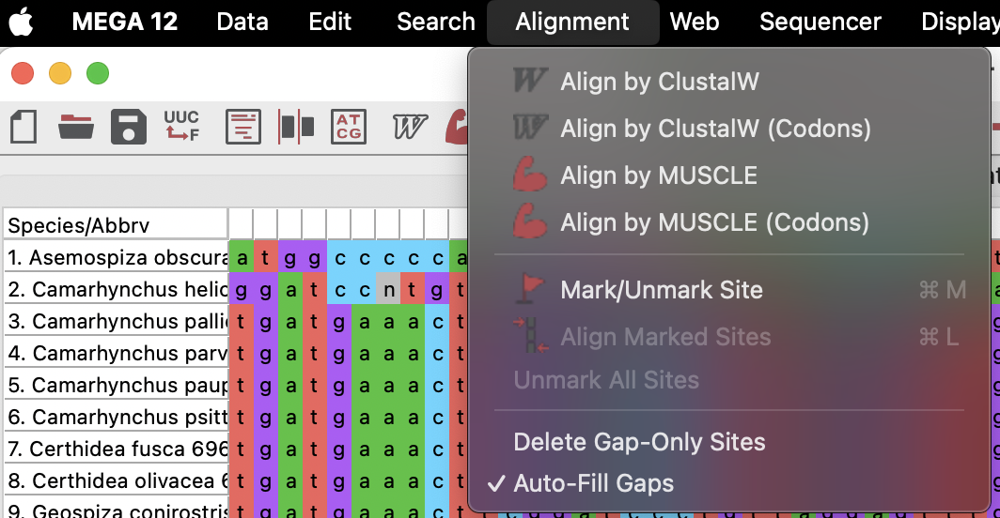
  2. 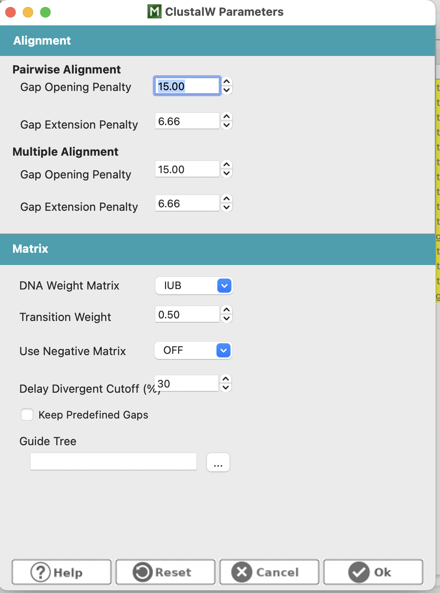
  3. 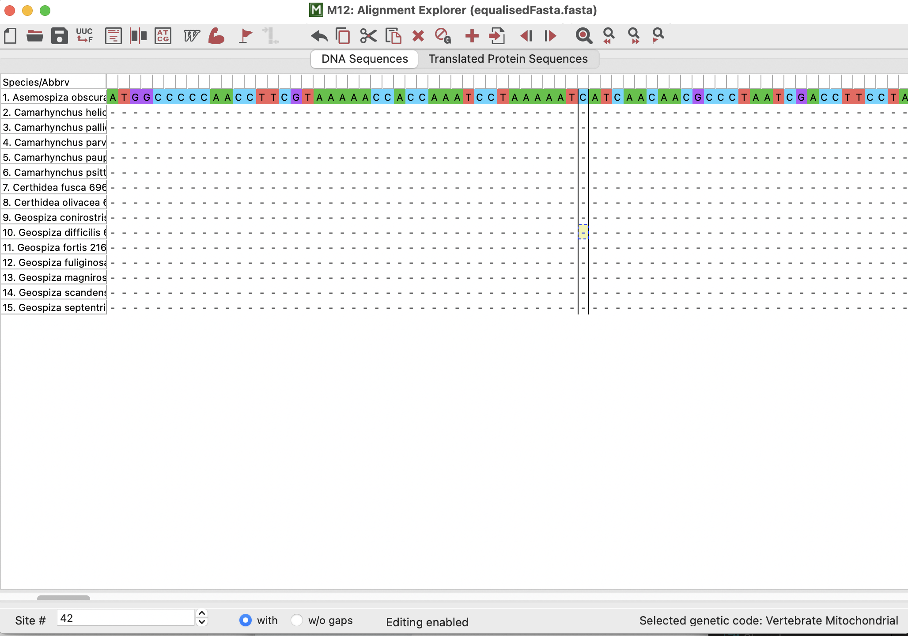

One strength of a GUI interface like **MEGA** or **Geneious** is that you can add or remove basepairs or spaces to help improve your alignment. This may sound like cheating with the data, but sometimes our alignment algorithms do a poor job. Also, sometimes when you get into science you might find that, actually, some of our decisions are straight-up arbitrary! Not a comforting thought, but you should always try to be the best scientist that you can be regardless! 

Anywho. At this point, you could export your alignment as a .fasta file and then load it back into R, if you would like (as below). Or, you could continue on to making a tree in **MEGA**

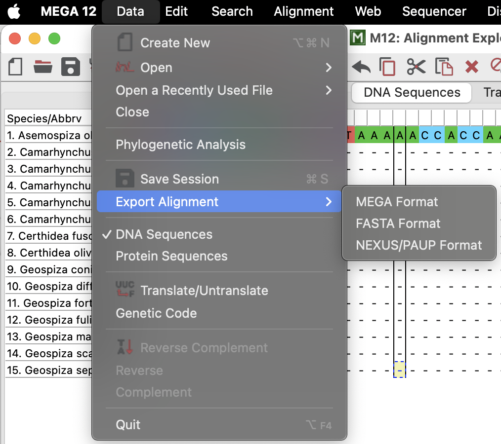


# Tree-building in **MEGA**

## Build your tree

In order to build a tree in **MEGA**, we need to send our new alignment back to the main session by clicking on the little save icon in the top bar.


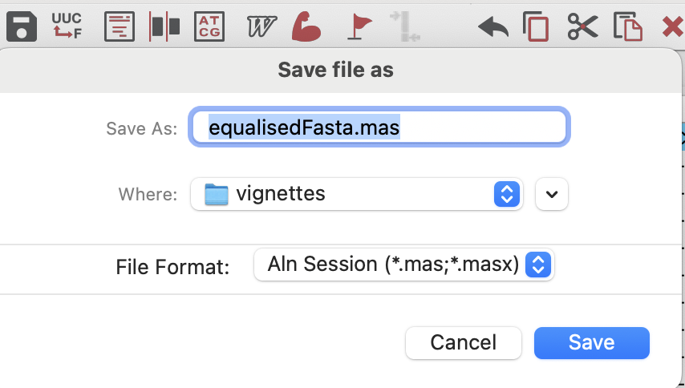

We can then go back to the main session and open the .mas file that we just saved again using the "**DATA**" button, as above, but this time select "Analyze". Our data will appear in the main window and we can then click on the "**PHYLOGENY**" button to make a tree with the data that we just imported! We will use the simple neighbour-joining tree in this example (select "Ok" to use the currently active data). At this point we will make some decisions about how to build the tree. We will:

  1. Change the "**Test of Phylogeny**" to the "Bootstrap method" with 500 replicates — this will sub-sample the data 500 times, re-make the tree 500 times, and see how many times the topology remains constant! 
  2. Change the "**Substitutions Type**" to a simple "Jukes-Cantor model".

Otherwise, we will leave the defaults and click "Ok". **Note:** the "**Select Codon Positions**" option may only be present if you have chosen a protein translation.


   1. 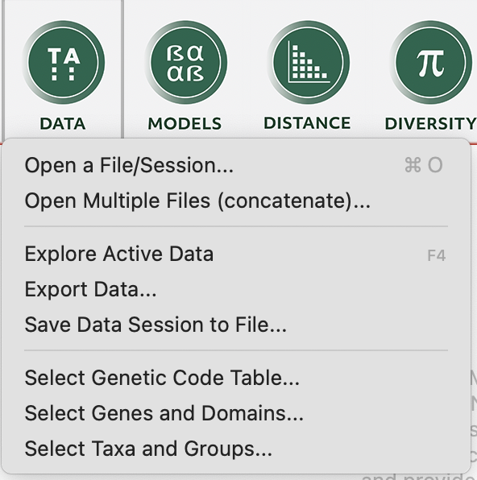
   2. 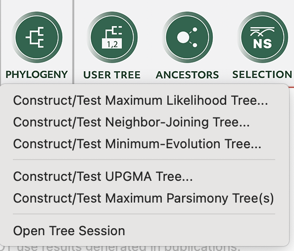

This will open a new window with two tabs; the "Original tree" and the "Bootstrap Consensus Tree". We want to select the latter, which will show the below tree, with the bootstrap support percentage for how often each node remained the same when sub-sampled. You will also note that **MEGA** has kindly reported how your tree was made, which would be critical to report in a paper... or assignment!

  3. 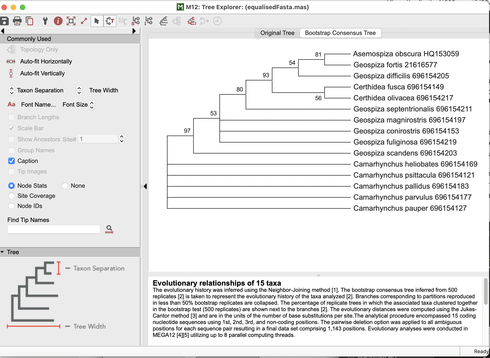
  
Take a moment to play with the settings here on the top bar, the left-hand bar, and even clicking on the tree and the nodes (or right-clicking) to see options! 


## Save your tree

Now it's time to save your tree and to conduct you analysis back in **R**! Select File > "Export Current Tree (Newick)" and save the tree how you'd like it saved, including Bootstrap values! **MEGA** will open a new window with a text string (this is the newick format for a tree). You can go ahead and use the save icon to chose where you want the file to be saved (or you could even straight-up copy and paste it into a text file or probably even **R**).

  3. 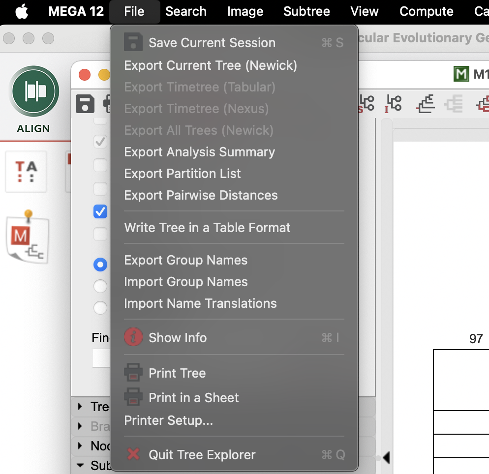


# Read your tree back into **R**

It's time to re-join the world of the coding! To do this, we will need to read our newick tree back into **R** and into a "phylo" format for use with the **phytools** package. This is very easily achieved using the function `phytools::read.newick()`!

```{r hiddenDownloadTreeFile, include=FALSE}
utils::download.file(url = "https://raw.githubusercontent.com/jbdorey/EvolutionPracs/main/vignettes/MEGA_tree.nwk",
                     destfile = "MEGA_tree.nwk",
                     method="curl")
```

```{r readInNewick}
tree <- phytools::read.newick()


```


