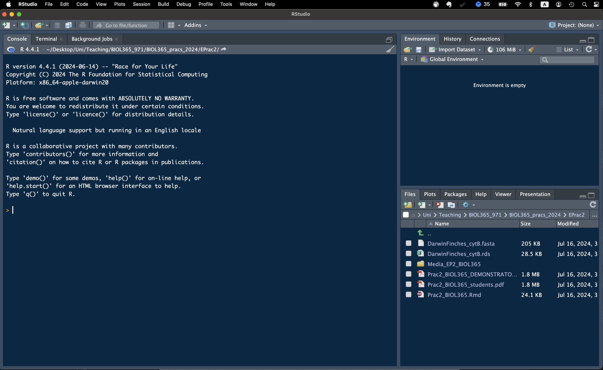

```{r libraryChunk, load-packages, include=FALSE}
# Markdown written by James B Dorey; contact jdorey@uow.edu.au (jbdorey@me.com) if help is needed.
# markdown packages
library(rmarkdown)
library(formatR)
library(styler)

# Load core packages
library(dplyr)
library(kableExtra)

options(width = 60)
matrix(runif(100), ncol = 20)
demonstratorVersion = FALSE
#| include: FALSE
knitr::opts_chunk$set(collapse = TRUE, comment = "#>")

```

`r if(demonstratorVersion == TRUE){"\\\n\n**THIS IS A DEMONSTRATOR ONLY VERSION**\\\n"}`

```{r setSECRETRootPath, include=FALSE,  eval=TRUE}
  # Set the RootPath to your folder
RootPath <- tempdir()
  # You can then set this as the project's working directory. 
  # This is where R will first look to find 
  # or save data as a default
setwd(RootPath)
```

# Introduction to the practical schedule

Practicals will be run as the below practical schedule from the course handbook. Following this practical, we will have:

1.  Four weeks of the *Phylogenetics Module*. The first three weeks will be focused on teaching you phylogenetics in the *R* programming language and the fourth will be aimed at providing support for your **Grant Proposal** assignment.
2.  We will have four weeks of the *Conservation Behaviour Module*. This module will focus on teaching you about human-wildlife conflicts and supporting you in your **Elevator Pitch** assignment.
3.  In weeks **7** and **13**, instead of a prac, we will have in-class quizzes, each worth 20% of your final grade and base on the lectures delivered previously.
4.  In weeks **11** and **12**, you will deliver your seminars to the class, instead of undertaking a standard practical.


<div class="alert alert-info">
  <strong> Attention:</strong> <br>
**Once you have completed all of the questions** and **shown your demonstrator or Lecturer** the answers and the outputs, you may leave. Or, feel free to hang around, play, or help your classmates. 
</div>

# Working together

You won't be forming groups *per se*, but it is possible to work together on benches to provide your neighbours help with code and the like. I do encourage this as your neighbour may have already overcome errors that you have come across and both the student helping and the one receiving help should benefit! Of course, we will be here to help you as well; your demonstrators should have the answers and, if not, your lecturers will.

# Start thinking about a macroevolutionary question

"Macroevolutionary questions" may sound like an arcane concept. However, they are really just questions that we ask with the goal of uncovering broad scale (almost always across multiple species) evolutionary patterns. Maybe that doesn't help... But, a simple question like "*I wonder how many bird species have purple feathers*" could easily be addressed as a macroevolutionary question! But, that might be too broad of a question...

Because I work on bees, I might have a question about a particular bee subgenus. Say the halictid (from the family Halictidae) bee subgenus *Lasioglossum (Homalictus)*. I might come up with a hypothesis such as "*More bees in the subgenus* Homalictus *are metalic in colouration than non-metalic*". That's a simple enough question and I suspect that it's true... but these bees are found all over the place (Australia to Southern China and India)! Maybe I could narrow it down to a place where there are fewer species and lots of genetic data available. I happen to work on the Fijian *Homalictus*, so I could hypothesise that "*More FIJIAN bees in the subgenus* Homalictus *have metallic abdomens than non-metallic abdomens*" — a question about the prevalence of a state. The data to answer this question could be derived from [here](https://uowmailedu-my.sharepoint.com/:b:/g/personal/jdorey_uow_edu_au/EY-bgdariG1BmtpnuPjMHagBMtcrx9BQaxgHqgpl2bo5Aw?e=BFcQVj). You could also hypothesise that "*Homalictus* bees are more likely to move from having metallic abdomens to non-metallic abdomens than the other way around" — a question about how frequently states evolve and their direction.


You get the idea. Now we are talking in terms of macroevolution.

You might have a question that you want to answer, or you might have a group that you are interested in. But, you need to choose a taxon that is big enough (say \>7 species) and limit yourself to a subset of those species (\<30) for which both genetic data and trait data either exist or can easily be harvested. You could start by searching in **Google Scholar**, or **Scopus**, for something like "*macroevolution bears*". Then you can see what genetic data are available and what morphological data are available. While you can use those same data for your assignment, you **must ask a novel question using those data or a subset of those data**.

Talk among your table or with your desk mate and with your demonstrators. You don't need to have a project set in stone by any means, but it's good to get started on thinking about this and what you might be able to do!

# Getting ready with *R* and *RStudio*

Your computers should already have *R* and *RStudio* installed. If they do not, or you are using a personal computer, feel free to follow the steps below to prepare yourself for the week 2 practicals, where we will dive in pretty quickly.

If you have a moment of spare time you may consider skimming the below text, especially the "Script preparation" and "What's coming next week" sections.

## Install *R*

If *R* is NOT installed on your computer already, we will go ahead and do that now. Please visit the [**CSIRO mirror for CRAN**](https://cran.csiro.au) and download the relevant version of *R* for your operating system. Then, follow the instructions to install it on your computer.

## Install *RStudio*

*R* is a command-land programming language and *R*, by itself is horribly ugly and I don't like the idea of working in it directly. For this reason, most users will use R within a much nicer interface program, called *RStudio*. Download the free version of [RSTudio](https://posit.co/download/rstudio-desktop/). Now, when both programs are installed, you can simply open up RStudio and get coding!

We are not going to do much with *R* today, don't worry, but I'd like to get you a little acquainted and at least start installing some packages in *R* so that we are ready for the following weeks.

## Running *R* in *RStudio*

Before we get into working in *RStudio*, let's make a folder where we will save all of our practical outputs and related files. Mine is called "*BIOL365_pracs_2025*". Notice how I have used underscores instead of spaces? This is very good practice to not have ANY spaces in your folder paths where you want to do coding stuff. Most of the time it's fine... but, **pro tip**, sometimes, it will cause problems that might be hard to track down!

When you open up *RStudio* for the first time, it will look a little something like the below (Fig. 2). But, without the funky colour scheme.

{width="600px"}

In the top left-hand side drop down, there is a white page with a green plus sign on it. Click on that and you can then select to add a new "R Script" (Fig. 3). We can then go ahead and save this blank script in a folder for these pracs (Fig. 4). I have called this script "*MyFirstRScript.R*".

{width="200px"}

{width="200px"}

It's also VERY good practice to leave some info about who made this script, why, and how they can get in touch with you! Go ahead and copy the below into your script and then personalise it with your details!

```{r Notes, eval = TRUE}
# BIOL365 at the University of Wollongong, very basic R stuff
# Getting ready to do stuff with R
# Written by FirstName LastName YEAR-MONTH-DAY University of Wollongong; your@email.here
```

Did you notice all of the hashtags? These are comments and *R* will ignore them (Fig. 5)!

{width="600px"}

## Script preparation

### Working directory primer

I know that many of you struggle with the concept of **working directories** and I think that they are important enough, as some of you have pointed out — thank you :), to describe in some detail. Just like some of the content that we cover in Conservation Biology (e.g., think about macroecology), the name sounds much scarier than the reality and accepting that will hopefully help you master these concepts. *(Upon reflection, this may be a poor example for many.)* Similarly **working directories** are actually quite simple! One way to look at a working directory is to think of them as a breadcrumb trail from the **root directory** where all of your computer's files are stored directly to your working file (**working directory**) that contains your **R** project, code, files, etc.

You could imagine that your **root directory** is your closet (e.g., `/` on Mac/Linux and `C:\` on Windows). Within your closet you may have shelves, hangers, shoe racks, *no, don't look at the skeletons*, a laundry basket, etc. These are all things that you might use to keep your closet nice, tidy, and organised — **these are your folders**. Within your drawers you may also have further compartments which you could also consider **folders** and, in this way, you closet is a hierarchical system containing smaller and smaller storage units (**folders**). Each of these units may contain further units (**folders**), and each of these may also contain items like shirts, jewelry, shoes... To take our figure example below the item "Shirt" is clothing; this tells us about the use of the item. In the same way, file extensions (e.g., `file.extension`) tells the computer what a file is and how to open it! You are likely very used to these things like images (`.jpg`, `.tiff`, `.png`), text files (`.docx`, `.txt`, `.r`), or data files (`.csv`, `.xlsx`, `.rda`). Hence, we might say `Shirt.cloth`!

These items are the **files**, just like your `.r` file that holds the text of your code! 


This is essentially what your computer looks like!

> What about cloud storage like *OneDrive* or *GoogleDrive*? Well, imagine that you keep all of your stuff in Elon Musk's closet and say "Let me keep all of my stuff in your closet and use it whenever I want, because my closet is just a matchbox". And then you trust all of your stuff to Elon and hope that he doesn't cut it, lose it, or sell it to someone else. This is probably fine, but you often rely on internet access to be able to use stuff in your closet.

Each time that you start an **R** project, you make a decision about where to store this in your closet. Maybe you store it somewhere very hidden, or maybe it's the first thing there when you open the door (near the **root directory**). Every time that you want to access that project, and the associated items (**files**), you might decide that you need to search the closet to find everything (*and trust me, finding that anything in your closet that you used two years ago is not easy!!*). This is what you do when you choose your directory from the **Files** tab in RStudio. It's a headache.

Alternatively, imagine that when you next wanted to find everything associated with your project you just had to find the .r code file and at the very top there was a magical string attached to you **working directory** and every item that you needed needed for your project. This is what we are doing below.


<div class="alert alert-info">
  <strong> Attention:</strong> <br>
Windows gives file paths in a different way than everyone else. :( 

  <strong> Windows:</strong> <br>
  On **Windows**, to find your file paths, right click on a file or folder and select "Properties". Then, you can copy the file "Location". But, you will need to change all of the backslashes (`\`) into forward slashes (`/`). For example:
  
      "D:\Users\jamesdorey\..." 
Becomes...

      "D:/Users/jamesdorey/..."
  

  <strong> MacOS:</strong> <br>
  On Mac or Linux, this is much easier. Using a Mac, you can right-click on a file and hold the "option" key to `Copy "file/folder" as Pathname`. Simply paste this into R and you will get something like the below automatically:
  
    '/Users/jamesdorey/...'

</div>

### Setting the working directory
Let us begin by telling *R* where our working directory (the folder that you made above) actually is. My "*BIOL365_pracs_2025*" folder is found at the end of the path:

"*/Users/jamesdorey/Desktop/Uni/Teaching/BIOL365_971/BIOL365_pracs_2025/Prac1/*" (see again, no spaces!). So, I can run the below:

```{r setRootPath, include=TRUE,  eval=FALSE}
  # Set the RootPath to your folder
RootPath <- "/Users/jamesdorey/Desktop/Uni/Teaching/BIOL365_971/BIOL365_pracs_2025/Prac1/BIOL365_pracs_2025"
  # You can then set this as the project's working directory. 
  # This is where R will first look to find 
  # or save data as a default
setwd(RootPath)
```

Congratulations, you have set your working directory! *R* can still access files outside of this folder, but it will look there by default after you set it (this must be set each time you open *R*).

**A quick pro-tip:** You can run code, once it's entered into your script by having your mouse click on, or above, the line that you want to run and then pressing the "**Run**" button on the top right hand side of the script window. That's a right pain. On mac you can simply use "**command+enter**" and on PC you can use "**control+enter**" to run your code. It'll make you life easier and quicker.

<div class="alert alert-warning" role="alert">

 >**Q1:** What is your working directory? Are you running Windows or Mac and did you need to change the path to make this work?

`r if(demonstratorVersion == TRUE){"**The range of median values is 15.3 (4.2 to 19.5).**"}`

</div>


### Install packages

Let us also quickly install a few packages that we'll need to start with next week (you mostly only need to do this once per package and per version of *R*).

```{r installPackages, eval=FALSE, message=FALSE, warning=FALSE, collapse=TRUE, results=FALSE}
#  This package is for data management and table manipulation
install.packages("dplyr")
# This package lets us use tidy pipes; %>%
install.packages("magrittr")
```

You may have seen that more than one package was installed when you ran the above code. That's normal, many packages depend on other packages to work.

### Load packages

The last *R* thing that I will get you to do today is to load the packages into *R* (this also should be done every time you open *R*, for the relevant packages). You need to do this because you may not always want EVERY package that you have ever downloaded to be accessible from in *R*... it can cause issues. In this way, you can be more selective about which ones are active.

```{r loadPackages, include=TRUE}
library(dplyr)
library(magrittr)
```


# Read in data

I'm going to borrow this part from another course that I teach into, BIOL361 and so this might be familiar to some of you. But, getting you a little familiar with data in R this week when the mental load is a little lower should help!

Let's go ahead and download a dataset from [this publication](https://doi.org/10.3389/fevo.2024.1339446) to play with. We can start by simply downloading it using the below code (or you could copy the url to the website and download it via your browser, but why not do it all in R?).

```{r downloadData, include=TRUE}
utils::download.file(url = "https://raw.githubusercontent.com/jbdorey/BIOL361_25/main/DoreyPrac1/SuppCollectionInfo_7Aug2023.csv",
                     destfile = "SuppCollectionInfo_7Aug2023.csv",
                     method="curl")
```

Okay, we have downloaded these data and you can go ahead and look in your working directory (*if you're not sure type "getwd()" into R to see where this is*). Let's go ahead and read it into R and we can also look at it once it's read in. To do this, we will use the **tidyverse** package, **readr**.

```{r readInData}
  # read in the data using readr
HylaeusData <- readr::read_csv("SuppCollectionInfo_7Aug2023.csv")

```

Now that we have read it in, you can view the data either by simply running "`HylaeusData`" or "`View(HylaeusData)`". You can also have a scroll below of the dataset.

<div class="alert alert-warning" role="alert">

> **Q2:**After *View()*ing the data, tell us, what is in the third column 5th row?

`r if(demonstratorVersion == TRUE){"**FBA 064760**"}`

</div>


```{r, outputTable1, echo=FALSE}
kableExtra::kbl(HylaeusData) %>%
  kableExtra::kable_material(c("striped", "hover")) %>%
  kableExtra::kable_styling(bootstrap_options = "responsive", full_width = F, fixed_thead = T) %>%
  kableExtra::scroll_box(height = "350px")

```


You can find more info about getting started with *R* and *RStudio*, along with other tutorials at [**Our Coding Club**](https://ourcodingclub.github.io/tutorials/intro-to-r/#download).

# Got a problem with R? **CHECK HERE!**

I made the first iteration of these pracs in 2024. That means that there is one year of students (~71 people) who have already been through these practicals. They came up with some common issues and so I decided to help them by collating a list of these issues and potential fixes (or suggestions). These can be found under the [Week 5 prac article](https://jbdorey.github.io/EvolutionPracs/articles/PhyloPrac5.html)! You know what that means? **If you have a problem, go and check there first :)**

I also will update these practicals to improve the learning and so new errors may occur. Do be patient with me as these pracs are tested over and over and are also run on an agnostic machine (GitHub) to make sure that they can work on a computer that is NOT mine. But, now we're running it on up to 100 new computers and with up to 100 new hands typing out possible error ;)

# What's coming next week?

Next week, we will be downloading data from GenBank using a web browser and then using *R*. Once we have those data and have played around with them a little bit, it'll be time for you to explore and maybe start thinking about the data that you want to use for your **Grant Proposal** assignment!

# Packages used today

{width="200px"} {width="200px"}
