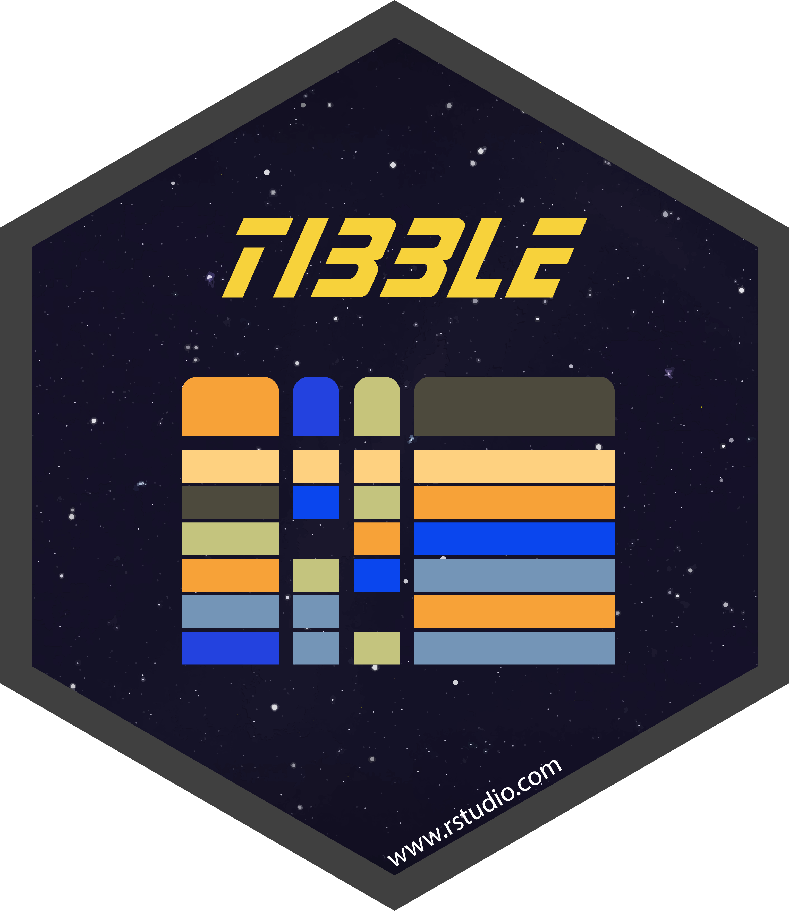

---
title: "Evolution Prac 3 — Aligning genetic data and building phylogenies in R"
author: Dr James B Dorey and Dr Damien Esquerré, University of Wollongong
date: "Version `r format(Sys.time(), '%Y-%m-%d')`; practical 2025-08-15"
output: 
   rmarkdown::html_document:
    toc: true
    toc_depth: 3
    toc_float: true
    number_sections: true
    theme: cerulean
    highlight: pygments
    fig_caption: true
    latex_engine: xelatex
pkgdown:
  as_is: true
vignette: >
  %\VignetteIndexEntry{PhyloPrac3}
  %\VignetteEngine{knitr::rmarkdown}
  %\VignetteEncoding{UTF-8}
always_allow_html: true
urlcolor: blue
abstract: "Today we will be re-downloading genetic data and starting to play around with making phylogenetic trees!

\n
**Be certain to save your R script from this week to help you next week!**"
--- 
  
```{r libraryChunk, load-packages, include=FALSE}
# Markdown written by James B Dorey; contact jdorey@uow.edu.au (jbdorey@me.com) if help is needed.
# markdown packages
library(rmarkdown)
library(formatR)
library(styler)
library(kableExtra)

# Load core packages
library(dplyr)

options(width = 60)
matrix(runif(100), ncol = 20)
demonstratorVersion = FALSE
if(demonstratorVersion == FALSE){
  demoHide = 'hide'
}else{
  demoHide = 'markup'
}
#| include: FALSE
knitr::opts_chunk$set(collapse = TRUE, comment = "#>")

```


`r if(demonstratorVersion == TRUE){"\\\n\n**THIS IS A DEMONSTRATOR ONLY VERSION**\\\n"}`


```{r secretRootPath, include=FALSE}
  # Set the RootPath to your folder
RootPath <- tempdir()
  # You can then set this as the project's working directory. 
  # This is where R will first look to find 
  # or save data as a default
setwd(RootPath)

packageList <- c(
    # Tidyverse packages:
  "tibble",            #  A lovely table format package
  "tidyr",             # Another data maniupulation package from the tidyverse
  "stringr"           #  to manipulate text strings
)
lapply(c(packageList, "dplyr", "magrittr", "ape", "rentrez"), 
       library, character.only = TRUE)
```

<div class="alert alert-info">
  <strong> Attention:</strong> <br>
**Once you have completed all of the questions** and **shown your demonstrator or Lecturer** the answers and the outputs, you may leave. Or, feel free to hang around, play, or help your classmates. 
</div>

# Script preparation 
## Working directory 
Just like last prac, we will set our working directory. This will, likely, be the same directory as you used last week as it's all one project.
```{r setRootPath, include=TRUE,  eval=FALSE}
  # Set the RootPath to Prac1 folder
RootPath <- "YourFolderPathHere"
  # You can then set this as the project's working directory. 
setwd(RootPath)
```


## Install packages
We should already have the packages from last week installed. If they are not installed I'm sure that you can figure out how to do them using the below example or copying the code from last prac!

```{r installPackages, message=FALSE, warning=FALSE, results=FALSE, collapse = TRUE, eval = FALSE}
packageList <- c(
    # Tidyverse packages:
  "tibble",            #  A lovely table format package
  "tidyr",             # Another data maniupulation package from the tidyverse
  "stringr"           #  to manipulate text strings
)

# List the new (not installed) packages and then if there are any, install them.
install.packages(pkgs = c(packageList), 
              rebuild = FALSE,
              repos = "http://cran.us.r-project.org")
```

{width="100px"}
{width="100px"}
{width="100px"}

## Load packages
Once again, we will need to load the packages into R, even the ones that we used last week which were probably unloaded after you closed R following our last session. This week, we'll use a *base* function, `lapply()` that will **apply** a function over a **l**ist. In this case, we will apply our package list over the `library()` function. We will also add in the relevant packages from last week that we want to use this week. Do it all in one go!

```{r loadPackages_explicit, include=TRUE,  eval=FALSE}
  
lapply(c(packageList, "dplyr", "magrittr", "ape", "rentrez"), 
       library, character.only = TRUE)
```


# GenBank data
## Read data in

Let us start out by reading our fasta file back in from last week. If you've not saved the file, go ahead and download my version from **GitHub** and save it to your working directory now. Do this using the below code.

```{r downloadData, include=TRUE, eval = TRUE}
utils::download.file(url = "https://raw.githubusercontent.com/jbdorey/EvolutionPracs/main/vignettes/DarwinFinches_cytB.rds",
                     destfile = "DarwinFinches_cytB.rds",
                     method="curl")
```

In addition to last week I will also get an **outgroup** sequence from a sister taxon, *Asemospiza obscura*, that will help our phylogenetic analysis **root** our tree (i.e. it will help place the most recent common ancestor for our finches). I found this outgroup in the publication ["Phylogeny of Darwin’s finches as revealed by mtDNA sequences"](https://doi.org/10.1073/pnas.96.9.5101) and then found a cytB sequence accession number on GenBank — "**HQ153059**"! 
  
  **Note:** In this publication, the species was called *Tiaris obscurus*, but it seems like the name has changed! This is something to be aware of; taxonomy changes.

```{r mySecondSearch,  results=demoHide}
# Read in the data from last week
DarwinFinches_cytB_lw <- base::readRDS("DarwinFinches_cytB.rds")

# Download the outgroup cytB sequence, HQ153059, for the sister taxon, *Asemospiza obscura*
A_obscura_cytB <- ape::read.GenBank(access.nb = "HQ153059")

# We can combine the dataset from last week with the outgroup DNAbin objects simply
# by appending them together.
DarwinFinches_cytB <- append(DarwinFinches_cytB_lw, A_obscura_cytB)

# Annoyingly, we need to manually re-create the attributes for the DNAbin object and then re-
# add them to the DNAbin object
DarwinAttributes <- list(
  names = c(attributes(DarwinFinches_cytB_lw)$names, 
            attributes(A_obscura_cytB)$names),
  class = attributes(DarwinFinches_cytB_lw)$class,
  description = c(attributes(DarwinFinches_cytB_lw)$description, 
                  attributes(A_obscura_cytB)$description),
  species = c(attributes(DarwinFinches_cytB_lw)$species, 
              attributes(A_obscura_cytB)$species)
)

attributes(DarwinFinches_cytB) <- DarwinAttributes
```

Great, that was pretty easy wasn't it? This demonstrates one of the major advantages of running these kinds of things in a language like R; once you have things set up you can run them again quite quickly. Not only that, but what you did **is easily reproducible and resilient to new mistakes!** That's important in science. 

<div class="alert alert-danger" role="alert">
**Assignment tip:** Last year there was an issue with downloading too many sequences at once through R. This year I have formalised a fix for this issue ([see here for more info](https://jbdorey.github.io/EvolutionPracs/articles/PhyloPrac5.html#read-genbank-error)). If you're having trouble downloading say >300 sequences in one go, try the below code! 

```{r genbankMassRead, eval = FALSE, show = TRUE}
  # Go ahead and install the package "remotes", which we can use to install a very basic package from Github.
install.packages("remotes")
  # Now, install this as a package using Remotes to access Github — if you have a permissions issue, look at THE END OF "read.GenBank error" in Prac 5
remotes::install_github("jbdorey/EvolutionPracs", quiet = TRUE, upgrade = "never")
  # Now, you have a package called "EvolPracs" pracs installed and you can use function EvolPracs::DoreyGenbank() to call from Genbank! 
  # I have made you download the package this way so that you can access my help file using ?EvolPracs::DoreyGenbank
  # Here is an example usage of the function that will search using entrez and then download using ape! 
exampleAssignmentDownload <- EvolPracs::DoreyGenbank(db = "nucleotide",
                     term = "(cytb[Gene Name]) AND (Apis[Organism])",
                      # The maximum number of sequences to return
                     retmax = 500)

```

</div>

# Filter sequences

Alright, now that I've had my little preach, let's address another issue. We have 171 sequences, so there are more than one per species. That might be fine depending on your analysis but it'll complicate things down the line in a way that we really just don't need. Lets make things easy; we'll try to take *one individual per species*. But, not all of the sequences are the same length! Longer sequences *might* lead to better chances of overlapping our gene regions, so lets first figure out how long each sequence is. Unfortunately, **ape** doesn't keep the sequence length in the attributes of the file, but we can figure that out using `lapply()` — the same function that we used to read in all of our packages with the `library()` function! Let us do the same with the `length()` function.

**Note:** Sometimes I'll give you some complex/confusing script, like the below, don't stress too much about understanding these data manipulations yet, just focus on the outputs and what they mean.

```{r getSeqLengths,  results=demoHide}
# Find the sequence lengths and turn them into a numeric list in order of how they were
# found in DarwinFinches_cytB
seqLengths <- lapply(DarwinFinches_cytB, length) %>%
  as.numeric()

```

<div class="alert alert-warning" role="alert">

> **Q1:** What is the range of sequence lengths in seqLengths?

`r if(demonstratorVersion == TRUE){"**There is a range of 16,474 basepairs.**"}`

</div>

Now, we know some lengths and we want to use those to help us choose which sequences to take. What we'll do now is create a data frame (or a tibble from the **tibble** package which is nearly the same thing but a bit nicer) with all of the information that we might want to choose our sequences! 

**Note:** Again, the below code looks a bit confusing, but see how we are just calling the cells that go into each column individually below? The *accessionID* column takes the names from within attributes(DarwinFinches_cytB), etc.

```{r collateSeqChoiceData,  results=demoHide}
# Lets build a tibble column-by-column
genBankSummaryTibble <- tibble::tibble(
  accessionID = attributes(DarwinFinches_cytB)$names,
  species = attributes(DarwinFinches_cytB)$species,
  seqLength = seqLengths,
  description = attributes(DarwinFinches_cytB)$description,
) 

# Let's have a look!
genBankSummaryTibble

```

<div class="alert alert-warning" role="alert">

> **Q2:** What do you think would happen in our table if seqLengths were not in the same order of accession numbers as the rest of the table?

`r if(demonstratorVersion == TRUE){"**The wrong sequence lengths would likely get associated with the wrong specimen and the output data would be incorrect.**"}`

</div>

Great, now we can very quickly look at the data that we downloaded and make some choices on which sequences that we're going to keep. For simplicity's sake, let's just take the sequence that is longest per species. To do that we will need to sort by sequence length and then choose the top sequence. Who can help us with that? Our good friend **dplyr**.

**Note:** There may be some full or partial mitochondrial genomes in your data (lengths > 10,000 basepairs). We will `filter()` these out for simplicity **Additionally**, there are actually two sequences here (1) the cytB sequence and (2) the control region for cytB. I'll also remove all of the "control region" sequences for you below; but be aware of this for your project and check you alignments.

```{r chooseSequences,  eval= TRUE, results=demoHide}
# Let us begin to manipulate the tibble to do what we want!
  # We will put this new table into a new R object called theChosenSeqs
theChosenSeqs <- genBankSummaryTibble %>%
    # Keep only sequences less than 1,500 basepairs to ignore the mitogenomes
  dplyr::filter(seqLength < 1500) %>%
    # remove the control region sequences
      # What's that "!" mean?! This simple bit of syntax just means "get the opposite of" 
      # so, instead of returning all strigns where "control region" is detected, it 
      # returns all where it is NOT detected.
  dplyr::filter(!stringr::str_detect(description, "control region")) %>%
    # Group the data by species and then any sorting or filtering will be done
    # WITHIN that group
  dplyr::group_by(species) %>%
    # Sort by species and then by sequence length (top-down; descending)
  dplyr::arrange(species, dplyr::desc(seqLength))

# Quickly, have a look at what you've made...
theChosenSeqs

# Now, let us take the top sequence of each group
theChosenSeqs <- theChosenSeqs %>%
  dplyr::filter(dplyr::row_number() == 1)

```

<div class="alert alert-warning" role="alert">

> **Q3:** What's the longest sequence and what's the range of sequence lengths?

`r if(demonstratorVersion == TRUE){"**The longest sequence is 1,143 and the range is 229.**"}`

</div>

Amazing. So, now we have a table with the information that we want, how do we filter our *DNAbin* object to only include the specimens that we want? Well, now that we have found the longest sequences using our data manipulation, let's try and use the accession numbers from the above table to filter our *DNAbin* object.

In R, there are usually several different ways to do the same thing. But, we will use some *base* R syntax, the square brackets, the will select the matching elements to what's inside the square brackets. 

```{r filterDNAbin,  eval= TRUE, results=demoHide}
# List objects often have names for each element in the list; have a look at those
names(DarwinFinches_cytB)

# If we wanted to take the FIRST element, we could simply call the first element
DarwinFinches_cytB[1]
# We could call an element using its name
DarwinFinches_cytB["56682246"]

# Extending this logic, we can use the accessionID column from theChosenSeqs to filter out
# all of the sequences that we're interested in.
finchSpecies <- DarwinFinches_cytB[theChosenSeqs$accessionID]

# But you know what having accession numbers alone is a bit annoying. Lets add
# species names as well!
  # NOTE: This is an example of complex code that you need not worry too much about
attributes(finchSpecies)$names <- stringr::str_c(theChosenSeqs$species,
                                                 theChosenSeqs$accessionID,
                                                 sep = "_")

```

<div class="alert alert-warning" role="alert">

> **Q4:** What is the name of the 5th sequence in DarwinFinches_cytB?

`r if(demonstratorVersion == TRUE){"**The name is, for my file at least, '56682246'.**"}`

</div>

<div class="alert alert-warning" role="alert">

> **Q5:** What is the name of the 5th sequence in finchSpecies? 

`r if(demonstratorVersion == TRUE){"**The name is, for my file at least, '696154127'.**"}`

</div>

<div class="alert alert-warning" role="alert">

> **Q6** If you run "finchSpecies", what is the base composition (proportion) of "a"?

`r if(demonstratorVersion == TRUE){"**The base composition is, for my file at least, '0.267'.**"}`

</div>

# Align sequences 

Now we have 15 sequences; one per species in the cytB dataset on GenBank. But, the sequences are so far just running from their first base pair until their last... We can't say that each base pair at position 1 are the same by descent (that they are homologous). We want to compare how base pairs might have changed over time at each and every site along the sequences; we need to **align the sequences**. Sometimes this is straightforwards, sometimes it really is not. But let's find out together if we've got an easy alignment ahead of us! 

```{r install2,  eval=FALSE}
# Here, we'll use a package called msaR to observe and align our sequences
install.packages("msaR",
              repos = "http://cran.us.r-project.org")
# We also need the BiocManager to install packages from bioconductor, where many 
# genetics packages, like Biostrings and msa, are found
install.packages("BiocManager",
              repos = "http://cran.us.r-project.org")
  # you may get asked to install extra packages, select all "a"
BiocManager::install("Biostrings")
BiocManager::install("msa")
library(msaR)
library(Biostrings)
library(msa)
```
{width="100px"}
{width="100px"}
{width="100px"}
{width="100px"}

 \

```{r visualiseSeqs, eval = TRUE, results='hide'}

# msaR agrees that fasta is a fantastic data format and but it recognises that not 
# everyone thinks this way. So, it has provided a function to transform a DNAbin object,
# among several others, to fasta
finchSpecies_fasta <- msaR::as.fasta(finchSpecies)

# You can have a look at this output file and it looks like a horrible text string, but
# if you look closer, you'll see that it's a fasta text string with line breaks denoted
# by "\n" for "new line".
finchSpecies_fasta

# But, many R programs demand sequences of equal length. Don't worry too much about the 
# below but let me help you out here...
  # Please DON'T FREAK OUT when seeing this code; I'm just giving it to you 
  # to do some data wizardry (with some notes IF you're interested)
# First, lets add our fasta text into the "sequence" column of a new tibble (data frame)
lengthCorrectionTable <- tibble::tibble(sequence = finchSpecies_fasta) %>%
    # Separate sequences from one another, using the ">" as a delimiter 
  tidyr::separate_longer_delim(cols = "sequence",
                               delim = ">") %>% 
    # Remove the first row from the tibble
  dplyr::filter(!dplyr::row_number() == 1 ) %>%
  dplyr::as_tibble() %>%
    # Remove the hanging line break at the end of each sequence
  dplyr::mutate(sequence = sequence %>% stringr::str_remove("\\n$")) %>% 
    # Use the name > sequence line break to separate them
  tidyr::separate_wider_delim(sequence, delim = "\n",
                              names = c("name","sequence")) %>% 
    # THIS is the magic part, let's add blank "-" loci to pad out our alignments to the same length
  dplyr::mutate(lengthenedSequence = stringr::str_pad(sequence, pad = "-", side = "right",
                                                      width = max(stringr::str_count(sequence))),
                  # If you want, you can check this object to see that lengths are the same
                length2 = stringr::str_count(lengthenedSequence))
  
# Now, we can turn this back into a fasta format... Asian don't worry too much about
# this code.
equalisedFasta <- stringr::str_c(">",lengthCorrectionTable$name,"\n",
                                 lengthCorrectionTable$lengthenedSequence, 
                                 collapse = "\n")

# Now, let's save this fasta file for later use
write(equalisedFasta, "equalisedFasta.fasta")

# We can read this fasta in as a Biostrings object
equalised_BioString <- Biostrings::readDNAStringSet("equalisedFasta.fasta")
```

If you zoned out for that last section, start paying attention again here!

```{r, eval = TRUE}
# START PAYING ATTENTION AGAIN!
# finally, we can interactively look at our alignment!
msaR::msaR(equalised_BioString, menu=T, overviewbox = T, labelNameLength = 200)

```

Take a deep breath, that was quite an adventure! But now we have had a first look at our sequences. You'll notice that things look a little messy, especially that the letters don't really line up nicely along columns. You should expect this for an **unaligned** set of sequences. Maybe you can even start to see where they might match up! So, let's see if we can change that.


```{r alignment,  eval= TRUE}
# We can use the msa, Multiple Sequence Alignment package to align our sequences 
alignedFinches <- msa::msa(equalised_BioString)

# Then we can access the @unmasked slot of the alignment and view the results
msaR::msaR(alignedFinches@unmasked, menu=T, overviewbox = T, labelNameLength = 200)
```

How does this alignment look? Can you see sections that align better than others? Do you see sequences that look better than others? In some cases, there may be a sequence that does not align well and may need to be removed. For your project, if this is a problem, you may choose to remove it, and add a different sequence in for that species. You can feel free to do that either in a text editor or in R; whatever you're most comfortable with.

Now we have a reasonable  alignment of 15 species. That's certainly enough to make a tree with! 

# Make a phylogeny
As you will learn in your next lecture, there are a few different ways to build trees. But, for now let's keep it pretty simple.

## Distance tree
Lets make one of the simplest trees possible, a *neighbour-joining* tree. This kind of tree is built based on genetic distances between sequences. The closer the sequences, the closer they'll be on the tree! We can also tell **ape** that we have an outgroup species and it will make that species sister to all other taxa.

```{r nj tree, eval = demonstratorVersion}
# Let us start by converting the msa format sequences back into ape's DNAbin format
alignedDNAbin <- ape::as.DNAbin(alignedFinches@unmasked)

# We then need to build a pairwise distance matrix — the distances between each
# pair of sequences 
distanceFinches <- ape::dist.dna(alignedDNAbin)
```

```{r, eval = FALSE}
# Go ahead and have a look at the matrix
distanceFinches
```

```{r nj2 tree, eval = demonstratorVersion}
# Now we can use that distance matrix to build a phylogenetic tree
njFinches <- ape::nj(distanceFinches) %>%
    # Specify the outgroup to be sister to all other taxa
  ape::root(outgroup = "Asemospiza_obscura_HQ153059")

# This is a tree object of class "phylo", and we need to visualise it with another 
# function... creatively called "plot"
njFinches

# Let's have a look!
plot(njFinches)
  # If you have gaps in your sequence, you could look at ?ape::njs()

# the ape package also provides an "improved" version of the nj algorithm. 
  # Why not compare the tree?
ape::bionj(distanceFinches) %>%
  ape::root(outgroup = "Asemospiza_obscura_HQ153059") %>% 
  plot()
# Are you starting to understand how we use the pipes (%>%) from the magrittr package?
```

<div class="alert alert-warning" role="alert">

> **Q7:** What instantly jumps out about the nj tree and the groupings? 

`r if(demonstratorVersion == TRUE){"**The Geospiza fortis individual's branch is much longer than the others.**"}`

</div>

<div class="alert alert-warning" role="alert">

> **Q8:** Are the nj and bionj trees very different?

`r if(demonstratorVersion == TRUE){"**There are not very many differences.**"}`

</div>

## Maximum likelihood

The *neighbour-joining* tree is nice, quick, easy, but not the most robust implementation for tree-building. Other methods exist which you will learn more about next week. But, for now let's have a peak at these methods and the trees and see if anything jumps out at us. We'll want yet another package, for this — "*phangorn*", Phylogenetic Reconstruction and Analysis.

```{r installPhangorn, eval = demonstratorVersion}
# install and load phangorn
install.packages("phangorn",
              repos = "http://cran.us.r-project.org")
library(phangorn)
```

{width="100px"}

 \

Next week we will be talking about genealogies and models of evolution so I don't want to overload you now. However, a short prelude to that might be: A, T, C, and G can each evolve differently and can mutate to-and-from different states in a way that we would **not** expect from random chance. So, clever folks have come up with various *models of evolution* to account for this. The model that we choose depends on our data in terms of which model best fits our data and if our data are rich enough to make using a more complex model possible! Let us use **phangorn**'s `modelTest()` function to look at this.

```{r modelTest, eval = demonstratorVersion }
# Sadly we need to transform yet another data format from DNAbin to phyDat
# Don't ask me why they do this to us ;)
aligned_phyDat <- phangorn::phyDat(alignedDNAbin)
  # Do you see how we try to name objects so that they are concise but human-readable?

# Run the model test
finchTest <- phangorn::modelTest(aligned_phyDat,
                              # Which models to compare
                            model=c("JC", "F81", "K80", "HKY", "SYM"),
                              # Let's not worry about invariant (I) or gamma (G)
                              # variables for now. Look these up later IF you need
                            I = FALSE, G = FALSE) 
```

The `modelTest()` function lets you compare which model is the best fit for the data. Let me help you at least interpret the values that it returns! I don't expect you to remember these, but they are helpful concepts for phylogenetics and statistics at large.

  - **df** — the degrees of freedom 
  - **logLike** — the log of the likelihood. Because likelihood values are often very small (like **really** small), we take their log. Log values <1 are negative values and they get more negative as you add decimal places. Hence, the larger number (e.g., -100 > -500) is more likely! **Side quest:** why don't you compare the outputs of *log(0.1)*; *log(0.0001)*; and *log(0.00000001)*
   - **AIC** — the Akaike information criterion provides a comparison between models, given a set of data. Again, a smaller AIC value represents a more *parsimonious* (i.e., simpler) option, given the data. As a relative measure of support these numbers can only be compared within alternative hypotheses.
   - **BIC** — the Bayesian Information Criterion is very similar to the AIC except it also considers the number of observations in the formula. But again, a lower value is better.
   
<div class="alert alert-warning" role="alert">
   
> **Q9:** Which model is best supported by all three statistics?

`r if(demonstratorVersion == TRUE){"**The 'HKY' model is most-supported.**"}`

</div>

You can also ask phangorn to choose the best model for you!
```{r phangornChoosesModel, eval = demonstratorVersion }
# Find me the best model, phangoorn!
fit_mt <- phangorn::pml_bb(finchTest, 
                  # Change to trace = 1 to see more outputs
                 control = phangorn::pml.control(trace = 0))

# Now have a look at the best model and the relative rates of mutations table! 
fit_mt
```

<div class="alert alert-warning" role="alert">

> **Q10:** How many different rates are there REALLY in this model?

`r if(demonstratorVersion == TRUE){"**The rate matrix has 4x4 columns and rows (16 values). However, there are only two actual rates; 1.0 and 4.6. The rates of '0' are comparisons with self (a-a, c-c, g-g, and t-t). The matrix is also a reflection of itself. The HKY model is used to differentiate transition and transversion mutations.**"}`

</div>

<div class="alert alert-warning" role="alert">

> **Q11:** What are the relative rates of change for these rates?

`r if(demonstratorVersion == TRUE){"**The two actual rates are 1.0 and 4.6. The rate of '1' is actually just a place-holder against which to compare another rate. There should [probably] always be one rate of 1 as these are relative rates of change.**"}`

</div>

Now, let's make a bootstrapped *maximum likelihood* tree!

```{r bootstrapMLtree, eval = demonstratorVersion}
# You can then feed in the fit_mt from above to build your bootstrap tree
bs <- phangorn::bootstrap.pml(fit_mt, 
                                # Using 100 bootstraps
                              bs = 100, optNni = TRUE,
                              method = "ultrametric",
                              control = phangorn::pml.control(trace = 0))

# Plot your maximum likelihood tree. You will input a "tree" which should be the
# "Maximum clade credibility" tree (i.e., the statistically best tree from your 
# bootstrap), then you can give the bootstrap trees (BStrees), which include ALL
# of the bootstrap trees
phangorn::plotBS(
  tree = bs %>%
      # Find the Maximum clade credibility tree
    phangorn::maxCladeCred() %>% 
      # We can root the tree at this point
    ape::root(outgroup = "Asemospiza_obscura_HQ153059"),
  BStrees = bs , 
  p = 10, type="p", digits=2, main="Ultrafast bootstrap")
```

<div class="alert alert-warning" role="alert">

> **Q12:** What's different about this tree from the last one?

`r if(demonstratorVersion == TRUE){"**1. Branch lengths are slightly different and 2. we now have bootstrap support values for nodes.**"}`

</div>

<div class="alert alert-warning" role="alert">

> **Q13:** Are some nodes better supported than others?

`r if(demonstratorVersion == TRUE){"**Yes, some nodes are better supported, with higher values showing greater support. The node of 100 shows that those taxa are always sister, whereas other nodes are as low as 26 (percent of the time together).**"}`

</div>

I am also going to save the DNAbin data for use in next week's prac.

```{r saveData, eval = demonstratorVersion}
  # Save the DNAbin as a fasta file
ape::write.FASTA(alignedDNAbin,
                 "alignedDNAbin.fasta")
```


# Do you REALLY hate doing this in R?

Listen... I'm not entirely without compassion. Sometimes doing stuff in R might just hurt your brain too much. Maybe, just maybe, you consider being forced to code *EVERYTHING* to be emotional abuse. I may not agree, but others do ;) 

I have already given you a way to manually download your data from GenBank. There are also more manual/GUI ways to align sequences and to build trees! In fact, these are broadly implemented as can still be a good way to learn and certainly can be a good way to do science. *I just tend to prefer offering you a way to do everything in one place.*

With this in mind, I have also built a tutorial to help you align sequences and build a tree using a simple enough GUI program called Molecular Evolutionary Genetics Analysis (**MEGA**). This program can be downloaded [**here**](https://www.megasoftware.net). The tutorial is located [**here**](https://jbdorey.github.io/EvolutionPracs/articles/MEGA_tutorial.html).

# Your homework


<div class="alert alert-danger" role="alert">

**Attention:**
By the end of Week 4 (next week), I want you to have the data that you mentioned in Question 12; prac 2. You will need to show this to your demonstrator. I have re-phrased this below:

> **Q12; prac 2:** Show your demonstrator...
>
>  - taxon that's interesting to you;
>  - The number of species in that group; 
>  - The appropriate number of **ALIGNED** sequences (for 7 = 30 species/subspecies);
>  - and what gene region you have chosen?

</div>

# What's coming next week?

Next week we will be focusing on doing something interesting and useful with our phylogeny! We will be starting to think about harvesting ecological, phenotypic, or biogeographic data to test a macro-evolutionary hypothesis using your phylogeny. We will be using Darwin's finches once again but you should be advanced enough to have at the very least an idea of what group you will examine for your project.

**Be certain to save your R script from this week to help you next week!** If you don't, well... sounds like you've got some catching up to do.


 \
 \
 \
 \
   
# New packages used today
{width="200px"}
{width="200px"}
{width="200px"}
{width="200px"}
{width="200px"}
{width="200px"}
{width="200px"}
{width="200px"}


