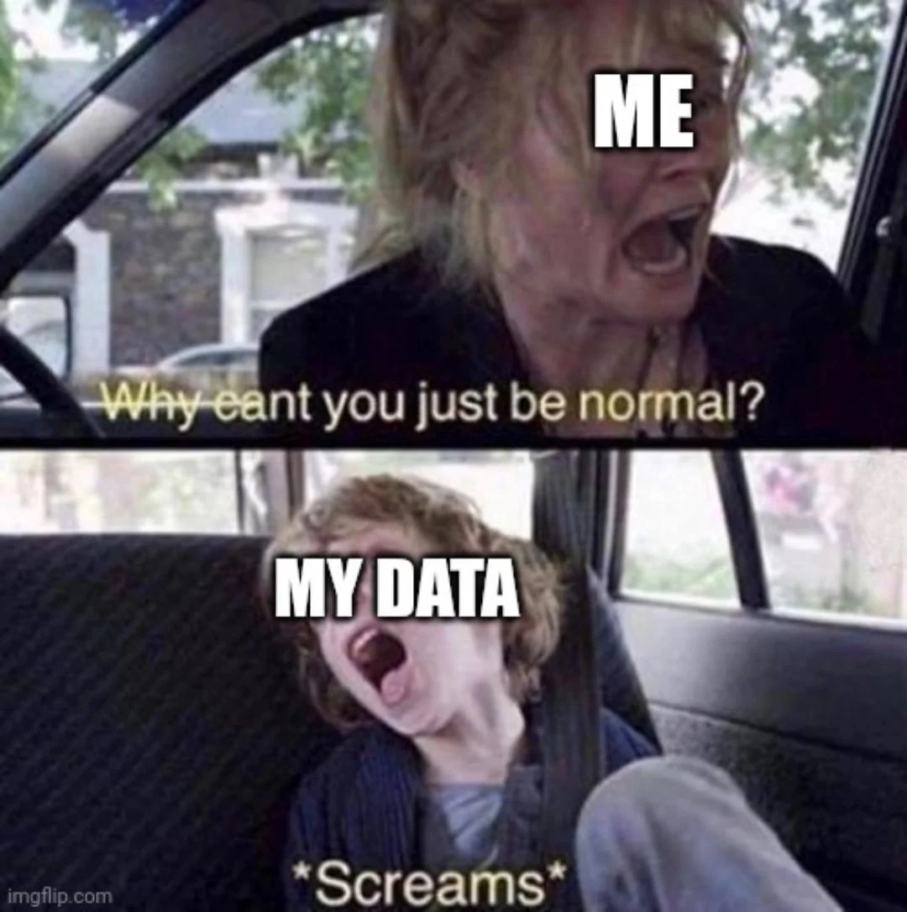

```{r libraryChunk, load-packages, include=FALSE}
# Markdown written by James B Dorey; contact jdorey@uow.edu.au (jbdorey@me.com) if help is needed.
# markdown packages
library(rmarkdown)
library(formatR)
library(styler)
library(kableExtra)

# Load core packages
library(dplyr)

options(width = 60)
matrix(runif(100), ncol = 20)
demonstratorVersion = FALSE
#| include: FALSE
knitr::opts_chunk$set(collapse = TRUE, comment = "#>")

```

`r if(demonstratorVersion == TRUE){"\\\n\n**THIS IS A DEMONSTRATOR ONLY VERSION**\\\n"}`

```{r secretRootPath, include=FALSE}
  # Set the RootPath to your folder
RootPath <- tempdir()
  # You can then set this as the project's working directory. 
  # This is where R will first look to find 
  # or save data as a default
setwd(RootPath)
```

<div class="alert alert-info">
  <strong> Attention:</strong> <br>
**Once you have completed all of the questions** and **shown your demonstrator or Lecturer** the answers and the outputs, you may leave. Or, feel free to hang around, play, or help your classmates. 
</div>

# Script preparation

## Working directory

Just like last prac, we will set our working directory. This will, likely, be the same directory as you used last week as it's all one project.

```{r setRootPath, include=TRUE,  eval=FALSE}
  # Set the RootPath to Prac1 folder
RootPath <- "YourFolderPathHere"
  # You can then set this as the project's working directory. 
setwd(RootPath)
```

## Install packages

We should already have the packages from last week installed.

```{r installPackages, message=FALSE, warning=FALSE, results=FALSE, collapse = TRUE, eval = demonstratorVersion}
#  A tidyverse package for reading in Excel sheets
install.packages("readxl",
              repos = "http://cran.us.r-project.org")
```

{width="100px"}

\

## Load packages

Once again, we will need to load all of our packages into R.

```{r loadPackages_explicit, include=TRUE,  eval=demonstratorVersion}
lapply(c("dplyr", "magrittr", "ape", "rentrez", "tidyr", "stringr"), 
       library, character.only = TRUE)
```

# Load and prepare genetic and trait data

## Genetic alignment (from last week)

Let us start off about where we were yesterday by loading in the genetic alignment that we saved last week. You can download last week's alignment using the code below as I have hosted the data online.

```{r downloadData, include=TRUE, eval = TRUE}
utils::download.file(url = "https://raw.githubusercontent.com/jbdorey/EvolutionPracs/main/EPrac4/alignedDNAbin.fasta",
                     destfile = "alignedDNAbin.fasta",
                     method="curl")
```

Okay, we have downloaded these data and you can go ahead and look in your working directory (*if you're not sure type "getwd()" into R to see where this is*). Let's go ahead and read it into R.


```{r readFasta, eval = TRUE}
  # Use ape to read in the aligned sequences
alignedDNAbin <- ape::read.FASTA("alignedDNAbin.fasta") 
  # Let's also simplify our sequence names (this'll make things easier and 
  # look better in our tree!)
names(alignedDNAbin) <- names(alignedDNAbin) %>% 
  stringr::str_remove_all("HQ[0-9]|[0-9]") %>%
  stringr::str_replace_all("_", " ") %>%
  stringr::str_squish() 

  # Let's also make the Maximum Likelihood (ML) tree from last week  
finchesML <- alignedDNAbin %>%
  phangorn::phyDat() %>%
  phangorn::pml_bb(model = "HKY", 
                   control = phangorn::pml.control(trace = 0)) %>%
  phangorn::bootstrap.pml(bs = 100, optNni = TRUE,
                          method = "ultrametric", 
                          control = phangorn::pml.control(trace = 0))
  
  # plot the tree and write it to the object "treeML"
(treeML <- phangorn::plotBS(
  tree = finchesML %>%
      # Find the Maximum clade credibility tree
    phangorn::maxCladeCred() %>% 
      # We can root the tree at this point
    ape::root(outgroup = "Asemospiza obscura"),
  p = 10, type="p", digits=2, main="Ultrafast bootstrap")
)
```

## Finch trait data

The reason that we've been doing finches this whole time is that I know it's easy enough to get some finch data from the internet! We will download data from a Dryad database that digitised 6,500 specimens that were measured by David Lack! A treasure trove of data, so thanks to David for making them available!

You can download the data from this link — <https://datadryad.org/stash/dataset/doi:10.5061/dryad.150> — under **Download full dataset** on the top right hand bar. Save these to your working directory. We will read in "morphLack.xls"

```{r sneakyDataDownload, include = FALSE, eval = TRUE}
gc()
utils::download.file(url = "https://raw.githubusercontent.com/jbdorey/EvolutionPracs/main/EPrac4/morphLack.csv",
                     destfile = "morphLack.csv",
                     method="curl")
finchData <- readr::read_csv("morphLack.csv", guess_max = 7000)
```

```{r downloadData_morphology, include=FALSE, eval = FALSE}
utils::download.file(url = "https://raw.githubusercontent.com/jbdorey/EvolutionPracs/main/EPrac4/morphLack.xls",
                     destfile = "morphLack.xls",
                     method="curl")
finchData <- readxl::read_excel("morphLack.xls", sheet = "morphLack.TAB", guess_max = 7000)

```

```{r secretFinchData, eval = TRUE, include=FALSE}
finchSummary <- finchData %>%
  dplyr::mutate(scientificName = paste(GenusL69, SpeciesL69, sep = " ")) %>% dplyr::group_by(scientificName) %>%
  dplyr::summarise(medianBH = median(BeakH, na.rm = TRUE), rangeBH = max(BeakH, na.rm = TRUE) - min(BeakH, na.rm = TRUE)) 
```

```{r readFinchTraits, eval = demonstratorVersion}
# We can read these data into R very easily using readxl
finchData <- readxl::read_excel("morphLack.xls",
                         sheet = "morphLack.TAB",
                          # readxl needs to figure out what's in each column (text, 
                          # numbers...), so let it read all rows to figure this out.
                         guess_max = 7000)

# Have a look at this big data table:
finchData

```

This finch data table has 6,758 data observations across 20 variables. We can guess what some of the columns are: **IslandID** = island (could be good for biogeography analyses), **BodyL** = body length; **WingL** = wing length; **TailL** = tail length; **BeakW** = beak width; **BeakH** = beak height; **LBeakL** = lower beak length; **UBeakL** = upper beak length; **TarsusL** = tarsus length; and I don't know what **N-UBkL** is... oh well. The point is that there are traits that we can start asking macroevolutionary questions about. Maybe we can get at a classic and look at beak size (don't worry, I don't think we're treading on Darwin's toes).

One potential issue with this dataset, as impressive as it is, there is a lot of missing data. But, that's okay. Let us just use one of the more-complete variables like beak height. The next thing that we might consider is that there are loads of measurements and we only want one per species. We could take the mean or median values per species. Firstly, we can make a quick histogram of this variable to see if it is normally distributed...

```{r beakVolumne, eval = demonstratorVersion}
# Have a look at the histogram
hist(finchData$BeakH)
# I'd say that's right-skewed and so let's use a median value
# Let's calculate the median for each species and put it into a new column
finchSummary <- finchData %>%
    # There are two sets of names in the dataset, original and
    # updated, let's use the latter and put it in a new column
  dplyr::mutate(scientificName = paste(GenusL69, SpeciesL69, sep = " ")) %>%
    # Group by scientificName to calculate the mean within groups
  dplyr::group_by(scientificName) %>%
    # let's get the median beak height per species
  dplyr::summarise(medianBH = median(BeakH, na.rm = TRUE),
                    # The range is the max minus the min values per species
                   rangeBH = max(BeakH, na.rm = TRUE) - min(BeakH, na.rm = TRUE)) 

# Have a look at these data by getting a quick summary
summary(finchSummary)
```

<div class="alert alert-warning" role="alert">

> **Q1:** What is the range of the median beak height values?

`r if(demonstratorVersion == TRUE){"**The range of median values is 15.3 (4.2 to 19.5).**"}`

</div>

I'll show you, but don't expect you to emulate this, that we can use a *Shapiro-Wilk Normality Test* to statistically test if our data significantly differs from a normal distribution

```{r testRange, eval = demonstratorVersion}
  # If p-value > 0.05, we'd say that we can't reject the null hypothesis (normal
  # distribution)... This is close enough!
stats::shapiro.test(finchSummary$medianBH)
  # The range is NOT normally distributed
stats::shapiro.test(finchSummary$rangeBH)
  # But, if we log-transform this variable, it is normal!
stats::shapiro.test(log(finchSummary$rangeBH))
```

{height="250px"}

## Match genetic and trait data

We have two different datasets that we want to work together with, so let's see how well they overlap with one another and then start making them work together.

```{r checkDataMatch, eval = demonstratorVersion}
# Let us have a look at how well our taxon names match between the genes
# and the trait data
  # Extract the DNA names
dnaNames <- names(alignedDNAbin) %>%
    # Turn them into a data frame (tibble)
  tibble::tibble(scientificName = .)

  # We can perform a "left_join" to put these tibbles together and see what's
  # missing! 
compareNameTable <- dplyr::left_join(dnaNames, finchSummary, by = "scientificName")

```

Looks like we've got pretty good overlap! The trait data is only missing three of our genetic species and one of those is the outgroup. In your own project, you could absolutely go hunting for that extra data but, for our purposes, I'm pretty happy with that result. We can look at trait evolution across 12 species with these data.

Now, let's *prune* our tree to make sure that the data overlap.

```{r secret_treeML_dropped, include=FALSE,  eval=TRUE}
treeML_dropped <- ape::drop.tip(treeML,
                      tip = c("Geospiza septentrionalis", "Certhidea fusca", "Asemospiza obscura"))
```

```{r matchTips, eval = demonstratorVersion}
  # We can drop the tips on our tree that don't have trait data associated with them.
treeML_dropped <- ape::drop.tip(treeML,
                      tip = c("Geospiza septentrionalis", "Certhidea fusca", 
                              "Asemospiza obscura"))

  # Let's only select the traits for those species in the tree
finchSummary <- finchSummary %>%
    # We can find the names %in% the tree tip labels slot and filter for those
  dplyr::filter(scientificName %in% treeML_dropped$tip.label) %>%
    # let's also add the log transformation to normalise our range data
  dplyr::mutate(log_rangeBH = log(rangeBH))
```

```{r secretFinchData2, eval = TRUE, include=demonstratorVersion}
finchSummary <- finchSummary %>%
  dplyr::filter(scientificName %in% treeML_dropped$tip.label) %>%
  dplyr::mutate(log_rangeBH = log(rangeBH))

```

Now we have matching datasets. With our matching datasets, we can start to answer some hypotheses! For the sections that are coming, I'll be using the book, **Phylogenetic Comparitive Methods in R by Liam Revell & Luke Harmon**, as a reference. It's a great book and Liam is also the author of a fantastic R package, **phytools**.

# Phylogenetically independent contrasts

In comparative biology, we will often be asking questions about traits and if they are related to one another. For example, do bigger animals have larger home ranges? This is a relatively easy question to ask and answer as we can simply use regression to see the correlation between those two traits. However, a key assumption of linear regression (like many other analyses) is that data points are independent. The problem is that more-closely related taxa are more likely to share similar traits and so **cannot be considered independent** from one another.

[Joseph Felsenstein (1985)](https://www.jstor.org/stable/2461605) pointed out this issue that trait correlations could, especially in worst case scenarios (Fig. 1), could lead to misleading results. He proposed then that, if traits evolve randomly (by Brownian motion) in each lineage after each node, you could correct for this bias. This correction technique is termed **phylogenetically independent contrasts**. The mathematics behind this correction, I'll admit, is a little beyond me. However, the use of these tools is not.


Before moving on, let's make a simple hypothesis. **Finches with larger beak heights will have larger beak height ranges than finches with smaller beak heights**. I have no idea if this hypothesis has been asked before, but you can see that I have provided a TESTABLE hypothesis that will serve as a great bounding board for some tests.

## Regular regression

Let's begin by using regular-old linear regression to test our hypothesis. Keep in mind that, as of writing this, I don't know what the answer will be. For this we can ignore the phylogeny

```{r regularRegression, eval = demonstratorVersion}
  # We can start by just plotting these two variables to see how they look
plot(finchSummary$medianBH, finchSummary$log_rangeBH)

  # We should then run a linear regression on the same data
  # Firstly, let's make the model!
linear_BH <- stats::lm(data = finchSummary,
                       formula = log_rangeBH ~ medianBH)
  # Have a peak and you might see where the y-intercept and slope of a linear model
  # (y = mx + c). In the model, c = Intercept; m = log_rangeBH
linear_BH

  # Now, let's test our hypothesis!
summary(linear_BH)
```

<div class="alert alert-warning" role="alert">

> **Q2:** Ignoring phylogeny, are median beak height and log range of beak height significantly correlated? What's the significance level (p-value) for the model?

`r if(demonstratorVersion == TRUE){"**Yes. The median beak height and log range of beak height are significantly correlated with a p-value of 0.0007. This means that there is a 0.07% chance that this pattern has arisen by chance.**"}`

</div>

```{r plotRegularRegression, eval = demonstratorVersion}
  # Like I mentioned, the linear model is just a line; so we can also plot that line!
plot(finchSummary$medianBH, finchSummary$log_rangeBH)
abline(linear_BH, col = "red", lwd = 2)

```

## Phylogentically independent contrasts (PIC)

Okay, now we've checked using regular linear regression, let's use our phylogenetic correction. We will use **ape**'s `pic()` function to do this.

**Note:** We actually have a slight problem here, most *Camarhynchus* species sequences are identical for cytB. The same is maybe true for *Geospiza magnirostris* and *Geospiza conirostris*. These are all visible as *zero branch lengths* in the phylogeny. We must then fix this (or drop those taxa). Don't worry too much about the first bit of code, I'll basically add a *small* branch length for these species and then make them split, using `ape::multi2di()`. It will add a little noise to the data, but should be fine as a demonstration; we could also fix this by adding more genetic data or choosing a different gene with more variation.

```{r picCorrection, eval = TRUE}
  # Make a new tree to not save-over our "real" tree
treeML_fixed <- treeML_dropped
  # Add a small branch length (0.001) to those with an exactly zero length (0);
  # Looks like some are almost zero (0.00000001); we also want to fix these!
treeML_fixed$edge.length <- treeML_fixed$edge.length %>% 
  dplyr::if_else(. < 0.001, 0.001, .)
  # Make these new branch lengths bifurcate (split)
treeML_fixed <- treeML_fixed %>%
  ape::multi2di(random = TRUE,tol = 0.001)

  # Feel free to compare how the original and changed trees look!
# Create a side-by-side layout
par(mfrow = c(1, 2))
  # Then make each plot!
plot(treeML_dropped, main = "Original plot", sub = "node numbers shown for illustration", 
     col.sub = "darkred", cex = 0.5)
  # We can also plot the node numbers that will relate to the pic values coming up!
ape::nodelabels(treeML_dropped$node.label, bg = "white", frame = "circle", cex = 0.5)
plot(treeML_fixed, main = "New plot", sub = "now with tiny branches added", 
     col.sub = "darkred", cex = 0.5)
  # Return R's plots to a single one! 
par(mfrow = c(1, 1))
```

Okay, let's now do our PIC! We need to run our pic regression through zero and so will add "+0" to our model. The reason for this is that the direction of rotation for any node (right or left) is completely arbitrary and so is the direction of subtraction (pic values can be - or +; see `pic_logRangeBH`). So our pic regression should go through zero and have no intercept term. *(Running without this term gives a VERY similar answer anyway.)*

```{r picAnalysis, eval = demonstratorVersion}
  # Let's calculate PIC for log range BH and for median BH
pic_logRangeBH <- ape::pic(finchSummary$log_rangeBH, 
                 treeML_fixed)
pic_medianBH <- ape::pic(finchSummary$medianBH, 
                 treeML_fixed)

  # We can use these PIC's to run a new linear regression! 
picLM <- lm(pic_medianBH ~ pic_logRangeBH + 0)

  # Let's test this new hypothesis
summary(picLM)
```

<div class="alert alert-warning" role="alert">

> **Q3:** Do you come to the same or a different conclusion, in regards to our hypothesis, given this pic analysis? What's the p-value of this model?

`r if(demonstratorVersion == TRUE){"**Yes. The median beak height and log range of beak height are significantly correlated with a p-value of 0.0002. This means that there is a 0.02% chance that this pattern has arisen by chance. Including phylogeny has actually strengthened our p-value and we can be even more confident (both in regards to significance and accounting for relatedness) that these traits are associated.**"}`

</div>

We can plot this model as well!

```{r plotPIC, eval = demonstratorVersion}
  # Make the plot
plot(pic_logRangeBH, pic_medianBH)
  # Add in some dashed lines through zero on the horizontal and vertical
abline(h = 0, lty = "dotted")
abline(v = 0, lty = "dotted")
  # Add in the model regression.
abline(picLM, col = "red", lwd = 2)

```

Listen, I've given you a lot to think about here. I'm very pleased if you've come this far in our prac. What follows is also a very useful tool in macroevolutionary analyses. I would strongly recommend paying attention here as these kinds of analyses might be very useful for your assignment! 

# Ancestral state reconstruction

We will now use an awesome package called **phytools**, which was written by Liam Revell, who also wrote **Phylogenetic Comparitive Methods in R**. We can install that now.

```{r installExtras, eval = demonstratorVersion}
install.packages("phytools",
              repos = "http://cran.us.r-project.org")
library(phytools)
```

{width="100px"}

\

We can reconstruct the probable state of a variable (continuous or categorical) along the phylogeny using *ancestral state reconstructions*. We will do just that!

### Continuous variable

```{r fastAnc}
# Get a vector with the median beak heights and the scientific names
medianVector <- setNames(finchSummary$medianBH, finchSummary$scientificName)
 
# Use phytools to reconstruct ancestral states is the fastAnc function, which
# estimates ancestral states using maximum likelihood
ancMedian <- phytools::fastAnc(treeML_fixed, medianVector,
                  vars = TRUE, CI = TRUE)

# We can plot this tree using phytools and then add in the estimated values
# At the nodes to see how the birds have evolved in this trait
  # Plot the tree using phytools
phytools::plotTree(treeML_fixed, ftype = "i", fsize = 0.5, lwd = 1)
  # Add in the nodes
phytools::labelnodes(text = ancMedian$ace %>% round(0) %>% as.character(),
                     node = names(ancMedian$ace) %>% as.numeric(),
                     interactive = FALSE,
                     shape = "circle",
                     cex = 0.5)
  
# We can also use phytools to map this evolution as a continuous trait along
# our tree branchs!
plotMap <- phytools::contMap(treeML_fixed, medianVector, plot = FALSE) %>%
  phytools::setMap(c("white", "orange", "black"))
# Plot the tree
plot(plotMap, leg.txt = "Median beak height (mm)", fsize = 0.7)


```

Hey, look at that! There are very few species with high beaks, and they are mostly grouped in one genus, *Geospiza*! That's cool.

<div class="alert alert-warning" role="alert">

> **Q4:** From the tree, which species has the biggest median beak height?

`r if(demonstratorVersion == TRUE){"***Geospiza magnirostris* has the biggest beak height (Darkest colour on tree and in the legend).**"}`

</div>

### Categorical variable

We don't necessarily have a great categorical data in our dataset. However, we could make a continuous variable categorical, and so let's use beak height again. We can make a histogram and see that there are some natural breaks in beak height (see below). Let's split it into small (\<10 mm) and large beaks (\>10 mm).

<div class="alert alert-danger" role="alert">
**Attention:**

Last year, many students just breezed through this and never htought about what they were doing. You should be asking yourself, WHY am I turning these data into a categorical dataset? Is it because I need to do this or is it because James wants to give you an easy example of how to analyse a categorical dataset? 

Do I need to do this for my continuous data, if I choose to use continuous data, in my assignment? 

Think about that for me, would you? If fact that's what question 5 has become...

> **Q5:** Do I need to transform my continuous data into categorical data for my assignment? 

`r if(demonstratorVersion == TRUE){"**Please. For the love of God, don't.**"}`

</div>


```{r categorical reconstruction}
# See the histogram of species median beak height
hist(finchSummary$medianBH, breaks = 20)

# Make this into a categorical variable using an if-else statement
finchSummary <- finchSummary %>%
  dplyr::mutate(beakCat = dplyr::if_else(medianBH > 10,
      # IF medianBH > 10:
    "Large", 
      # ELSE medianBH < or = 10:
    "Small"
  ) %>% as.factor())

# Get a vector with the beak categories and the scientific names
beakVector <- setNames(finchSummary$beakCat, finchSummary$scientificName)

# Just like we have done for our phylogenetic tree evolution models, we need to
# choose a model of evolution (transition) for our categorical variable
# In this case, it's a bit more of a pain and we need to build the models and then
# test them ourselves
  # Equal rates between each = ER
ER_fit <- phytools::fitMk(treeML_fixed, 
                        beakVector,
                        model = "ER")
  # All rates different (ARD) means that all transition rates can be different
ARD_fit <- phytools::fitMk(treeML_fixed, 
                        beakVector,
                        model = "ARD")
  # We could compare the fit of these models as below
tibble::tibble(
  model = c("ER", "ARD"),
  LogL = c(stats::logLik(ER_fit), stats::logLik(ARD_fit)),
  aic = c(stats::AIC(ER_fit), stats::AIC(ARD_fit))
)

# HOWEVER, there are only two states and so not much to compare! If there were more
# states then you'd choose those with the lowest AIC and biggest Log likelihood.
```

Now, let's do something cool and calculate the probability that each node is large or small using *marginal ancestral state reconstruction*. We'll need another package for this — **corHMM**. *Sorry, it doesn't have a logo :(*

```{r installcorHMM, include = TRUE, eval = demonstratorVersion}
# Install and load the package
install.packages("corHMM",
              repos = "http://cran.us.r-project.org")
library(corHMM)
```

You're gonna hate me for this, but we need to turn our categories into numbers (0, 1, 2, 3, ... etcetera)! We can do this transformation in text by converting it first into a factor and then into a number and taking 1 away so that it starts at zero.

```{r marginalReconstruct, eval = TRUE}

# Modify the finch data to be numbered categorical with only species name
# and that numbered factor in a DATA FRAME format
funchNumbered <- finchSummary %>% dplyr::select(scientificName, beakCat) %>%
    dplyr::mutate(beakCatNumbered = beakCat %>%  as.numeric()-1) %>%
    dplyr::select(!beakCat) %>% as.data.frame()

# Undertake the marginal reconstruction. This is a pretty complex bit of code.
# Please do examine ?corHMM for help.
cor_margRecon <- corHMM::corHMM(
  treeML_fixed,
  funchNumbered,
  node.states = "marginal",
    # Feed in our chosen model
  model = "ER", 
    # The number of rate categories
  rate.cat = 1,
    # A rate matrix (for the number of trait factors) to optimise
  rate.mat = matrix(c(NA,1,1,NA),2,2)
)

  # Have a look at the output
cor_margRecon

# Choose the colours to use once
cols <- setNames(c("darkorange", "darkgreen"),
                 levels(finchSummary$beakCat))
  
# Let's plot the tree.
phytools::plotTree.datamatrix(treeML_fixed,
                              data.frame(beakVector),
                              colors = list(cols), header = FALSE, fsize = 0.45)
legend("bottomleft", legend = levels(finchSummary$beakCat), pch = 22, pt.cex = 1.5,
       pt.bg = cols, bty = "n", cex = 0.8)
ape::nodelabels(pie = cor_margRecon$states, piecol = cols, cex = 0.5)
```

That's a pretty cool plot, I think. It shows the probability at each node that the ancestral state there was large or small. It also shows the state in the present day! You can see that, in this case, the analysis has struggled to give us strong answers. But, closer to those nodes with more consistent states, you can see that the probabilities are higher that the ancestor had that state. Maybe it would be better with more states, or better genetic data that gave us longer branch lengths, I can't say for sure!

<div class="alert alert-warning" role="alert">

> **Q6:** Is it more likely that the common ancestor of *Camarhynchus pallidus* and *Geospiza scandens* had a large or a small beak?

`r if(demonstratorVersion == TRUE){"**It's most likely that the common ancestor had a small beak. The pie chart at their most-recent common ancestor (the fourth node from the root) shows >75% probability of being a small-beaked species.**"}`

</div>

<div class="alert alert-warning" role="alert">

> **Q7** How would you coe in a change in the colour of the categories in your phylogeny?

`r if(demonstratorVersion == TRUE){"**By changing the colours (using HEX codes or R colour names) you would change the values in:**"}`

</div>

```{r exampleColourChange, include = demonstratorVersion, eval = demonstratorVersion}
  # Change to the worst colours ou can easily think of
cols <- setNames(c("hotpink", "#FFFF00"), levels(finchSummary$beakCat))
# Let's plot the tree.
phytools::plotTree.datamatrix(treeML_fixed,
                              data.frame(beakVector),
                              colors = list(cols), header = FALSE, fsize = 0.45)
legend("bottomleft", legend = levels(finchSummary$beakCat), pch = 22, pt.cex = 1.5,
       pt.bg = cols, bty = "n", cex = 0.8)
ape::nodelabels(pie = cor_margRecon$states, piecol = cols, cex = 0.5)
```


<div class="alert alert-success" role="alert">
**A small byword:** Running analyses in almost any statistical program involves transforming your data into different formats. Depending on the data and the analyses that you're doing this load can be bigger or smaller. However, doing all of these things in a single program and a single script is really very convenient. I don't expect you to remember or understand all of my data manipulations but, trust me, keep these pracs with you and the code may very well come in handy for the future. *This is how I got started with R.*

I'm saying, save the URL for the pracs (I'll try and keep it alive) or better yet, save these pages as a PDF!

</div>

# Your homework

<div class="alert alert-warning" role="alert">

**Attention:**
It is now the end of Week 4 (next week), I want you to have the data that you mentioned in Question 12; prac 2. You will need to show this to your demonstrator. I have re-phrased this below:

> **Q12; prac 2:** Show your demonstrator...
>
>  - taxon that's interesting to you;
>  - The number of species in that group; 
>  - The appropriate number of **ALIGNED** sequences (for 7 = 30 species/subspecies);
>  - and what gene region you have chosen?

What if you don't have these data to show now? Well, we will be very concerned about you. We might frown at you and give you a gentle admonishment. If you're lucky, we'll help you to find the data but **don't expect us to stay late if you haven't reached out for help early.**

</div>

<div class="alert alert-danger" role="alert">

**Attention:**

I have more homework for you. By next week, at the minimum, I want you to **have your trait data** and to have attempted to **align it with your phylogenetic data** and **have it plotted**.

The further along you are, the better we will be able to help you. **Remember**, we only have so long in the prac class and there are only so many demonstrators. We won't be able to give you our undivided attention (*I'm sorry, I'd really like to be able to!*), so please come as prepared as you can but don't be afraid to ask for help with genuine problems. I know that this assignment can be challenging and that's why we have a whole prac time available to seek help.

</div>

# What's coming next week?

Next week we will be talking about your assignment and providing help with the first component of your **Grant Proposal** assignment. Don't forget to make sure that you have read and understood what you need to do for that element of your assignment and the marking criteria. Most of the marks are assigned just for including the correct elements — note that this means you could, if you wanted, even use the data that we have harvested in our pracs (but I'd prefer it if you at least asked a different question).

We will be available to help talk you through hypotheses and analyses. It will be a great opportunity to get support on the first component of your assignment and a head start on the following component.

**Be certain to save your R script from this week to help you with your assignment!**


# A reminder of the assignment guidelines

**Please check Moodle for the most-recent version**

## Part (a) — preliminary phylogeny (5%)

The idea of this component of the grant proposal assignment is to (i) demonstrate your data and phylogenetic abilities and (ii) to ensure that you have preliminary results to describe in your grant application.

1.  Build a phylogeny using public data from a clade (group of organisms) of interest

    a.  I would suggest that between 7 and 30 taxa should be used, however, more might be reasonable. These tree tips could be species or individuals within a species, so long as you have original data for each tip.

    b.  Your tree must have an outgroup (probably from a closely related genus; however, the outgroup does not need to have trait data)

2.  Using trait data from the literature or data extracted from photos for that clade model that trait along the phylogeny (from the above point) and summarise how that trait has changed

    a.  Your traits could come from a published paper directly, or could be extracted from photos of your species (e.g., something simple like beak colour or measurements if photos with scales are available for all species or individuals)

    b.  You must, in writing and figures, explain how your trait(s) have evolved across the phylogeny. If your data allow it, consider including a statistical test.

    c.  Provide references to the (i) genbank accession numbers for the sequences (or similar), (ii) the original research articles (or similar) where the data were retrieved or derived, and (iii) your code — the latter will help demonstrators help you with your code

```{r noteOnTabke, include=FALSE,  eval=FALSE}
  # The table is produced by copying into this website: https://tabletomarkdown.com/convert-spreadsheet-to-markdown/ and then finding and replacing all double spaces in it until there are none left and it looks like the below
```

**Table 1**: A description of each assignment component and what is expected to achieve a particular score for that component (total possible mark sums to five)

| **C.** | **1** | **0.5** | **0** |
|---------------|-------------------------|------------------|---------------|
| **1a** | A phylogenetic tree of appropriate size (\>7 and \<30 tips, excluding outgroup) is provided | A phylogenetic tree of inappropriate size (\<7 or \>30 tips excluding outgroup) is provided | No phylogeny is provided |
| **1b** | An appropriate (e.g., relative within the same family or subfamily) outgroup is provided | An inappropriate (very distant or internal relative) outgroup is provided | No outgroup is provided |
| **2a** | Traits for all tree tips (excluding outgroup) are included and inferred along the phylogeny | Traits for only some tree tips (excluding outgroup) are provided and/or not inferred along phylogeny | No traits are provided |
| **2b** | Trait evolution across the phylogeny is well described. For example, and if relevant to their data, the student describes how and where the trait has changed (within which clades or species); how that trait might be related to another (if another was measured); the range, mean, or median values of that trait across the phylogeny or in particular groups; etc. | Trait evolution across the phylogeny is poorly thought out and explained. The student misses major patterns in the phylogeny or describes them particularly poorly. A clever student might describe their patterns to their demonstrator or lab mates in one of the pracs prior to submission | No description of trait evolution is provided |
| **2c** | (i) Genbank accession numbers, (ii) references to trait sources, and (iii) student R code are all provided | Only 1–2 of the references (see left) are provided | None of the references are provided |

## Part (b) — Project quality and innovation (15%)

The idea of this component of the grant proposal assignment is to (i) identify a knowledge gap and develop a well-structured and thought out hypothesis, (ii) understand and describe the novelty of your question, (iii) describe your methods and their appropriateness, and (iv) explain the importance of your project to a grant agency. We will keep in mind that the scope of your grant must be smaller than one that you would submit to ARC or to another granting agency. This means that we are interested in seeing the quality of your reasoning and writing.

1.  Very brief literature background of project (no more than one paragraph)

    a.  Generally, a good background will start with a broader issue and narrow down to a more specific one. You won’t have too much space here so try and be succinct and hit a few important points to get the reader to where they need to be rather efficiently

2.  Identifying gap in knowledge

    a.  Identify the knowledge gap that you are filling — please note that this will probably be a minor gap given the scope of the assignment, and that’s fine!

3.  Lay out your hypothesis, which is informed by background knowledge/theory (**not a research question!**)

    a.  Provide a hypothesis that will help you test and address the knowledge gap. Hypotheses, rather than research questions, are explicitly testable (i.e. an expected and alternative outcome is clear). For example, “*The relationship between A and B will be C* ”. Or, from our pracs was “*Finches with larger beak heights will have larger beak height ranges than finches with smaller beak heights*”. This is compared with a research question like “*We will examine how finch beak height impacts beak height range*”

4.  Novelty/originality and innovation of the proposed research (has this question been asked before? How is your project novel)

    a.  Explain why this research hasn’t been done before and how it’s new (I don’t expect you to do an exhaustive literature search, but do provide some citations for related research here). This can be hard to show but maybe you can find a novel angle or ecological tint to your hypothesis.

5.  Appropriateness of the proposed research design (how will your project answer the hypothesis that you’re wanting to address)

    a.  Given the context that you have included from points 1 and 2 about, explain how you will answer your *hypothesis* using your phylogenetic methods. NOTE: referring back to your pilot phylogeny could be very convincing!

6.  Potential to create new knowledge and research capacity (blue-sky), and economic, commercial, environmental, social and/or cultural benefits for Australia (societal benefits).

    a.  What is the potential for your project to result in new knowledge or new research? You could discuss how your work will lead to new research (follow up research), provide new and important understandings, expand the field or bring it up to speed with better known taxa (e.g., birds are very well known, whereas reptiles and invertebrates are less well known), etc. (blue-sky component)

    b.  Why is your project important? This could be the importance for government, conservation, commercial applications (e.g., agricultural), or cultural benefits for Australia (societal benefits component). For many ecological questions, conservation can be a safe option to fall back on

**Table 2**: A description of each assignment component and what is expected to achieve a particular score for that component (total possible mark sums to fifteen)

| **C.** | **2.5** | **1.25** | **0.5** | **0** |
|--------------|----------------|---------------|--------------|--------------|
| **1a** | The background is clear and succinct, bringing the reader from the broader topic to the specific gap and hypothesis professionally | The background is somewhat clear but inefficient, still brings the reader from the broader topic to the specific gap and hypothesis | The background if rambling and unclear, the topics discussed are of dubious relevance but guide the reader to the gap and hypothesis | The background is absent or completely irrelevant so that the reader is not at all prepared for the specific gap and hypothesis |
| **2a** | NA | Student clearly and succinctly identifies a knowledge gap of strong relevance to their project and methods | Student identifies a knowledge gap of dubious relevance to their project and methods | Student does not identify and state a knowledge gap |
| **3a** | NA | Student clearly and succinctly and provides a testable hypothesis | Student only provides a research question | Student does not provide a hypothesis or research question |
| **4a** | Student identifies clearly how the research is novel, and provides references (2–5) to support their argument | Student identifies how their research is novel but may not be clear. The student provides references (2–5) to support their argument | Student poorly very identifies how their research is novel and probably provides insufficient references (0–1) | Student does not identify how their research is novel and provides no references |
| **5a** | Provides a clear argument that is supported by the sections above and references (at least 2) as to why their methods are appropriate and will address the hypothesis. Phylogeny is used well to justify their methods | Provides an argument that may not be well supported by the above sections or references but that it is clear how they will address the hypothesis. Phylogeny is used to justify their methods | Provides poorly-reasoned arguments or sufficient references but it is clear how they will address their hypothesis. Phylogeny is used to justify their methods | Provides no arguments for how their methods will address the hypothesis |
| **6a** | Student provides a clear, thoughtful, and succinct explanation of the potential for new knowledge or new research resulting from their proposal that is also justified with references | Student provides some explanation of the potential for new knowledge or new research resulting from their proposal that is also justified with references | Student provides a poor explanation of the potential for new knowledge or new research resulting from their proposal that might not be justified with references | The students don’t offer any explanation of the potential for new knowledge or new research resulting from their proposal or references |
| **6b** | Student clearly and thoughtfully explains the importance of the project for one or more of the mentioned bodies/themes (government, conservation…) such that the reader is convinced that the project is worth funding | Student provides arguments for the importance of the project for one or more of the mentioned bodies/themes (government, conservation…) but the reader is left with serious doubts about funding the project | Arguments for arguments for the importance of the project for one or more of the mentioned bodies/themes (government, conservation…) but it is unclear that the project would have any benefits | No arguments are provided. |

\
\
\
\

# New packages used today

{width="200px"} {width="200px"} And **corHMM** :/
