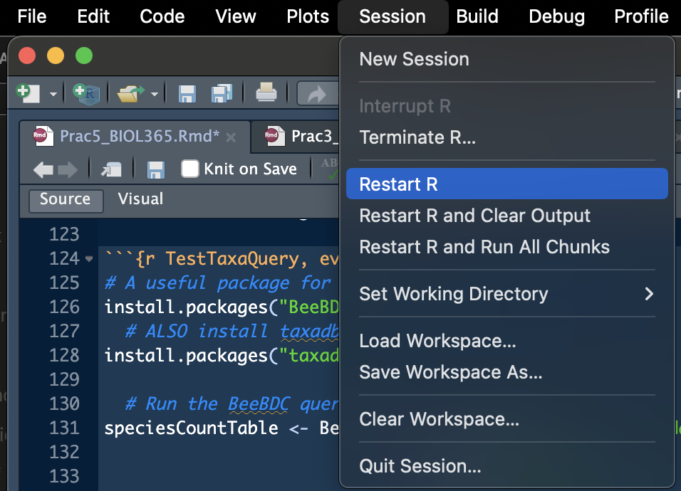
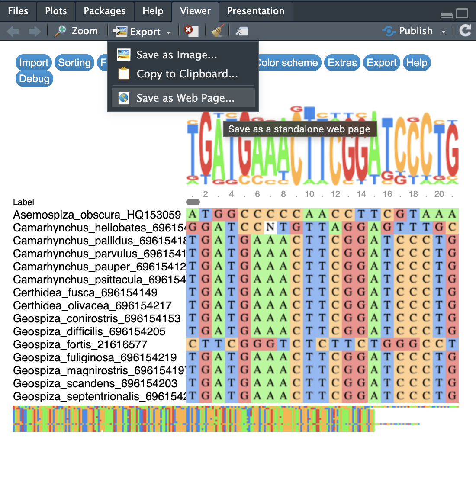

```{r libraryChunk, load-packages, include=FALSE}
# Markdown written by James B Dorey; contact jdorey@uow.edu.au (jbdorey@me.com) if help is needed.
# markdown packages
library(rmarkdown)
library(formatR)
library(styler)
library(kableExtra)

# Load core packages
library(dplyr)


matrix(runif(100), ncol = 20)
demonstratorVersion = FALSE

```

`r if(demonstratorVersion == TRUE){"\\\n\n**THIS IS A DEMONSTRATOR ONLY VERSION**\\\n"}`

```{r secretRootPath, include=FALSE}
 # Set the RootPath to your folder
RootPath <- tempdir()
  # You can then set this as the project's working directory. 
  # This is where R will first look to find 
  # or save data as a default
setwd(RootPath)
```

# Script preparation

## Working directory

Below is the example path to MY ROOT directoy. **NOTE**: A common pitfall that I have seen is people including a *file* at the end of the path, such as: "*/Users/jamesdorey/Desktop/Uni/Teaching/BIOL365_971/BIOL365_pracs_2025/EPrac5**/Prac5_BIOL365.Rmd***" See how that last part in bold is actually a file with a file extension? That's not a directory (folder).

```{r setRootPath, include=TRUE,  eval=FALSE}
  # Set the RootPath to Prac1 folder
  # This is the example path to MY FOLDER. 
RootPath <- "/Users/jamesdorey/Desktop/Uni/Teaching/BIOL365_971/BIOL365_pracs_2025/EPrac5"
  # You can then set this as the project's working directory. 
setwd(RootPath)
```

## Install packages

Below are ALL OF THE PACKAGES that we have used in these pracs

```{r installPackages, message=FALSE, warning=FALSE, results=FALSE, collapse = TRUE, eval = FALSE}
CRAN_packageList <- c(
    # Tidyverse packages:
  "dplyr",
  "magrittr", # This package is critical if R says that it can't find the function "%>%"
  "tibble",            #  A lovely table format package
  "tidyr",             # Another data maniupulation package from the tidyverse
  "stringr",           #  to manipulate text strings
  "readxl",  # Lets you read in excel files
    # GENETICS packages on CRAN
  "rentrez",
  "ape",
  "msaR",
  "phangorn",
  "phytools",
  "corHMM",
    # General R package to help with phytools
  "plotrix",
    # General R package to help with BeeBDC
  "taxadb",
    # This package gives you access to "bioconductor" packages
  "BiocManager"
)
  # Install the packages that are hosted on CRAN
install.packages(pkgs = c(CRAN_packageList), 
              rebuild = FALSE,
              repos = "http://cran.us.r-project.org")

  # These packages are installed from bioconductor
BiocManager::install("Biostrings")
BiocManager::install("msa")

  # READ in your packages
lapply(c(CRAN_packageList, "dplyr", "magrittr", "ape", "rentrez"), 
       library, character.only = TRUE)
```

\

## Load packages

Once again, we will need to load all of our packages into R.

```{r loadPackages_explicit, include=TRUE,  eval=FALSE}
lapply(c(CRAN_packageList, "Biostrings", "msa"), 
       library, character.only = TRUE)
```

# Do my genetic data relate to my trait?
I've driven this home a few times already, so have a look at the last two prac intros for example, but... We will not be linking traits directly to our genetic variants/mutations. This is possible but extremely complicated and usually done in *genome-wide association studies*. Bugger that, I say. Instead, we will: 

1.    Build a tree using the genetic data

2.    Using that tree and statistical methods we will infer how our trait(s) have changed with evolution

# What if I want to do a more complicated analysis?
Sure, maybe I haven't shown you how to do all tests and I didn't want to freak you out. Usually, if you want to do a standard statistical test you can do it in a phylogenetically explicit manner as well. So, consider the data that you have (continuous, categorical, count...), think of (or just google) the statistical test that you will need and then look for a function (probably in the *phytools* package).

Some below examples could be:

1.    ANOVA (continuous and categorical) — `phytools::phylANOVA()`

2.    Chi-squared (count data — two binary traits) — `phytools::fitPagel()`

Here is a link to a useful workshop in using *phytools* — http://www.phytools.org/Cordoba2017/ — Maybe you'll find something cool there. But for example, [Exercise 15](http://www.phytools.org/Cordoba2017/ex/15/Plotting-methods.html) has some really cool plotting ideas.


# Common general issues

## Troubleshooting
Many issues you could figure out yourself.  A very powerful technique to consider is to select and run each R object individually and work your way back up the code until you find the problem. For example, maybe you made an object a few lines up, but you accidentally removed all of the spaces from your species names in your alignment but did not realise! Oops. When you try to make the tree with your outgroup you might find that it says that the outgroup is not in your tree! If you looked at the objects that got you to this point, you would probably realise this and go to find that problem! 

## could not find function "%\>%"

This is a common error that I get regularly. It's also INCREDIBLY simple to fix! The problem is that the pipe function, `%>%`, is exported from the *magrittr* package! So, when you get the "could not find function "%\>%"" error, all you need to do is run the below and all will be well again!

```{r magrittr, include=TRUE,  eval=TRUE}
library(magrittr)
```

## Error in loadNamespace(x) : there is no package called ‘PACKAGE NAME’

Another very common issue that people came across involves R not being able to find a particular package. For example, in the taxa name query code below, people were often confronted with the error:

```         
Loading required namespace: taxadb
Failed with error:  ‘there is no package called ‘taxadb’’
 - Downloading taxonomy...
Error in loadNamespace(x) : there is no package called ‘taxadb’
```

R has tried to tell you EXACTLY what the problem is here, that the *taxadb* package is not installed! All you need to do is install it and all will be well again. *For further context*, the reason that this happens is because in BeeBDC, the function `BeeBDC::taxadbToBeeBDC()` is not considered to be a core package that all users will want. To save EVERYONE from having to download *taxadb*, we let users choose to download it if they need it.

```{r TestTaxaQuery, eval = FALSE}
# A useful package for taxonomic and occurrence data
install.packages("BeeBDC")
  # ALSO install taxadb
install.packages("taxadb")

  # Run the BeeBDC query
speciesCountTable <- BeeBDC::taxadbToBeeBDC(name = "Apidae",
                               rank = "Family",
                               provider = "gbif") %>%
  dplyr::filter(taxonomic_status == "accepted") %>%
  dplyr::group_by(genus) %>%
  dplyr::count()
```

## Trouble with installing packages

Sometimes you will have trouble installing R packages or loading them in. What a drag! Often the easiest option is to just restart R! This is quick and easy from the "Session" drop down in R studio. See **Figure 1** below.

An advanced option is to actually set up a new folder to save your packages in. This is actually really easy and can be useful when you want different places to save packages for specific research projects. You can do the below:

```{r renv, eval = FALSE}
  # Install renv = "R environment"
install.packages("renv")
  # Initialise a project in your RooPath. Hey, nice.
renv::init(RootPath)
```

{width="400px"}

## read.GenBank error

So this is an anusual one that I don't 100% understand. But, my guess is that potentially GenBank is bloacking download requests from R over maybe 376 accession numbers (sequences). Let me help you cheat the system by breaking up the request. In this case we will:

1.  Do our *entrez* search with too many sequences

2.  Turn the search results into a tibble, break them into groups, then into a list by group

3.  *[dplyr::]*pull out the column with the accession IDs (**NOTE**: I'm just highlighting how dplyr lets you read the code like a sentence!!)

4.  Feed each list of IDs into *ape*'s function, read.GenBank

5.  Combine each returned read.GenBank result into one DNAbin object!

Now, the below is a reasonably extensive chunk of code. But, see how with some experience in data management we have overcome a major issue and done something that's REALLY difficult in only a few lines of code and now we can do it over and over again from now on! For this project and for subsequent ones. Coding is powerful.

```{r myFirstSearch,  eval = demonstratorVersion}
myCheekySearch <- rentrez::entrez_search(db = "nucleotide",
              term = "(cytb[Gene Name]) AND (Apis[Organism])",
                # With this new search term, I can see 171 sequences, which is enough for me to
                # download, I think! So, I'll set this in retmax
              retmax = 500)

# Inspect the object and answer the question below
myCheekySearch

# What we actually need are the accession numbers form the myCheekySearch object. Let's turn this
  # vector into a list of vectors, each 200 long. I'm going to write it in the tidyverse because
  # it's easy for me, but it might not be the most concise way to do this.
myCheekySearch_list <- myCheekySearch$ids %>% 
  dplyr::tibble(accessionIDs = .) %>%
  # Group by the row number and step size (200 IDs at once)
  dplyr::group_by(group = ceiling(dplyr::row_number()/200)) %>%
  # Split the dataset up into a list by group
  dplyr::group_split(.keep = TRUE)
  
  # You can check out any element of the list... let's look at the 2nd
myCheekySearch_list[[2]]

  # Now we can apply the function across a list using lapply
GenBank_list <- myCheekySearch_list %>%
    # FIrst, let's pass our list into lapply to extract (pull out) on the accessionIDs
  lapply(
      # Remember, when you use the pipe, %>%, you can call the data being passed in with "."
    X = .,
    FUN = dplyr::pull,
    accessionIDs) %>%
  lapply(
    # The data to feed into the function
  X = .,
  FUN = read.GenBank)

# This is called a "for loop" It is an EXTREMELY useful tool where you cant count from 1 to
 # i iterations (in our case 1 to (i-1)). Don't worry too much about understanding it, but they
  # are extremely useful tools and can be quit equick to build for simple problems like below
for(i in 1:(length(GenBank_list)-1)){
  if(i == 1){
    GenBank_loop <- append(GenBank_list[[i]], GenBank_list[[i+1]])
      # Make the attribute list for the first pair of DNAbin objects
    attributesList <- list(
      names = c(attributes(GenBank_list[[i]])$names, attributes(GenBank_list[[i+1]])$names),
      class = attributes(GenBank_list[[i]])$class,
      description = c(attributes(GenBank_list[[i]])$description,
                      attributes(GenBank_list[[i+1]])$description), 
      species = c(attributes(GenBank_list[[i]])$species,
                  attributes(GenBank_list[[i+1]])$species)
      )
  }else{
    GenBank_loop <- append(GenBank_loop, GenBank_list[[i+1]])
            # Make the attribute list for the first pair of DNAbin objects
    attributesList <- list(
      names = c(attributesList$names, attributes(GenBank_list[[i+1]])$names),
      class = attributesList$class,
      description = c(attributesList$description,
                      attributes(GenBank_list[[i+1]])$description), 
      species = c(attributesList$species,
                  attributes(GenBank_list[[i+1]])$species)
      )
    }
}
  # We can then call this object whatever we want in R 
combinedGenBank <- GenBank_loop

  # let's now add the attributes to this new object
attributes(combinedGenBank) <- attributesList

```

# Common alignment/tree issues

**Look, these issues are going to be hard to address here and without being there to help you along, but let me try...**

## Incorrect number of tips

A common issue, especially when applying the code to your own taxa is that the trees or alignments might say that you don't have enough tips, or maybe they are NULL, or maybe some other issue. You will need to check your alginment to see that all of the names are there that you expect! Check:

```         
names(DarwinFinches_cytB)
```

Or

```         
theChosenSeqs
```

If there are too few names, or missing names then something has gone wrong! Keep running the R objects that feed into each other until you find where things change FROM WHAT YOU EXPECTED!! E.g.,

```         
names(DarwinFinches_cytB)
theChosenSeqs
genBankSummaryTibble
attributes(DarwinFinches_cytB)
```

Quite often, the problem actually came from reading in the fasta file itself! See the next point

## Can't see the msaR alignment box
This is a weird issue on some PC laptops. I'm sorry to say that I don't know why and I don't use PC to find out. But, I did find a work-around that worked for some people. As with Figure 2 below, you can select "Export" in the "Viewer" tab on the bottom right hand side of RStudio and save as a Web Page. This can then be opened in your internet browser (hopefully).

**REMEMBER: this is an interactive plot so scroll across and see the alignment!**



## Reading in a fasta from a .fasta file vs from read.GenBank

This is an important one and one where many people have had troubles. Let me try to make this clear.

1.  If you read in your data using `ape::read.GenBank()` then R will automatically download a bunch of really useful attributes with the data! The is why we can extract these data from `attributes(youGenBank_data)` and turn it into the `genBankSummaryTibble` Go and have a look for that in the **Prac 3 manual**.
2.  If you read your data in from a **.fasta** file that's totally fine BUT remember that fasta files contain only TWO bits of information. They contain:
    -   The name of your sequence
    -   The sequence itself
    
Quite often the name of the sequence will have the accession ID, the species name, and then a bunch of info including the gene name and such. One easy way to get around this problem is to **make a copy** of this file where you only include the species names themselves, and remove the rest of that name part. We actually only did all of that data management to have a nicer tree with shorter names!

Also, see point **read.GenBank error** above for an alternative way to read from GenBank; if you had that problem! I may have told you to just go and grab your sequences from GenBank directly and using the accession numbers with `ape::read.GenBank()``.


## Problem with DNAbin object or type of DNA object
Some people have had issues feeding in DNAbin objects or other DNA object types into functions. Remember, that I asked you to look at the `class(ofYourObjects)`. Different functions are written to handle certain types of data and I have written this code the same — I expect a certain type of data to come into my code. Other types might be fine, but they might require a chance in the code to deal with this! 

Some common issues have included:

1.    **Using ChatGPT to help you with your code**. For your code (NOT YOUR WRITING), I will not discourage you from using ChatGPT, but let's be clear about one thing. ChatGPT can be a bit of an idiot. It does not know the context of the rest of the code or what you are doing and it will provide code that reflects this. For example, it might ask you to read in your fasta using the below from the Biostrings package. This might be fine if the rest of the code was designed with `XStringSet` objects in mind. It was not

    Biostrings::readDNAStringSet()

2.    Similar to the above you may realise that sometimes we read in fasta objects in different ways! For example, we can read in the **exact same fasta file** with two different packages and get different objects, the first of the below being a DNAbin object and the second coming out as a text string that we need to manipulate for use.  We do different things in different parts of the prac, so take your time and have a look at what we usually feed into each section.

Reads in as a DNAbin object:

    alignedDNAbin <- ape::read.FASTA("alignedDNAbin.fasta") 
    
Reads in as a text string:

    finchSpecies_fasta <- msaR::as.fasta(finchSpecies)
    
3.    We also saved and read our fasta file as an **.rds** data using `readRDS()` or `saveRDS()`. Why did we do this instead of saving to a fasta file? Becuase, when we save a DNAbin object this way we can keep the associated `attributes` with it! Remember, fasta files only keep the *>name* and the *sequence*.
    


## Random tree error
I will also point out that some people had trouble building their trees because **they did not run all of the preceding code**. So... go ahead and make sure you've run everything 

## msa::msa going really slow
Look guys, I'll start by saying that R can do some amazing things with complex datasets and sometimes we just need to be patient while it thinks. That said, many people are reading in whole mitogenomes (16-18,000 basepairs of data per sequence). Remember, we talked about this in Prac 2. I'm not going to stop you from aligning and building a tree from mitogenomes but, depending on your computer, it will take a lot longer. So have a think about if you want to just get one gene to build your tree. 

## Cannot find the function "getYmult()"
I was hoping that in this case *phytools* would give you a helpful error about which package you needed to install for this function. It does not. Regardless, a simple google of "getYmult()" would return that it comes from the R package *plotrix* which is a suggested (NOT COMPULSARY) dependency for *phytools*. Simply install *plotrix*.

```{r installPlotrix, eval = FALSE}
install.packages("plotrix")
```


# Data issues
I have not had too many data issues yet. Remember, that I have actually taught you and given you the code for a lot of data management! But, you may also use Excel or similar if you'd prefer — look at the marking guidelines and you'll see that I'm not marking you on which programs you use *per se*. Just be certain that you can meet those criteria to get full marks (I'm happy to give out full marks)!

## Objects are different length
This is a common issues where you can't combine two objects in R because one is longer/shorter than the other. Probably, you have mixed up code, missed a step or similar. In this case you need to track back the problem by running each object that has led up to that point until you find the number that does not make sense! Maybe, for example, you read in a fasta file without attributes and then you only have your outgroup name and not the ingroup species names! Let me give you an illustrative example below.

```{r objects_different_lengths}
# Let's say that we make two simple data frames 
FirstDataFrame <- dplyr::tibble(column1 = c(1, 2, 3, 4, 5, 6))
SecondDataFrame <- dplyr::tibble(column1 = c("a", "b", "c", "d", "e"))

# Can you already see the problem with joining these datasets? Let's have a look...
  # how long is each dataset?
nrow(FirstDataFrame)
nrow(SecondDataFrame)
```

```{r failedMerge, eval = FALSE}
# They are different lengths! So, what happens when we do a very simple merge?
failedMerge <- dplyr::bind_cols(FirstDataFrame, SecondDataFrame)
```

You'll get something like the below error. You will need to find the problem and change the sizes so that they match! Alternatively, you can look at how we used `dplyr::left_join()` in Prac 4; but this depends on what you're trying to do and on the error.

    Error in `dplyr::bind_cols()`:
    ! Can't recycle `..1` (size 6) to match `..2` (size 5).
    Backtrace:
     1. dplyr::bind_cols(FirstDataFrame, SecondDataFrame)


