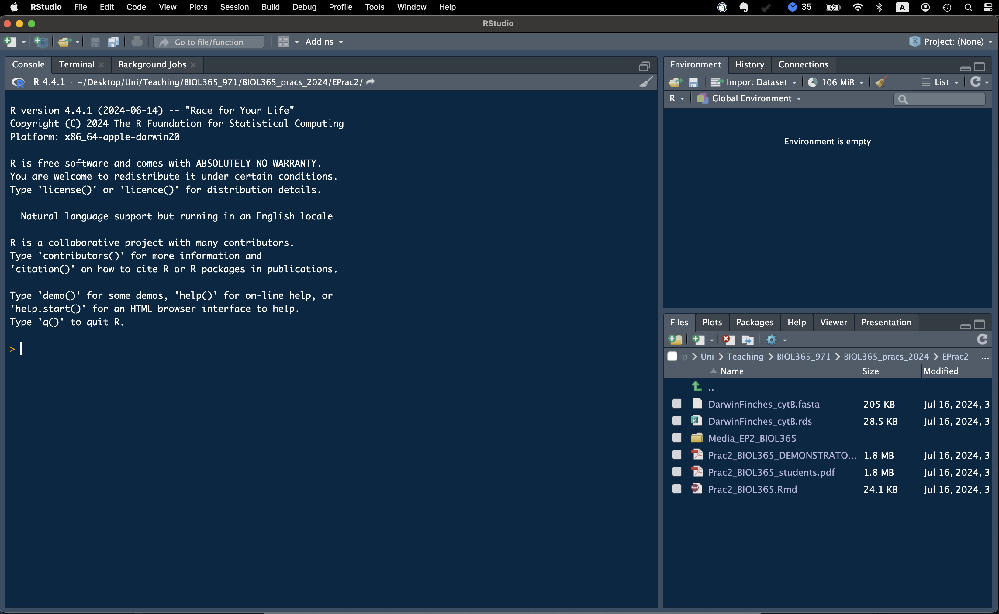
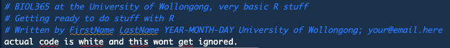

```{r libraryChunk, load-packages, include=FALSE}
# Markdown written by James B Dorey; contact jdorey@uow.edu.au (jbdorey@me.com) if help is needed.
# markdown packages
library(rmarkdown)
library(formatR)
library(styler)
library(kableExtra)

# Load core packages
library(dplyr)

options(width = 60)
matrix(runif(100), ncol = 20)
demonstratorVersion = FALSE
#| include: FALSE
knitr::opts_chunk$set(collapse = TRUE, comment = "#>")

```

`r if(demonstratorVersion == TRUE){"\\\n\n**THIS IS A DEMONSTRATOR ONLY VERSION**\\\n"}`

```{r setSECRETRootPath, include=FALSE,  eval=TRUE}
  # Set the RootPath to your folder
RootPath <- tempdir()
  # You can then set this as the project's working directory. 
  # This is where R will first look to find 
  # or save data as a default
setwd(RootPath)
```

# Introduction to the **R** practicals {-}

In BIOL361 I will take you through only two practicals, both based in **R**. If you've taken my other courses you may already know that I'm interested in giving you all a good knowledge of coding in **R** and how it's an extremely powerful tool for your careers. There may be some overlap and repetition, sorry in advance, but I want to make sure that everyone can jump in and start working on relatively even footing. 

1.  This prac will focus on teaching you some of the **(1) basics of R and RStudio**, **(2) getting your workspace ready**, **(3) reading in some data**, **(4) a touch of data manipulation**, and **(5) creating some simple plots**.

2.  The second prac will focus on some basics of running geographic information systems (GIS) analyses in **R**. You may have already done some GIS work in **ArcMap** (which is an expensive and proprietary program that only works on PC) or **QGIS** (an open source program that works across PC, mac, and Linux). I have previously found both to be equally as terrible as each other, but I haven't used either for some time because now I work in **R**!

Finally, a small note to mention that these pracitcals are checked, double checked, and run in a way to make sure that it works. However, as you will learn making your own code, once yo ugive it to someone else they're likely going to break it. That's not a problem and we are here to help you! So, don't stress out too much :) 


## Working together {-}

You won't be forming groups *per se*, but it is possible to work together on benches to provide your neighbours help with code and the like. I do encourage this as your neighbour may have already overcome errors that you have come across and both the student helping and the one receiving help should benefit! Of course, we will be here to help you as well; your Demonstrators should have the answers and, if not, your Lecturers will.

## base *R* and the *tidyverse* {-}

In my tutorials you will notice that I tend to use **tidyverse** packages — such as **dplyr**, **magrittr**, **stringr**, **readr**, and **ggplot2**. I do thise rather than using the **r** packages, **base**, **plot**, and several others for a couple of very good reasons.

1. **tidyverse** is easier to read! This is one of the primary reasons! These packages are made to work well together and be human-readable. Weh nwe want to "filter" out data rows we literally ``dplyr::filter()` those rows. If we want to "select" only certain columns, well we `dplyr::select()` those columns! If we want to extract strings of text that match certain patterns, well we can `stringr::str_extract()` those strings. 

2. It is generally faster. This may not seem like much, but when you're dealing with hundreds of millions of data cells then you're going to want to do this quickly. In general, **tidyverese** functinos are faster than **base** functions. Although, there are some packages that are quicker. 

3. Using **tidyverse** doesn't mean you can't also work together with **base R**. You don't need to pick on or the other; they both work together perfectly well! especially as you get more comfortable in this regard.

<div class="alert alert-info">
  <strong> Attention:</strong> <br>
I will be explicit when I am using a function from a certain function. When you see two columns, like `dplyr::select()`, know that I'm calling the package **dplyr** and the function *select*. Some *functions* can be called by more than one **package**; so this is actually really good practice! I also find that it makes it easier for me to not make mistakes and to better-understand what I'm doing. 
</div>

# Getting ready with *R* and *RStudio* {.tabset .tabset-pills}

Your computers should already have **R** and **RStudio** installed. If they do not, or you are using a personal computer, feel free to follow the steps below to prepare yourself for the week 2 practicals, where we will dive in pretty quickly.

If you have a moment of spare time you may consider skimming the below text, especially the "Script preparation" and "What's coming next week" sections.

## Install *R*

If **R** is NOT installed on your computer already, we will go ahead and do that now. Please visit the [**CSIRO mirror for CRAN**](https://cran.csiro.au) and download the relevant version of **R** for your operating system. Then, follow the instructions to install it on your computer.

## Install *RStudio*

**R** is a command-land programming language and **R**, by itself is horribly ugly and I don't like the idea of working in it directly. For this reason, most users will use R within a much nicer interface program, called **RStudio**. Download the free version of [RStudio](https://posit.co/download/rstudio-desktop/). Now, when both programs are installed, you can simply open up RStudio and get coding!

We are not going to do much with **R** today, don't worry, but I'd like to get you a little acquainted and at least start installing some packages in **R** so that we are ready for the following weeks.

## Running *R* in *RStudio*

Before we get into working in **RStudio**, let's make a folder where we will save all of our practical outputs and related files. Mine is called "*BIOL361_pracs_2025*". Notice how I have used underscores instead of spaces? This is very good practice to not have ANY spaces in your folder paths where you want to do coding stuff. Most of the time it's fine... but, **pro tip**, sometimes, it will cause problems that might be hard to track down!

When you open up **RStudio** for the first time, it will look a little something like the below (Fig. 2). But, without the funky colour scheme.

{width="600px"}

In the top left-hand side drop down, there is a white page with a green plus sign on it. Click on that and you can then select to add a new "R Script" (Fig. 3). We can then go ahead and save this blank script in a folder for these pracs (Fig. 4). I have called this script "*MyFirstRScript.R*".

{width="200px"}

{width="200px"}

It's also VERY good practice to leave some info about who made this script, why, and how they can get in touch with you! Go ahead and copy the below into your script and then personalise it with your details!

```{r Notes, eval = TRUE}
# BIOL361 at the University of Wollongong, very basic R stuff
# Getting ready to do stuff with R
# Written by FirstName LastName YEAR-MONTH-DAY University of Wollongong; your@email.here
```

Did you notice all of the hashtags? These are comments and **R** will ignore them (Fig. 5)!

{width="600px"}

# Script preparation

## Working directory primer

I know that many of you struggle with the concept of **working directories** and I think that they are important enough, as some of you have pointed out — thank you :), to describe in some detail. Just like some of the content that we cover in Conservation Biology (e.g., think about macroecology), the name sounds much scarier than the reality and accepting that will hopefully help you master these concepts. *(Upon reflection, this may be a poor example for many.)* Similarly **working directories** are actually quite simple! One way to look at a working directory is to think of them as a breadcrumb trail from the **root directory** where all of your computer's files are stored directly to your working file (**working directory**) that contains your **R** project, code, files, etc.

You could imagine that your **root directory** is your closet (e.g., `/` on Mac/Linux and `C:\` on Windows). Within your closet you may have shelves, hangers, shoe racks, *no, don't look at the skeletons*, a laundry basket, etc. These are all things that you might use to keep your closet nice, tidy, and organised — **these are your folders**. Within your drawers you may also have further compartments which you could also consider **folders** and, in this way, you closet is a hierarchical system containing smaller and smaller storage units (**folders**). Each of these units may contain further units (**folders**), and each of these may also contain items like shirts, jewelry, shoes... To take our figure example below the item "Shirt" is clothing; this tells us about the use of the item. In the same way, file extensions (e.g., `file.extension`) tells the computer what a file is and how to open it! You are likely very used to these things like images (`.jpg`, `.tiff`, `.png`), text files (`.docx`, `.txt`, `.r`), or data files (`.csv`, `.xlsx`, `.rda`). Hence, we might say `Shirt.cloth`!

These items are the **files**, just like your `.r` file that holds the text of your code! 


This is essentially what your computer looks like!

> What about cloud storage like *OneDrive* or *GoogleDrive*? Well, imagine that you keep all of your stuff in Elon Musk's closet and say "Let me keep all of my stuff in your closet and use it whenever I want, because my closet is just a matchbox". And then you trust all of your stuff to Elon and hope that he doesn't cut it, lose it, or sell it to someone else. This is probably fine, but you often rely on internet access to be able to use stuff in your closet.

Each time that you start an **R** project, you make a decision about where to store this in your closet. Maybe you store it somewhere very hidden, or maybe it's the first thing there when you open the door (near the **root directory**). Every time that you want to access that project, and the associated items (**files**), you might decide that you need to search the closet to find everything (*and trust me, finding that anything in your closet that you used two years ago is not easy!!*). This is what you do when you choose your directory from the **Files** tab in RStudio. It's a headache.

Alternatively, imagine that when you next wanted to find everything associated with your project you just had to find the .r code file and at the very top there was a magical string attached to you **working directory** and every item that you needed needed for your project. This is what we are doing below.


<div class="alert alert-info">
  <strong> Attention:</strong> <br>
Windows gives file paths in a different way than everyone else. :( 

  <strong> Windows:</strong> <br>
  On **Windows**, to find your file paths, right click on a file or folder and select "Properties". Then, you can copy the file "Location". But, you will need to change all of the backslashes (`\`) into forward slashes (`/`). For example:
  
      "D:\Users\jamesdorey\..." 
Becomes...

      "D:/Users/jamesdorey/..."
  

  <strong> MacOS:</strong> <br>
  On Mac or Linux, this is much easier. Using a Mac, you can right-click on a file and hold the "option" key to `Copy "file/folder" as Pathname`. Simply paste this into R and you will get something like the below automatically:
  
    '/Users/jamesdorey/...'

</div>

## Setting the working directory

Let us begin by telling **R** where our working directory (the folder that you made above) actually is. My "*BIOL361_pracs_2024*" folder is found at the end of the path:

"*/Users/jamesdorey/Desktop/Uni/Teaching/BIOL361/Lectures/2025/Github_BIOL361_25/BIOL361_25/DoreyPrac1*" (see again, no spaces!). So, I can run the below:


```{r setRootPath, include=TRUE,  eval=FALSE}
  # Set the RootPath to your folder
RootPath <- "/Users/jamesdorey/Desktop/Uni/Teaching/BIOL361/Lectures/2025/Github_BIOL361_25/BIOL361_25/DoreyPrac1"
  # You can then set this as the project's working directory. 
  # This is where R will first look to find 
  # or save data as a default
setwd(RootPath)
```

Congratulations, you have set your working directory! **R** can still access files outside of this folder, but it will look there by default after you set it (this must be set each time you open **R**).

**A quick pro-tip:** You can run code, once it's entered into your script by having your mouse click on, or above, the line that you want to run and then pressing the "**Run**" button on the top right hand side of the script window. That's a right pain. On mac you can simply use "**command+enter**" and on PC you can use "**control+enter**" to run your code. It'll make you life easier and quicker.

## Install packages

Let us also quickly install a few packages that we'll need to start with next week (you mostly only need to do this once per package and per version of **R**).

```{r installPackages, eval=FALSE, message=FALSE, warning=FALSE, collapse=TRUE, results=FALSE}
#  This package is for data management and table manipulation
install.packages("dplyr")
#  This package is for reading in tabular data, like .csv files
install.packages("readr")
# This package lets us use tidy pipes; %>%
install.packages("magrittr")
# This package is used to manipulate strings of text — it's really powerful! 
install.packages("stringr")
# ggplot2 is an extremely powerful graphical packages
install.packages("ggplot2")
```

You may have seen that more than one package was installed when you ran the above code. That's normal, many packages depend on other packages to work.

## Load packages

The last **R** thing that I will get you to do today is to load the packages into **R** (this also should be done every time you open **R**, for the relevant packages). You need to do this because you may not always want EVERY package that you have ever downloaded to be accessible from in **R**... it can cause issues. In this way, you can be more selective about which ones are active.

```{r loadPackages, include=TRUE, eval = FALSE}
library(dplyr)
library(readr)
library(magrittr)
library(ggplot2)
library(stringr)
```

You can find more info about getting started with **R** and **RStudio**, along with other tutorials at [**Our Coding Club**](https://ourcodingclub.github.io/tutorials/intro-to-r/#download).


# Read in data

Let's go ahead and download a dataset from [this publication](https://doi.org/10.3389/fevo.2024.1339446) to play with. We can start by simply downloading it using the below code (or you could copy the url to the website and download it via your browser, but why not do it all in R?).

```{r downloadData, include=TRUE}
utils::download.file(url = "https://raw.githubusercontent.com/jbdorey/BIOL361_25/main/DoreyPrac1/SuppCollectionInfo_7Aug2023.csv",
                     destfile = "SuppCollectionInfo_7Aug2023.csv",
                     method="curl")
```

Okay, we have downloaded these data and you can go ahead and look in your working directory (*if you're not sure type "getwd()" into R to see where this is*). Let's go ahead and read it into R and we can also look at it once it's read in. To do this, we will use the **tidyverse** package, **readr**.

```{r readInData}
  # read in the data using readr
HylaeusData <- readr::read_csv("SuppCollectionInfo_7Aug2023.csv")

```

Now that we have read it in, you can view the data either by simply running "`HylaeusData`" or "`View(HylaeusData)`". You can also have a scroll below of the dataset.

> **Q1:** What kind of data are we looking at here? **Note**: this is a macroecology question that relates to those lectures. It is *not* a statistical question or a coding question (although if it were one of those things it would be the latter!)

`r if(demonstratorVersion == TRUE){"**These are species occurrence data.**"}`

```{r, outputTable1, echo=FALSE}
kableExtra::kbl(HylaeusData) %>%
  kableExtra::kable_material(c("striped", "hover")) %>%
  kableExtra::kable_styling(bootstrap_options = "responsive", full_width = F, fixed_thead = T) %>%
  kableExtra::scroll_box(height = "350px")

```

# Manipulate the data

### Filter
If we were to play with these data in **Excel**, which we certainly could, we could probably do some of the actions that we are going to do below. However, they would be (a) slower, (b) less reproducible, and (c) more prone to error. So, let's go ahead and do them in **R**! Let's begin with a simple function to *filter* our dataset to only include *male* specimens.


```{r FilterDataBasic}
# We can create a new R dataset, without over-writing the previous one as below
HylaeusData_malesOnly <- HylaeusData %>% 
  dplyr::filter(sex == "male")
```

Did you see how easy that was? Why don't you go ahead and look at those data by typing "`HylaeusData_malesOnly`" or "`View(HylaeusData_malesOnly)`" into the **R** Console.

> **Q2:** How many specimens are marked as "**male**" and how many are marked as "**female**"? How many aren't labeled for *sex* at all? You will need to do some more filtering to figure this out. Hint: There are several ways to figure out how many **aren't** labelled for sex. But you could use `dplyr::filter(is.na(sex))`.

`r if(demonstratorVersion == TRUE){"**Male only = 33; female only = 40; NA = 11**"}`

That was a pretty basic bit of data *filter*ing that you're likely to do in real life and for your job. But, that's also pretty easy to do in Excel. One of the powerful parts of **R** coding is that you can do really complex things really, really, easily! Why don't we try to do a more-complex filtering command in **R**?

```{r FilterDataComplex}
# Let's filter based on two out of three countries (French Polynesia, Micronesia, and Fiji)
HylaeusData_FPandM <- HylaeusData %>% 
    # Use the %in% command to ask for ANY of the text strings *in* the country column
  dplyr::filter(country %in% c("French Polynesia", "Micronesia"))
```

```{r, outputTable2, echo=FALSE}
kableExtra::kbl(HylaeusData_FPandM) %>%
  kableExtra::kable_material(c("striped", "hover")) %>%
  kableExtra::kable_styling(bootstrap_options = "responsive", full_width = F, fixed_thead = T) %>%
  kableExtra::scroll_box(height = "350px")
```

> **Q3:** Which *Hylaeus* species are found in **French Polynesia** and **Micronesia**?

`r if(demonstratorVersion == TRUE){"***Hylaeus aureaviridis*, *Hylaeus chuukensis*, and *Hylaeus tuamotuensis*. **"}`

### Subset columns

Another thing that you might want to do with data is to remove, or only *select* certain columns. This is actually a pain to do in **Excel** and **R** does this *much* better. You might do this to not share all of the data, or to reduce the size of a dataset (especially when it gets in the millions of rows — which, by the way, **Excel** will **not** tolerate).

```{r select}
HylaeusData_spLatLon <- HylaeusData %>% 
  dplyr::select(scientificName, decimalLatitude, decimalLongitude)
```

```{r, outputTable_select, echo=FALSE}
kableExtra::kbl(HylaeusData_spLatLon) %>%
  kableExtra::kable_material(c("striped", "hover")) %>%
  kableExtra::kable_styling(bootstrap_options = "responsive", full_width = F, fixed_thead = T) %>%
  kableExtra::scroll_box(height = "350px")
```


### Create a new column

I will leave you with one more little tidbit of **R**'s power and ease of use. One thing that you might do in **Excel** that would be a bit of a pain is create a new column using some other existing column. You could copy it across and do some annoying find-replace to modify it. What a pain! This is much easier in **R**. Let's *mutate* up a new column to extract the genus name from the *scientificName* column in the last dataset that we made! 

**Note**: `dplyr::mutate` is not the most heuristic function name in **dplyr**. But, you can essentially use it to (i) add new column, (ii) over-write columns, and (iii) modify existing columns (essentially still over-writing). Below, we are creating a new column called "genus" that is then filled with the output from `stringr::str_extract(string = scientificName, pattern = "[A-Z][a-z]+")`.

```{r mutate}
HylaeusData_spLL_G  <- HylaeusData_spLatLon %>% 
  dplyr::mutate(genus = stringr::str_extract(string = scientificName, 
                                             pattern = "[A-Z][a-z]+"),
                .before = decimalLatitude)
```

```{r, outputTable_mutate, echo=FALSE}
kableExtra::kbl(HylaeusData_spLL_G) %>%
  kableExtra::kable_material(c("striped", "hover")) %>%
  kableExtra::kable_styling(bootstrap_options = "responsive", full_width = F, fixed_thead = T) %>%
  kableExtra::scroll_box(height = "350px")
```

Did you see that? We used the mutate function from the **dplyr** package to create the "*genus*" column, and inside of that function we used the **stringr** function to *extract* a string that matched the provided pattern! We also asked from R to place the new column where we wanted it; `.before` the *decimalLatitude* column.

> **Note**: You don't need to worry so much about the `pattern` that I used. But, for context it's from a language called **regex** (*regular expression*) and it's a code that works across more coding languages than just **R**. The pattern asks for any CAPITAL LETTER between A and Z (`[A-Z]`) and then any lowercase letter between a and z (`[a-z]`). The latter also will take any lowercase letter until the pattern is broken (`+`); i.e. by a space between the genus and species name!


# Make some plots

Okay, there's probably a moderate difficulty introduction to some data reading and manipulation in R. And particularly using **tidyverse** packages like **readr**, **dplyr**, **magrittr**, and **stringr**. Personally, I really like how the **tidyverse** makes it much easier for a human to read the code. There's another **tidyverse** package that's probably the most-widely used on around. This is [**ggplot2**](https://ggplot2.tidyverse.org). Let's begin by using some of **ggplot2**'s basic functions; next week we will use some extensions of the package to also make maps using these same data! 

## Histogram

We will start with a simple summary of the number of male and female bees in the dataset...

```{r ggHist}
HylaeusHistogram <- ggplot2::ggplot(
              # You need to tell ggplot2 which dataset to use
            data = HylaeusData,
              # ggplot2 also has an unusual way to specify the plot's AESthetics, 
              # using the "aes()" function
            ggplot2::aes(x = sex)) +
    # See that? ggplot2 uses a "+" to add new elements to their plots! This is quite 
    # useful and easy to code actually! 
  ggplot2::geom_histogram(stat = "count")
  # Now view the plot
HylaeusHistogram
```

That's an easy way to quickly look at your data and identify what it looks like! Do you see any patterns? Any potential problems? Answer the question below.

> **Q4:** Why are there specimens that are "**NA**" for sex? **Hint**: Bees are actually usually quite easy to sex.

`r if(demonstratorVersion == TRUE){"** Because they don't have sex specified in the dataset.**"}`

## Make histograms prettier 

### Colour by sex

We can also make our histograms a bit prettier! That would be nice, no? If we want to (1) save a plot object, like `HylaeusHist_pretty`, and (2) view it at the same time, we can also surround the whole thing in brackets as below — *just a little tip :)*

```{r ggHist_sex, message = FALSE}
(HylaeusHist_pretty <- ggplot2::ggplot(
              # You need to tell ggplot2 which dataset to use
            data = HylaeusData,
              # ggplot2 also has an unusual way to specify the plot's AESthetics, 
              # using the "aes()" function
            ggplot2::aes(x = sex, fill = sex)) +
    # See that? ggplot2 uses a "+" to add new elements to their plots! This is quite 
    # useful and easy to code actually! 
   ggplot2::geom_histogram(stat = "count") 
)
```

### Choose colours

That's great, but we relied on **R** to choose colours for us. That's fine, but sometimes we really want to make thigns prettier still! 

```{r ggHist_sex_manual, message = FALSE}
(HylaeusHist_pretty <- ggplot2::ggplot(
              # You need to tell ggplot2 which dataset to use
            data = HylaeusData,
              # ggplot2 also has an unusual way to specify the plot's AESthetics, 
              # using the "aes()" function
            ggplot2::aes(x = sex, fill = sex)) +
    # See that? ggplot2 uses a "+" to add new elements to their plots! This is quite 
    # useful and easy to code actually! 
   ggplot2::geom_histogram(stat = "count") +
    # Let's use a MANUAL colour scale
   ggplot2::scale_fill_manual(values = c("#E69F00", "#56B4E9"),
                              na.value = "grey")
)
```


### ggplot2 themes

Wonderful! But what about that gross default background? 

**Classic theme**

```{r ggHist_sex_manual_classic, message = FALSE}
(HylaeusHist_pretty <- ggplot2::ggplot(
              # You need to tell ggplot2 which dataset to use
            data = HylaeusData,
              # ggplot2 also has an unusual way to specify the plot's AESthetics, 
              # using the "aes()" function
            ggplot2::aes(x = sex, fill = sex)) +
    # See that? ggplot2 uses a "+" to add new elements to their plots! This is quite 
    # useful and easy to code actually! 
   ggplot2::geom_histogram(stat = "count") +
    # Let's use a MANUAL colour scale
   ggplot2::scale_fill_manual(values = c("#E69F00", "#56B4E9"),
                              na.value = "grey") +
    # Let's use a classic theme
   ggplot2::theme_classic()
)
```

**Dark theme**

I don't know why you'd ever use this... unless for a dark mode website?

```{r ggHist_sex_manual_dark, message = FALSE}
(HylaeusHist_pretty <- ggplot2::ggplot(
              # You need to tell ggplot2 which dataset to use
            data = HylaeusData,
              # ggplot2 also has an unusual way to specify the plot's AESthetics, 
              # using the "aes()" function
            ggplot2::aes(x = sex, fill = sex)) +
    # See that? ggplot2 uses a "+" to add new elements to their plots! This is quite 
    # useful and easy to code actually! 
   ggplot2::geom_histogram(stat = "count") +
    # Let's use a MANUAL colour scale
   ggplot2::scale_fill_manual(values = c("#E69F00", "#56B4E9"),
                              na.value = "grey") +
    # Let's use a classic theme
   ggplot2::theme_dark()
)
```

**Linedraw theme**

I have never used this one before either, but here you go! 

```{r ggHist_sex_manual_Linedraw, message = FALSE}
(HylaeusHist_pretty <- ggplot2::ggplot(
              # You need to tell ggplot2 which dataset to use
            data = HylaeusData,
              # ggplot2 also has an unusual way to specify the plot's AESthetics, 
              # using the "aes()" function
            ggplot2::aes(x = sex, fill = sex)) +
    # See that? ggplot2 uses a "+" to add new elements to their plots! This is quite 
    # useful and easy to code actually! 
   ggplot2::geom_histogram(stat = "count") +
    # Let's use a MANUAL colour scale
   ggplot2::scale_fill_manual(values = c("#E69F00", "#56B4E9"),
                              na.value = "grey") +
    # Let's use a classic theme
   ggplot2::theme_linedraw()
)
```

**There are plenty of themes to choose from** — [see here](https://ggplot2.tidyverse.org/reference/ggtheme.html) — but they are all completely customisable with further code that we won't touch on here.

## Line graphs 

We could also look at some line graphs of when the specimens were collected! This is cool because **R** is able to translate the date format into a meaningful X-axis.

```{r ggline}
(HylaeusHist_pretty <- ggplot2::ggplot(
              # You need to tell ggplot2 which dataset to use
            data = HylaeusData,
            ggplot2::aes(x = eventDate)) +
    # See that? ggplot2 uses a "+" to add new elements to their plots! This is quite 
    # useful and easy to code actually! 
   ggplot2::geom_line(stat = "count") +
    # Let's use a classic theme
   ggplot2::theme_classic()
)
```

Cool, but what if we want to also see when the males and the females were collected? Well, we could `group` these in `ggplot2::aes()`, or, we could take advantage of **ggplot2**'s simple method of adding (`+`) in new elements! So, let's add in some points based on sex!

```{r ggline_points}
(HylaeusHist_pretty <- ggplot2::ggplot(
              # You need to tell ggplot2 which dataset to use
            data = HylaeusData,
            ggplot2::aes(x = eventDate)) +
    # See that? ggplot2 uses a "+" to add new elements to their plots! This is quite 
    # useful and easy to code actually! 
   ggplot2::geom_line(stat = "count") +
    # Add in the point data; sometimes it's easier to define the data and aes within
    # the new line, but it's not always necessary!
   ggplot2::geom_point(data = HylaeusData,
                       ggplot2::aes(x = eventDate, 
                                      # Grouping variable! 
                                    group = sex,
                                      # note "colour" and not "fill" — you can play around with 
                                      # this depending on what you're doing
                                    colour = sex),
                       stat = "count") +
   ggplot2::scale_colour_manual(values = c("#E69F00", "#56B4E9"),
                              na.value = "hotpink") +
    # Let's use a classic theme
   ggplot2::theme_classic()
)
```

> **Q5:** Make a line plot where eventDate is (1) grouped by sex with (2) "male" as a warm colour, (3) "female" as a cool colour, and (4) "NA" as a neutral shade.

## Very simple statistical test

I also want to very briefly show you that statistics are also *really* easy in **R**! It may be a silly question to ask, but, we could ask if we have collect more female *Hylaeus* than we do male *Hylaeus*, on average. Without thinking too much about the statistical robustness of our question, let's use years as sampling events. First, we will have a look at the number of records by *year*, by calling the `base::table()` function for year, which will count for us.

```{r stats}
  # Get a summary table of the counts per year
table(HylaeusData$year)
  # Now, get a summary matrix (or table) of year AND sex.
table(HylaeusData$year, HylaeusData$sex)
  # Ask for the class of the R object
class(table(HylaeusData$year, HylaeusData$sex))
```  

Without going into great detail, the `base::table()` function returns a *class table* object. **Base R** objects, compared with **tidyverse** objects, can be a pain to work with. For example, the existence of "row names" is a constant pain as they are essentially a column that's harder to interact with. Instead, let's use **tidyverse** to build our table; it's longer and a bit more confusing, but actually easier than using `base::table()` and turning it back into a *tibble*! My apologies as it gets a little long, but feel free to follow my comments there or not. 

Back to the statistics... If we look at both *year* AND *sex*, it might be that we do collect more females on average! Let's test that using a statistic; the *Z-test* of two proportions using the default `stats::prop.test()` function.

```{r runStats}
HylaeusTable <- HylaeusData %>% 
    # First, we will gorup by year and sex to apply functions within those groupings
  dplyr::group_by(year, sex) %>% 
    # Count the number in each year+sex group and then drop any "NA" or empty values (year and sex
    # were not always recorded :( )
  dplyr::count() %>%
  tidyr::drop_na() %>%
    # Make the tibble wider by putting each count of sex into its own column
  tidyr::pivot_wider(names_from = sex,
                     values_from = c(n)) %>%
    # Instead of having "NA" for no males or females caught, make those into zero (for calculating
    # The proportion of females below).
  tidyr::replace_na(list(male = 0, female = 0)) %>% 
    # Calculate the proportion of females and the total numebr of specimens per year
  dplyr::mutate(propFemale = female/(male+female),
                totalSpecimens = male+female)

  # Test this statistically
proportionTest <- stats::prop.test(x = HylaeusTable$propFemale, 
                 n = HylaeusTable$totalSpecimens)
  # View the empirical proportion and the estiamted proportion of females 
dplyr::tibble(proportionOfFemales = HylaeusTable$propFemale,
              estimate = proportionTest$estimate,)
```

The *Z-test* calculated the *estimated* proportion of females expected for each time and by-and-large there are more females recorded (a higher proportion) than expected by chance. But...

> **Q6: **Was the proportion different from the expected at a statistically significant level of 5%? **Hint:** run `proportionTest` in the **R** console and have a look at the statistical outputs.

`r if(demonstratorVersion == TRUE){"**Yes. the p-value is 0.0007, much less than the standard 0.05 (or 5%) alpha value.**"}`

<div class="alert alert-info">
  <strong> Attention:</strong> <br>
Once you have completed all of the questions and shown your demonstrator or Lecturer the answers and the outputs, you may leave. Or, feel free to hang around, play, or help your classmates.
</div>

# What's coming next week?

Next week, we will be extending some of what we learnt here in order to read in GIS data, make some maps, and do some simple analyses.

# Packages used today

{width="200px"} 
{width="200px"}
{width="200px"} 
{width="200px"}
{width="200px"}

Plus the default R packages, **base** and **utils** 