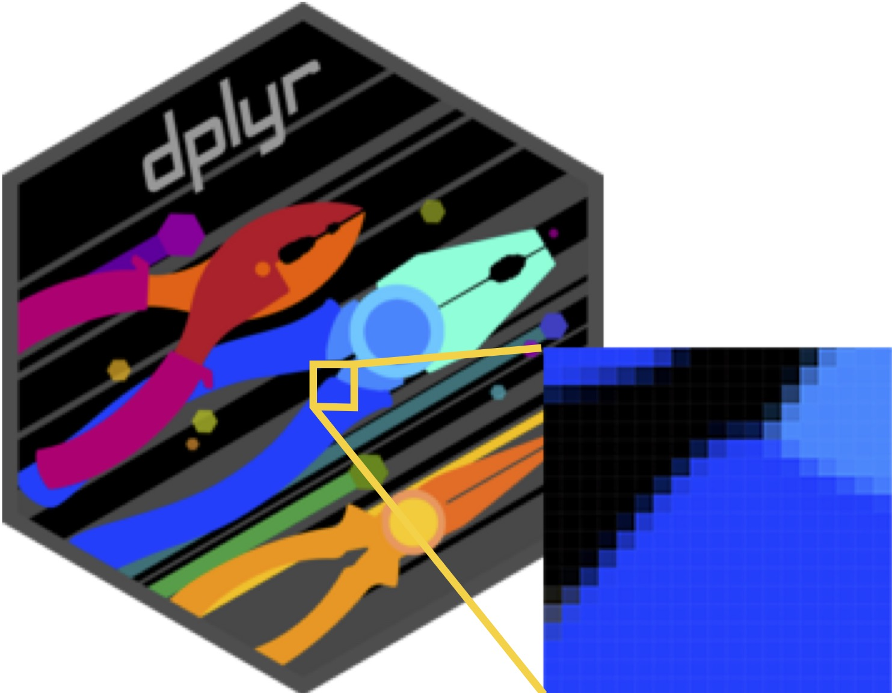
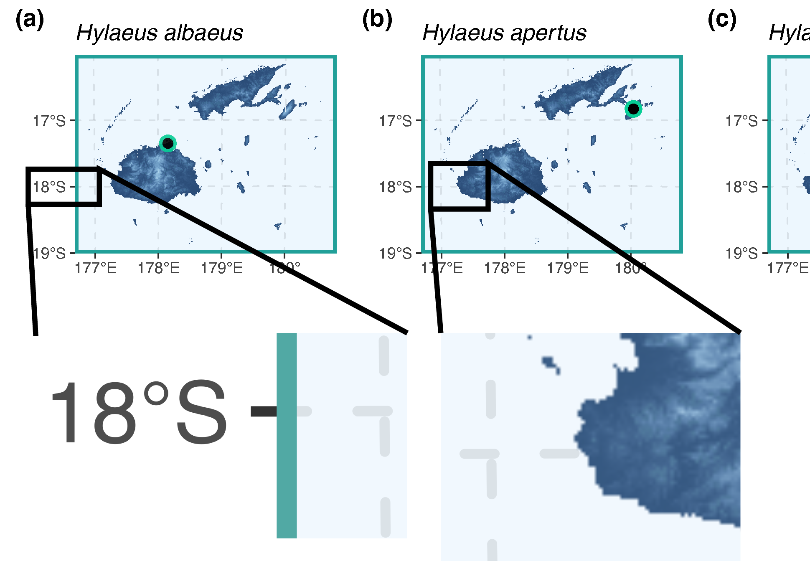
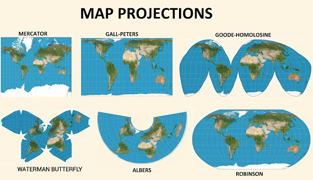

```{r libraryChunk, load-packages, include=FALSE}
# Markdown written by James B Dorey; contact jdorey@uow.edu.au (jbdorey@me.com) if help is needed.
# markdown packages
library(rmarkdown)
library(formatR)
library(styler)
library(kableExtra)

# Load core packages
library(dplyr)


matrix(runif(100), ncol = 20)
demonstratorVersion = FALSE

```

`r if(demonstratorVersion == TRUE){"\\\n\n**THIS IS A DEMONSTRATOR ONLY VERSION**\\\n"}`

```{r setSECRETRootPath, include=FALSE,  eval=TRUE}
  # Set the RootPath to your folder
RootPath <- tempdir()
  # You can then set this as the project's working directory. 
  # This is where R will first look to find 
  # or save data as a default
setwd(RootPath)
```

# GIS data basics

People are often quite intimidated by working with any data, let alone specialised datasets and formats! Even **Excell** data formats can be scary if you're so inclined. So, I'll try to dispell some of your fears in this section as even "complex" data can be demistified. Much of the data that we are going to be using isn't *actually* complex!

## Raster and vector data

Alright, so I know that I said our data weren't complex and then I threw two random and scary-sounding words at you. Well, don't stress I'll break it down and also point out that *raster* and *vector* data are also regularly used by most of us on a daily basis! In the shortest terms possible... *raster* data are matrices/tables of data and vector data are simply points and lines. 

### Raster data (matrices or tables)

One of the most-commonly known raster file formats would be the *.jpg* format. But, many others are commonly used, such as *.tiff*, *.png*, and *.gif*. You might be wondering "How on Earth is that a matrix or table??". And loo, fair enough. But take a look at the below dplyr logo. This is a *.png* file, and if we zoom in, we can start to see the pixels which are actualyl just cells of a matrix that are filled with colour! This logo has a resolution of 240x277 (66,480) pixels.



### Vector data (points and lines)

Vector data formats are even simpler, I think than raster data formats. Once again, you are all familiar with these formats! Probably the most-common one would be the *.pdf* format. But others exist like *.svg* and *.shp*. Vector file formats **do not have pixels** at all, which actually has some benefits. This means that we can keep zooming and zooming in on a vector file (just as we did above) and we will never see pixels! 

Below, you can see a cutout of a *.pdf* map file which has vector data (letters, numbers, points, and lines) as well as raster data embedded (a raster map of elevation). On the left hand side you can see that we can zoom into the 18ºS and the lines without any pixels appearing. But, on the right hand side, you cna see that the lines of the map remain clear but the pixels of the map begin to appear! 



## Projections

This is something that is better covered in another topic, but very briefly... The earth is more or less a sphere, but quite often we want to represent this sphere on a flat surface (a map). Most of the time, if we zoom in enough this isn't really a problem! However, the further out that we zoom the more and more problematic this is! For that reason we "**project**" that round map onto a flat surface. These are "**Projected Coordinate Systems**".

 

[Image from here](https://practicalgeoskills.blogspot.com/2020/04/map-projections-meaning-and-examples.html)

It's clear that these projection are visually very... diverse. This becomes a problem when you're doing analyses or trying to make maps! In this prac we will mostly circumvent this issue by using a "**Geographic [3D] Coordinate System**" like WGS84 (below).

 

[Image from here](https://en.wikipedia.org/wiki/World_Geodetic_System)

# Script preparation

## Install and load packages

Set you working directory again. This can be the same as last week's or a new one — up to you! 

```{r setRootPath, include=TRUE,  eval=FALSE}
  # Set the RootPath to your folder
RootPath <- "/Users/jamesdorey/Desktop/Uni/Teaching/BIOL361/Lectures/2025/Github_BIOL361_25/BIOL361_25/DoreyPrac1"
  # You can then set this as the project's working directory. 
  # This is where R will first look to find 
  # or save data as a default
setwd(RootPath)
```

These are the **NEW** packages that we will use this week. If you have lost those from last week, go back and install them as well. Although, below we will also install some GIS packages.

```{r installPackages, eval = FALSE}
install.packages("geodata")
install.packages("tidyterra")
```

Load all of the packages from this week and last week into **R**.

```{r loadPackages, eval = FALSE}
library(dplyr)
library(readr)
library(magrittr)
library(stringr)
library(ggplot2)
library(geodata)
library(tidyterra)
```

## GIS in *R* formats and packages

Different GIS programs tend to have different file formats. **ArcMap** is the most cagey (as it's a proprietary program) and so has a bunch of annoying proprietary file formats. **QGIS** is open source and tends to use some simpler formats (yay!). **R** is more-or-less able to open any of those formats and read them in (even more yay!). Let's install the needed packages and have a very short discussion of their [preferred] formats.

> "**Raster** data divide space into *rectangular grid cells* and they are commonly used to represent spatially continuous phenomena, such as elevation or the weather. Satellite images also have this data structure, and in that context grid cells are often referred to as pixels. In contrast, **vector** spatial data (*points, lines, polygons*) are typically used to represent discrete spatial entities, such as a road, country, or bus stop."

<div class="alert alert-info">
  <strong> Attention:</strong> <br>
Annoyingly, the first time that you use **terra** or **sf** on a new computer you may need to install some dependencies. Try to install the **terra** and **sf** packages first but then come back here if that doesn't work.

  <strong> Windows:</strong> <br>
  On **Windows**, you need to first install [Rtools](https://cran.r-project.org/bin/windows/Rtools/) to get a C++ compiler that **R** can use. You need a recent version of **Rtools42** (rtools42-5355-5357).

  <strong> MacOS:</strong> <br>
On **macOS**, you can use [MacPorts](https://www.macports.org/) or [Homebrew](https://brew.sh/).

With **MacPorts** you can do

`sudo port install R-terra`

With **Homebrew**, you need to first install GDAL:

`brew install pkg-config`

`brew install gdal`

Followed by (note the additional configuration argument needed for Homebrew)

```{r, eval = FALSE}
  # Install terra
install.packages("terra", type = "source", configure.args = "--with-proj-lib=$(brew --prefix)/lib/")
  # install sf
install.packages("sf", type = "source", configure.args = "--with-proj-lib=$(brew --prefix)/lib/")

library(terra)
library(sf)
```

</div>

### *terra* (formerly *raster*)

The [**terra**](https://rspatial.github.io/terra/index.html) package is mostly used to deal with raster data, but has some ability to work with vector data as well. *(It was also formerly called **raster**.)*

The **terra** package has two main data types, simply called **SpatRaster** and **SpatVector**. *(along with some minor types.)*

### *sf* (formerly *sp*)

The [**sf**](https://r-spatial.github.io/sf/), or *simple feature* package (formerly **sp**) mainly works with vector data. That's to say that by-and-large, it works with points and lines. However, it does have some abilities to use raster as well.

By and large, **sf** works with *data frames* and *tibbles* (the latter is what we make with `readr::read_csv()`!). Essentially, it stores the spatial data in an easily human-readable table!

# Read and plot data

Okay, maybe that's enough faffing around! There's more to know about GIS, but this isn't the place to learn it all. I just want to give you a brief overview of what's possible to do in R so that in your future careers you'll be able to do some amazing thigns for conservation biology! We have talked a lot about these data types, and now I think it's past time to get to work with them! 


## Raster

We can often find raster datasets from government, non-governmental, and other websites and datasets. You can spend ages looking around online for the best possible dataset to download and apply towards a conservation goal. However, **R** also provides packages that can very easily and quickly read in datasets from the internet! 

Below, we will use the **R** package **geodata** to download a Digital Elevation Model (DEM) os the entirity of Australia at a 30-second (~1 km) resolution.

```{r downloadRaster, include = TRUE}
AustralianElevations <- geodata::elevation_30s("Australia",
                               path = RootPath)
  # View a summary of the data
AustralianElevations
```

How about that! Within a few seconds we have a *spatRaster* showing the elevatino across Australia! 

> **Q1:** Looking at the summary of *AustralianElevations*, (1) what are the dimensions of the file, (2) what is the coordinate reference system and is it a **projected** or **geographic** coordinate system (see "Projections" above), and (3) what are the minimum and maximum elevational values for this map of Australia?

`r if(demonstratorVersion == TRUE){"**(1) 4296x5592; (2) geographic coordinate system — WGS 84; (3) -60 and +2159 meters above sea level**"}`

Let's go ahead and have a little peak at what our data looks like now as well. Quite often you can just run `terra::plot()` for your map... however, I don't always recommend this with bigger GIS files as they can freeze your computer. In fact, **ggplot2**, with the help of **tidyterra** does a better job once again! 

```{r plotRaster}
(AusEleMap <- ggplot2::ggplot() +
  tidyterra::geom_spatraster(data = AustralianElevations,
                             ggplot2::aes(fill = AUS_elv_msk)) +
    # Feel free to remove this line (don't leave an open "+" in the previous line) and
    # see what happens! "viridis" is one of MANY colour palettes available with ggplot2
  ggplot2::scale_fill_viridis_c(na.value = "transparent") )
```

Look, I know that I'm a data nerd and all but seriously? Within a few lines of code and a few minutes we have a map of Australia that you could use in a publication or for an analysis? That's pretty powerful stuff! **BUT**, an elevation map of Australia isn't necessarrily that interesting by itself... maybe we want some species occurrence data to go with it?

## Vector

### Point data

So, let's put some points on our map! Just like last week, we are going to download some data that I've hosted online and then read it into **R**.

```{r downloadData, include=TRUE}
utils::download.file(url = "https://raw.githubusercontent.com/jbdorey/BIOL361_25/main/DoreyPrac2/Australian_Coelioxys.csv",
                     destfile = "Australian_Coelioxys.csv",
                     method="curl")
```

Okay, we have downloaded these data and you can go ahead and look in your working directory (*if you're not sure type "getwd()" into R to see where this is*). Let's go ahead and read it into R and we can also look at it once it's read in. To do this, we will use the **tidyverse** package, **readr**.

```{r readInData}
  # read in the data using readr
CoelioxysData <- readr::read_csv("Australian_Coelioxys.csv")
```

```{r out.width='30%', out.extra='style="float:right; padding:10px"', fig.cap='', fig.align="right", echo = FALSE}

```

> **Q2:** What type of data did we just download? How many rows of data are included?

`r if(demonstratorVersion == TRUE){"**(1) Species occurrence data and (2) 102 rows of data, representing 102 species occurrence records**"}`

We just downloaded all of the available and quality data for the Australian bee genus, *Coelioxys*! These are really cool cuckoo bees that lay their eggs in the nests of other bees in the genus *Megachile* — just like cuckoo birds!

So, let's go ahead and have a quick look at those data. Just to show you how simple point data really are in GIS, we could simply plot the longitude (x-axis) and latitude (y-axis) and you should be able to make out the outline of Australia just using those occurrence data! ...But see how it's kinda squished? Think back to the importance of our projection systems and how we "see" the world [on a map].

```{r simplePointPlot}
plot(x = CoelioxysData$decimalLongitude, y = CoelioxysData$decimalLatitude)
```

But really, we want to make a much nicer plot, with these points overlaid with Australia. So, let's go ahead and add onto our previous **ggplot2** object!

```{r ggplotPoints1}
(AusEleMap_points <- AusEleMap +
  ggplot2::geom_point(data = CoelioxysData,
                      ggplot2::aes(x = decimalLongitude, y = decimalLatitude),
                      colour = "red"))

```

See, **ggplot2** is really clever! We could plot just a regular tibble file! But, to do more complex things, we will want to turn it into an **sf** *simple feature* format. This is actually really easy to do! And then we don't even need to specify the x and y, **R** just knows as we use the `ggplot2::geom_sf()` function now to plot the **sf** date format! We could also easily group our data by species.

```{r pointTosf}
CoelioxysPoints <- CoelioxysData %>%
  sf::st_as_sf(coords = c("decimalLongitude", "decimalLatitude"),
                # we can even match the coordinate reference system as we make our points!
               crs = sf::st_crs(AustralianElevations))

  # now make the map using the "sf" data points
(AusEleMap_points <- AusEleMap +
  ggplot2::geom_sf(data = CoelioxysPoints,
                    # Colour points by species name
                   ggplot2::aes(colour = scientificName)
                      ) +
      # Add in a simpler theme
    ggplot2::theme_bw())
```

> **Q3:** How many species are in the dataset and which is most-widespread?

`r if(demonstratorVersion == TRUE){"**(1) There are four species and (2) C. froggatti is the most abundant.**"}`

### Polygon data

Remember how I said that vector data are just points and lines? Well, so far we have only drawn points... Let's add in some lines! These data are called "polygon" data and are still relatively simple. It's also quite easy to get yourself some REALLY great polygon map data in R using a couple of packages, **rnaturalearth** and **rnaturalearthdata**; the latter if you need higher-resolution data. Let's go ahead and install+load these packages here.

```{r rnaturalearth_install, eval = FALSE}
  # Install packages
install.packages("rnaturalearth")
install.packages("rnaturalearthdata")
  # Load packages
library(rnaturalearth)
library(rnaturalearthdata)
```

Now we can go ahead and see how easy it is to download even more excellent GIS data *directly* into **R**. There are a few useful functions you might look up depending on your purposes, such as `rnaturalearth::ne_countries()`, `rnaturalearth::ne_coastline()`, and `rnaturalearth::ne_states()`. Obviously, we should download the Australia map, but depending on how stressed you are, I encourage you to play around and look at other countries as well! 

```{r naturalearthDownload}
  # I'll choose an agnostic name for the file in case you download other countries.
polygonMap <- rnaturalearth::ne_countries(
  scale = 50, # Can be 110, 50, or 10; 10 is the highest resolution and requires rnaturalearthdata
  country = "Australia",
  type = "map_units",
  returnclass = "sf" # You could also use "SpatVector" for the terra package! 
)
```

Alright, you've downloaded a map, the obvious next step is to view the map! You could use the `base::plot()` function, which will take a while and have... unexpected consequences (only do this if you're feeling chaotic and not short on time). Instead, let's use **ggplot2**. Go ahead and run and review the two maps below. The first map is all of Australia and tell me where the second map is. The second map will make the idea of polygons much clearer (if you have time, change the scale of the *polygonMap* above). 

```{r ggplotNaturalEarth, eval=FALSE}
  # plot the map in ggplot2
(ggPolyMap <- ggplot2::ggplot(data = polygonMap) + 
  ggplot2::geom_sf())

(mysteryMap <- ggplot2::ggplot(data = polygonMap) + 
    ggplot2::geom_sf() +
    ggplot2::ylim(-40.3,-39.5) + ggplot2::xlim(143,145)
  )

```

> **Q4:** Approximately how many points and how many lines are there in the mysteryMap polygon?

`r if(demonstratorVersion == TRUE){"**something like 18 points and 17 lines (I literally counted them)**"}`

# Simple analyses

Cool, so we have some raster data (DEM) and we have some vector data (points)... What can we do with this information?! Well, one of the simplest things that we could want to do with raster (or vector data like polygons) and vector data is to extract information at each of those points. That's quite easy to achieve here, so why don't we find the elevation at each of our occurrence points?

## Extract data

As we are working with a *raster* file, it is often easiest to *extract* the map data using the **terra** package. Somewhat annoyingly, this returns a `data.frame` object with only two columns, "ID" and "AUS_elv_msk"! How can we match our data back to the original occurrences?! 

```{r extractElevation}
  # Run the extraction
CoelioxysElevations <- terra::extract(AustralianElevations, CoelioxysPoints)
  # Examine the data's class
class(CoelioxysElevations)
```

```{r, outputTable_select, echo=FALSE}
kableExtra::kbl(CoelioxysElevations) %>%
  kableExtra::kable_material(c("striped", "hover")) %>%
  kableExtra::kable_styling(bootstrap_options = "responsive", full_width = F, fixed_thead = T) %>%
  kableExtra::scroll_box(height = "350px")
```

This is pretty easy it turns out! Let's work with our original *CoelioxysData* dataset which has all of the information that we could need, but *select* only *scientificName*, *decimalLatitude*, and *decimalLongitude* to make things easier. We can then *bind columns* together with the new *CoelioxysElevations* dataset using **dplyr**! Because they are in the same order, they should fit together well! 

```{r elevationFormat}
C_ele <- CoelioxysData %>%
    # Select a subset of the columns
  dplyr::select(scientificName, decimalLatitude, decimalLongitude) %>%
    # Bind these columns with those from the new dataset
  dplyr::bind_cols(CoelioxysElevations)
```

We can do analyses on these extracted data now as well! For example, we could look at how these species interact with elevation across their ranges. We can start out by grouping our data using the scientific names of the species and **dplyr**. Within those groups we could easily figure out some statistics like the mean, median, max, min, etcetera. We could also easily plot these data to see the patterns as well!

**Note**: Some people find **dplyr**'s `mutate` function quite confusing; I used to be one of them. You can think of `mutate` as a function that *mutates* columns of data by adding or changing. In the below chunk of code, we are *mutating* in a new column called "mean_elevation". We could also over-write or modify an existing column. For example if you wanted to over-write "mean_elevation", you could add another `mutate` directly below and make it something completely new, or even change it from a `numeric` value to a `character` value! Adding something like this will work ... `%>% dplyr::mutate(mean_elevation = mean_elevation %>% as.character())`

```{r plotElevation}
C_ele <- C_ele %>%
    # Group by scientific name to apply functions WITHIN group
  dplyr::group_by(scientificName) %>%
    # Create a new column with mean elevation per group
  dplyr::mutate(mean_elevation = mean(AUS_elv_msk, na.rm = TRUE))

  # Make a plot of the recently-extracted data per species
(C_ele_boxplot <- ggplot2::ggplot(data = C_ele,
                        ggplot2::aes(y = AUS_elv_msk,
                                     group = scientificName,
                                     colour = scientificName)) +
  ggplot2::geom_boxplot())
```

> **Q5:** Can you make a new column with the **median** elevational values?

`r if(demonstratorVersion == TRUE){"**something like 'dplyr::mutate(median_elevation = median(AUS_elv_msk, na.rm = TRUE))' added to the script**"}`

> **Q6:** Can you restrict the map view of *AusEleMap_points* to Australia's North East corner? **Hint**: run `?ggplot2::ylim()` and `?ggplot2::xlim()` and pay attention to the latitude and lonigtude values.

`r if(demonstratorVersion == TRUE){"**something like 'ggplot2::ylim(-30, -10) + ggplot2::xlim(140, 155)' added to the script**"}`

> **Q7:** What happens when you change the sign of the `ylim` (e.g., positive; 30 or negative -30) or  `xlim` (e.g., positive; 140 or negative -140)? Explain what happens in terms of where on Earth the plot covers.

`r if(demonstratorVersion == TRUE){"**Changing ylim to a *positive* value will plot in the Northern Hemisphere. Changing xlim to *negative* will plot in the Western Hemisphere **"}`

```{r restrictExtent, include = FALSE}
restricted_AusEle <- AusEleMap_points +
  ggplot2::ylim(-30, -10) + ggplot2::xlim(140, 155)
```

## Find the distance to coastline (nearest feature)

We can also do some simple vector-vector analyses. What if, for example, we wanted to know how close each point was to the coast line (or some other vector). First of all, we can look at the points and the polygon together (this is very helpful for getting a lay of the land, if you will...

```{r plotPointsPoly}
  # plot the map in ggplot2
(polyPointMap <- ggplot2::ggplot() + 
  ggplot2::geom_sf(data = polygonMap) + 
   ggplot2::geom_sf(data = CoelioxysPoints))
```

We could then ask for the *st_*distance to the polygon map of Australia for each point. Something like the below. Let's look at the first ten distances (from the first ten points to the polygon).

```{r nearestFeature_multipolygon}
distanceToPolygon <- CoelioxysPoints %>%
  sf::st_distance(polygonMap) 
head(distanceToPolygon, 10)
```

Hmm... That's a little odd, only the 8th point has a distance and the rest are actually zero! If you're confused by this, don't stress; so was I for a moment until I figured out that we are measuring the distance to a POLYGON that is essentially *filled in*! We want to measure the distance to the coast line, and so we need to make a conversion from a filled polygon to a simple line. We can evendo this within our function by employing the `sf::st_cast()` function by feeding *polygonMap* into it using the pipes (`%>%`).

```{r nearestFeature_multistring}
distanceToString <- CoelioxysPoints %>%
  sf::st_distance(polygonMap %>% sf::st_cast(to = 'MULTILINESTRING')) 
head(distanceToString, 10)
```

There we go, I think that make a bit more sense! And, you can see that the eight point is the *same* distance as it was in the previous example. That begs the question... 

> **Q8:** Why was the eight point (as well as the 13th, 21st, 42nd, and 74th) above zero, when the others were not? And why has that value stayed the same while the others have changed? This isn't really a trick question, but just to check that you understand what we did.

`r if(demonstratorVersion == TRUE){"**Those points that were >0 initially were off the coast of Australia. Perhaps because the coordinates were poorly collected, with poor precision, or even in an inter-tidal zone. The answer may also change if you changed the map resolution which woudl shift the coastline slightly.**"}`


<div class="alert alert-info">
  <strong> Attention:</strong> <br>
Once you have completed all of the questions and shown your demonstrator or Lecturer the answers and the outputs, you may leave. Or, feel free to hang around, play, or help your classmates.
</div>

# Packages used today

{width="200px"} 
{width="200px"}
{width="200px"} 
{width="200px"}
{width="200px"}
{width="200px"}
{width="200px"}
{width="200px"}


Plus the default **R** packages, **base** and **utils** as well as **geodata**